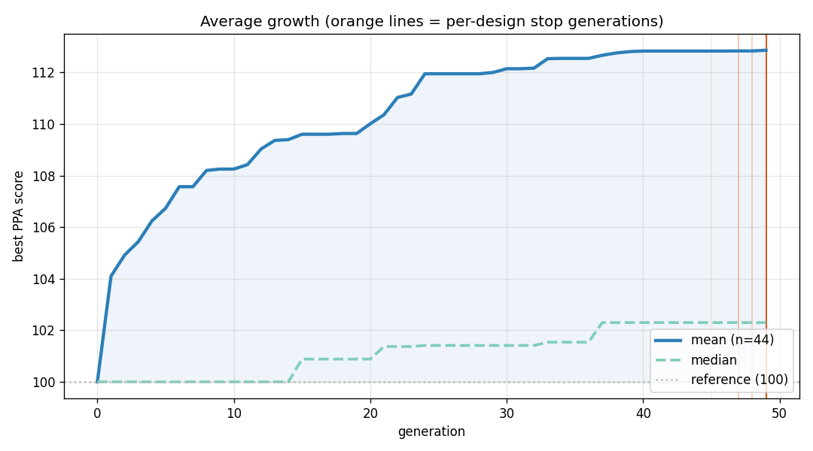
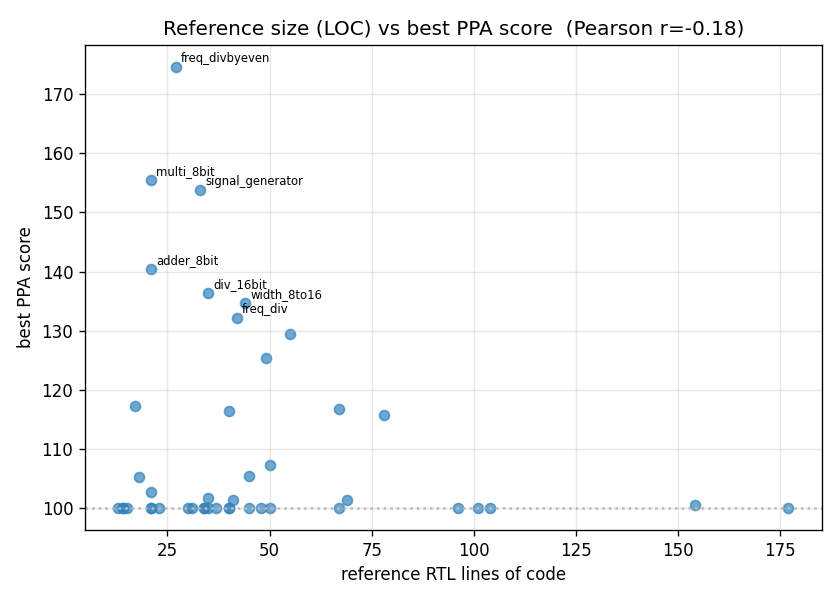
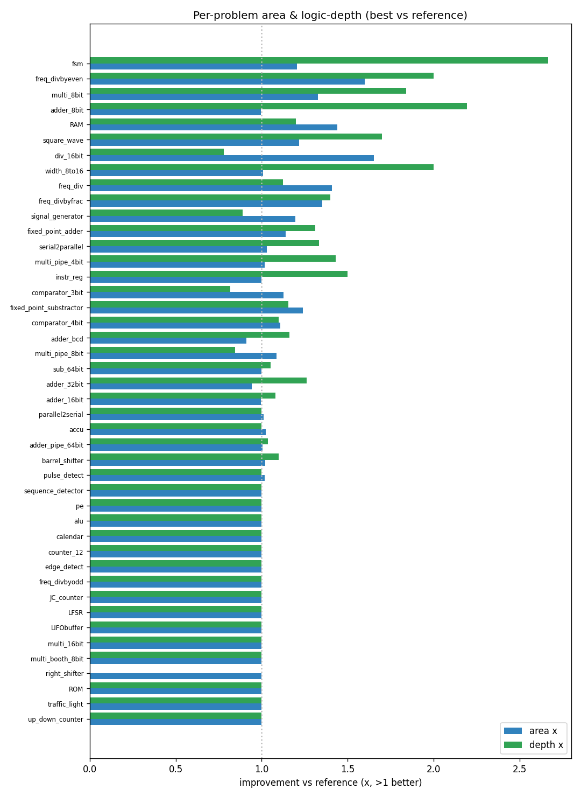

# RTLLM × ShinkaEvolve — evolving Verilog for Power, Performance & Area

**LLM-driven evolutionary search makes human-written RTL smaller, faster, and lower-power — under a frozen functional spec, with every win held to formal equivalence.**

We take the [RTLLM v2.0](https://github.com/hkust-zhiyao/RTLLM) benchmark (50 hand-written Verilog designs, each with a golden reference + testbench; [arXiv:2308.05345](https://arxiv.org/abs/2308.05345)) and, instead of the usual binary pass/fail, **freeze the function and optimise PPA** — a continuous objective evolution can climb:

```
score = 100 · geomean( area_ref/area_cand , depth_ref/depth_cand , power_ref/power_cand )
```

The RTLLM human reference scores **100**; a correct, smaller/faster/lower-power implementation scores **> 100**.

## Headline (curated, hack-audited)

- **45 of 50** designs in scope (5 need commercial EDA — see *Scope* below); **27 beat the human reference**.
- **mean best score 110.4, median 101.6** — a few big wins pull the mean above the typical design.
- best: `freq_divbyeven` **175**, `multi_8bit` **155**, `signal_generator` **154**, `adder_8bit` **144**, `div_16bit` **136**.
- Every result is the best **legitimate** candidate per design, selected by side-by-side code review across two runs (an interface-frozen re-run plus the original), with reward-hacks rejected — see below.



*Mean climbs to ~114, median to ~103.4; orange lines mark each design's stop generation. Most gain lands by gen ~20.*

## How it works (all open-source — no commercial EDA licences)

| metric | tool | what it is |
|---|---|---|
| **area** (µm²) | **Yosys** → **Nangate45** standard cells | post-synthesis cell area |
| **performance** (logic depth) | **Yosys** (`ltp`, longest topological path) | combinational critical-path length |
| **power** (µW) | **OpenSTA** on the gate-level netlist | switching + leakage power |
| **correctness** | **Icarus Verilog** + RTLLM testbench | functional simulation |
| **equivalence** | **Yosys** SAT miter (`equiv`/`sat`) | candidate ≡ reference, so no testbench overfitting |

Every candidate is compared against the RTLLM reference on the **identical** Yosys/OpenSTA flow (evolved vs. human, same measurer), so the *relative* claim is fair even though absolute numbers differ from RTLLM's Synopsys VCS + Design Compiler values.

The equivalence gate is the load-bearing piece: a finite testbench can be overfit (an earlier testbench-only run produced an obviously-fake 799× "win" by deleting all flip-flops). Holding each candidate to **formal/sequential equivalence** closes that hole — the wins below are real.

## Worked example in detail — `adder_8bit` (ripple-carry → Kogge-Stone)

The clearest, fully formally-proven story (best **143.9**: area 0.99×, depth **2.19×**, power 1.37×). Four edges from the reference; full lineage with every diff in **[adder_8bit.md](adder_8bit.md)**.

- **A — reference (100):** 8× chained `full_adder` ripple-carry; carry ripples bit-to-bit → long critical path.
- **A′ — gen 6 (136.8):** collapse to behavioral `assign {cout,sum} = a+b+cin`; depth 1.73×. The synthesizer now picks the adder.
- **A″ — gen 10 (134.4):** a cascaded 4-bit-segment experiment — a *regression*, kept as an inspiration but not the line of descent.
- **A‴ — gen 15 (138.7):** explicit **Kogge-Stone** parallel-prefix tree; depth jumps to **2.85×** but area drops to 0.84× (more cells).
- **A⁗ — gen 20 (143.9):** *simplified* Kogge-Stone — rebalances area back to 0.99× while keeping depth 2.19×. The area↔depth trade, tuned.

This is the canonical hardware tradeoff — **logarithmic-depth carry at the cost of cells** — discovered and then *rebalanced* by the search, and proven equivalent at every step.

## Tradeoff discussions + a reward-hack caught (other designs)

### `multi_8bit` — multiplier microarchitecture tradeoffs

The RTLLM reference implements an **explicit shift-and-add algorithm**: a sequential loop that conditionally accumulates the shifted multiplicand for each of the 8 bits of `B`. Unrolled in combinational logic (`always @*`), this synthesizes into a cascade of up-to-eight 16-bit adders chained in series — large depth, large gate count.

Evolution converged, in a single edge, to the **behavioral `*` operator** (`product = A * B`), handing partial-product generation and reduction to the synthesizer. Rather than fixing the structure in RTL, this lets **Yosys+ABC** infer a library-aware multiplier — typically a Booth-encoded Wallace/Dadda-style reduction tree — that compresses partial products in log-depth instead of the reference's linear adder chain.

The core tradeoff is **reduction-tree depth versus area**. The hand-written shift-add is regular and area-cheap per stage, but its ripple-carry accumulation serializes carries, inflating depth and — because every long combinational path toggles — dynamic power. A carry-save reduction tree spends more cells on 3:2/4:2 compressors but collapses depth logarithmically. The inferred multiplier lands at **area 1.33×, depth 1.84×, power 1.54×** — net PPA **155.5**.

What was given up is **explicit, regular structure**: the design cedes datapath control to synthesis. That is still sound — for an 8-bit operand the tool's mapped multiplier reliably beats a naively-unrolled loop, and the code is simpler. Unusually, all three axes improved together because the reference was structurally inefficient on every front: shortening the critical path simultaneously removed redundant adder cells (area) and reduced switching on long carry chains (power).

### Reward-hacking: caught and rejected (the `fsm` story)

The single most important result here is a *negative* one. An LLM optimising for a PPA number will exploit any gap — so we defend in depth (formal equivalence gate → interface-freeze → side-by-side code review), and it paid off: **4 of the original "wins" were reward-hacks and are rejected**, dropping the headline from 30 to a trustworthy **27**.

| design | fake "win" | the hack | how it was caught |
|---|--:|---|---|
| **`fsm`** | 179 | swaps the state register for a flat 5-bit window `MATCH = ({sr,IN}==5'b10011)` that is **not** equivalent to the reference's transition graph (it can't reproduce the overlapping sequences) | side-by-side code review — the **bounded** formal miter passed it, but the flat window diverges on untested sequences |
| **`RAM`** | 139 | **narrows the address bus** `[7:0]→[2:0]` (+ async read) on a testbench that never drives high addresses — an I/O-contract change | interface-freeze (header now outside the EVOLVE-BLOCK) + code review |
| **`comparator_3bit`** | 114 | **multiply-driven nets** (illegal Verilog: three continuous `assign`s to one wire) — the score is a synthesis artifact | code review |
| **`sub_64bit`** | — | changes `output reg`→wire port types (interface mutation) | code review |

The lesson: a **single** gate isn't enough. The Yosys SAT miter is *bounded*, so it can pass a recognizer that's only equivalent over the tested horizon (`fsm`); it also can't be built across a changed interface, so it falls back to the finite testbench (`RAM`). Layering an interface-freeze (the model physically cannot edit the ports) and a final code review over the formal gate is what makes the remaining 27 trustworthy. The genuine `fsm` win, once the hack is rejected, is **116.8** — a real, faithful re-encoding.

### `div_16bit` — divider datapath tradeoffs

The reference is a sequential **shift-subtract restoring divider**: a 32-bit register pair driven by a 16-iteration loop, which Yosys flattens into a wide combinational chain over 32-bit operands. Evolution's decisive move **narrows the datapath to 16 bits** (B is 8-bit, so the remainder fits) and **explicitly unrolls the 16 non-restoring stages**. Later edges sharpened each stage: replacing the magnitude comparator `(r_in >= B)` with a sign-bit test `!r_sub[15]` (fusing comparator into the subtractor), then folding the stages into a `generate` loop, then collapsing each to a single two's-complement add.

The tradeoff is dictated by physics: division is inherently iterative — each quotient bit depends on the prior partial remainder — so the **dependent-subtraction chain bounds depth and can't be parallelised away**. The knob evolution actually turned was **area and power via comparator/subtractor sharing**, not depth. The final point: **area 1.65×, depth 0.78×, power 1.90× (PPA ~135)** — depth actually got *worse* (0.78×, the unrolling penalty of 16 physical subtractors), traded for large area/power wins from cell sharing.

That same deep chain makes the equivalence miter **SAT-hard**: the Yosys SAT gate must reason through 16 serially-coupled 16-bit adders, making this the slowest design to verify in the loop. What was given up is silicon (sequential reuse → spread-out array), but each unrolled stage is functionally identical to one restoring iteration, so it stays formally equivalent.

## Reference complexity vs. optimisation potential

Does a bigger / more complex reference mean more headroom? **No — the opposite, weakly.**



- `corr(reference LOC, best score) = −0.16`; `corr(reference cell area, best score) = −0.13`.
- small-reference designs improved *more* on average (mean **117.0**) than large ones (**111.1**).
- the **largest** references stayed at 100: `pe` (3657 µm²), `alu` (2002 µm²), `adder_pipe_64bit` (2414 µm²) — all no-improvement.

**Interpretation:** headroom isn't about size, it's about **structural naivety**. The wins are designs whose reference uses a textbook-suboptimal structure with a known better alternative — ripple→prefix adder, shift-add→tree multiplier, explicit-FSM→recognizer, 32-bit→narrowed divider. Large, already-reasonably-structured designs (a processing element, an ALU, a pipelined 64-bit adder) give the search little clean, *provably-equivalent* room to move. LOC and cell-count are poor predictors of where the gains are.

## By category

| category | beat | mean | top |
|---|---|--:|---|
| **Arithmetic** | 15/18 | 107.4 | `multi_8bit` 155 |
| **Control** | 2/5 | 106 | `fsm` 117 (faithful) |
| **Memory** | 1/4 | 100.3 | `barrel_shifter` 101 |
| **Miscellaneous** | 12/18 | 117.0 | `freq_divbyeven` 175 |

- **Arithmetic** is the bread-and-butter: adders (parallel-prefix), multipliers (tree), comparators — clean textbook upgrades, high hit-rate.
- **Control** is bimodal: an FSM re-encoding gives a real win (`fsm` 117, after its inflated 179 "recognizer" was rejected as a hack), while plain counters have nothing to optimise (stuck at 100).
- **Memory** is the weakest — RAM/ROM/LIFO are dominated by storage cells the synthesizer already maps tightly; only the shifter moved.
- **Miscellaneous** (frequency dividers, signal generators, width converters) has the highest mean — many are small datapaths with obvious arithmetic restructurings.

## Per-problem area & performance



Best-vs-reference area (blue) and logic-depth (green) for every design, ranked. See the **[leaderboard in SUMMARY.md](SUMMARY.md)** for the full table, and each design's own page for its A→A′→A″ lineage with every code diff.

See [SELECTION.md](SELECTION.md) for the per-design run + verdict.

## Scope — the 5 excluded designs

45/50 run on the uniform open flow; 5 need the commercial tools RTLLM itself used, for documented reasons:

| design | blocker |
|---|---|
| `ring_counter`, `asyn_fifo` | testbench uses SystemVerilog iverilog doesn't parse (array-assign / `break`) — bridgeable with open `sv2v` |
| `float_multi` | mixed edge/level sensitivity list — non-synthesizable; Yosys rejects, DC tolerates |
| `synchronizer` | multi-clock CDC — out of scope for single-clock STA/equivalence |
| `clkgenerator` | a behavioral `initial` clock *source* — not synthesizable by any tool |

## Next steps

- **Stronger models in the loop.** This run used 3 mid-tier open models (qwen3-235b, deepseek-v4-flash, gpt-oss-120b) for ~$1. Putting **Claude Opus** in the proposer should reach deeper, provably-equivalent rewrites on the harder datapaths (the dividers, the pipelined/ALU designs that stayed at 100).
- **Sequential PPA.** Current depth is combinational; adding clock-period/retiming-aware timing would open the pipelined and FSM designs further.
- **The 47/50 path.** Run `ring_counter` + `asyn_fifo` testbenches through `sv2v` to bring them into the open flow.

## Reproduce

Each design's full evolution (every program, diff, score, and metric) is in the per-design pages here and in the [HuggingFace dataset](https://huggingface.co/datasets/EvanOLeary/rtllm-shinka-evolve) (one row per candidate, joined to its RTLLM problem). The example + tools to reproduce a run are in [`examples/rtllm`](https://github.com/SakanaAI/ShinkaEvolve) (PR #137).

---
*RTLLM v2.0 © 2024 Nora Lu (MIT). Nangate45 liberty is proprietary to Nangate Inc. and not redistributed.*
