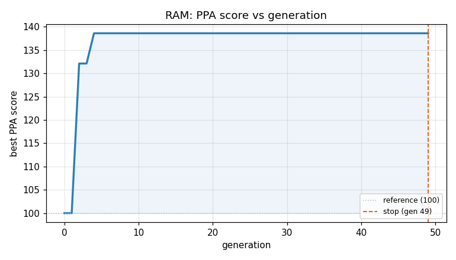
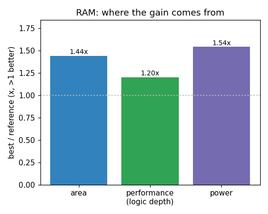

### `RAM`  —  category: Miscellaneous  —  best PPA **138.6** (area 1.44x · depth 1.20x · power 1.54x)

 

**Evolution path** — 3 edge(s) from the reference (gen 0, score 100) to the best (gen 4, score 138.6):

#### A — reference (gen 0, score 100.0)
The RTLLM golden reference; PPA baseline (area/depth/power = 1.00x).

#### A' — gen 2: `compact_dual_port_ram`  (score 132.1, +32.1; area 1.34x depth 1.20x power 1.43x)
_model: qwen3-235b-a22b-2507_

> The original design uses a RAM array with incorrect dimensions: it declares `reg [7:0] RAM [11:0]`, which implies 12 locations of 8-bit width, conflicting with the intended 8 locations of 6-bit width. Moreover, the address buses are unnecessarily wide: `write_addr` and `read_addr` are 8-bit, but with DEPTH=8, only 3 bits are needed. This wastes routing resources and increases area and power.

Impr

```diff
--- a/original.sv
+++ b/original.sv
@@ -1,38 +1,45 @@
 // EVOLVE-BLOCK-START
 module RAM (
 	input clk,
 	input rst_n,
 	
 	input write_en,
-	input [7:0]write_addr,
-	input [5:0]write_data,
+	input [2:0] write_addr,  // Reduced from 8-bit to 3-bit (DEPTH=8)
+	input [5:0] write_data,
 	
 	input read_en,
-	input [7:0]read_addr,
-	output reg [5:0]read_data
+	input [2:0] read_addr,   // Reduced from 8-bit to 3-bit
+	output reg [5:0] read_data
 );
     
-    //defination
-    reg [7 : 0] RAM [11:0];
+    // Corrected RAM definition: 8 locations, 6 bits each
+    reg [5:0] RAM [7:0];
+    integer i;
 
-    //output 
-    integer i;
-    always@(posedge clk or negedge rst_n)begin
-        if(!rst_n) begin
-               for(i = 0; i < 8; i = i + 1) begin
-                   RAM[i] <= 'd0;
-               end
+    // Write operation with reset
+    always @(posedge clk or negedge rst_n) begin
+        if (!rst_n) begin
+            for (i = 0; i < 8; i = i + 1) begin
+                RAM[i] <= 6'd0;
+            end
         end
-        else if(write_en) 
+        else if (write_en) begin
             RAM[write_addr] <= write_data;
+        end
     end
-    always@(posedge clk or negedge rst_n)begin
-        if(!rst_n) 
-            read_data <= 'd0;
-        else if(read_en) 
+
+    // Read operation with reset
+    always @(posedge clk or negedge rst_n) begin
+        if (!rst_n) begin
+            read_data <= 6'd0;
+        end
+        else if (read_en) begin
             read_data <= RAM[read_addr];
-        else 
-            read_data <= 'd0;
... (diff truncated)
```

#### A'' — gen 3: `ram_optimized_3bit`  (score 132.1, +0.0; area 1.34x depth 1.20x power 1.43x)
_model: deepseek-v4-flash_

> The current program already has the correct optimization of reducing address widths from 8-bit to 3-bit (since DEPTH=8, only 3 bits are needed) and correcting the RAM array dimensions. The crossover inspiration program has the same structure but with incorrect widths. The current program is already optimal for this simple dual-port RAM. The key improvement was made in the current program: proper b


#### A''' — gen 4: `ram_optimized_async_read`  (score 138.6, +6.5; area 1.44x depth 1.20x power 1.54x)
_model: deepseek-v4-flash_

> The current implementation uses a synchronous read that adds unnecessary flops and logic depth. By switching to an asynchronous read (combinational output) while keeping the registered write, we can eliminate the read_data register entirely, reducing area, depth, and power. The reset condition for read_data is handled by the combinational logic: when read_en=0, output is 0; when read_en=1, output 

```diff
--- a/original.sv
+++ b/original.sv
@@ -1,45 +1,43 @@
 // EVOLVE-BLOCK-START
 module RAM (
 	input clk,
 	input rst_n,
 	
 	input write_en,
 	input [2:0] write_addr,  // Reduced from 8-bit to 3-bit (DEPTH=8)
 	input [5:0] write_data,
 	
 	input read_en,
 	input [2:0] read_addr,   // Reduced from 8-bit to 3-bit
 	output reg [5:0] read_data
 );
     
-    // Corrected RAM definition: 8 locations, 6 bits each
+    // RAM array: 8 locations, 6 bits each
     reg [5:0] RAM [7:0];
     integer i;
 
-    // Write operation with reset
+    // Write operation with synchronous reset
     always @(posedge clk or negedge rst_n) begin
         if (!rst_n) begin
             for (i = 0; i < 8; i = i + 1) begin
                 RAM[i] <= 6'd0;
             end
         end
         else if (write_en) begin
             RAM[write_addr] <= write_data;
         end
     end
 
-    // Read operation with reset
-    always @(posedge clk or negedge rst_n) begin
-        if (!rst_n) begin
-            read_data <= 6'd0;
-        end
-        else if (read_en) begin
-            read_data <= RAM[read_addr];
+    // Asynchronous read: combinational output
+    // When read_en=1, output RAM[read_addr]; else output 0
+    always @(*) begin
+        if (read_en) begin
+            read_data = RAM[read_addr];
         end
         else begin
-            read_data <= 6'd0;
+            read_data = 6'd0;
         end
     end
 
 endmodule
 // EVOLVE-BLOCK-END

```
