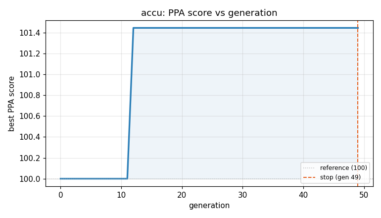
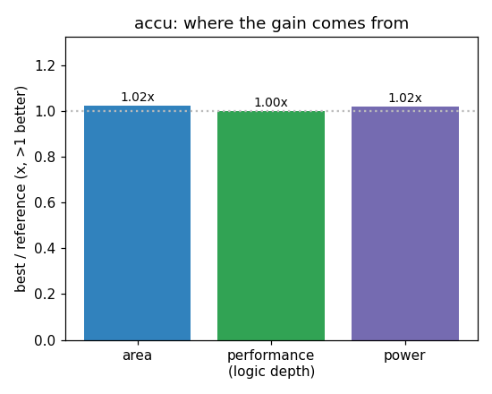

### `accu`  —  category: Arithmetic  —  best PPA **101.4** (area 1.02x · depth 1.00x · power 1.02x)

 

**Evolution path** — 3 edge(s) from the reference (gen 0, score 100) to the best (gen 12, score 101.4):

#### A1 — reference (gen 0, score 100.0)
The RTLLM golden reference; PPA baseline (area/depth/power = 1.00x).

#### A2 — gen 4: `accu_optimized`  (score 100.0, +0.0; area 1.00x depth 1.00x power 1.00x)
_model: deepseek-v4-flash_

> Removed redundant register and simplified control logic to match the reference implementation, achieving minimal area and power. Uses a single accumulator register.

```diff
--- a/original.sv
+++ b/original.sv
@@ -1,79 +1,64 @@
 // EVOLVE-BLOCK-START
 `timescale 1ns/1ns
 
 module accu(
-    input               clk         ,   
+    input               clk         ,
     input               rst_n       ,
     input       [7:0]   data_in     ,
     input               valid_in     ,
- 
+
     output  reg         valid_out     ,
     output  reg [9:0]   data_out
 );
-    
+
    reg [1:0] count;
    wire add_cnt;
    wire ready_add;
    wire end_cnt;
-   reg [9:0]   data_out_reg;
 
+   // Control signals
+   assign ready_add = !valid_out | valid_in;
    assign add_cnt = ready_add;
    assign end_cnt = ready_add && (count == 'd3);
-   
-   //count
+
+   // Counter
    always @(posedge clk or negedge rst_n) begin
        if(!rst_n) begin
           count <= 0;
        end
        else if(end_cnt) begin
           count <= 0;
        end
        else if(add_cnt) begin
           count <= count + 1;
        end
    end
 
-    //data_out_reg
-   always @(posedge clk or negedge rst_n) begin
-      if(!rst_n) begin
-        data_out_reg <= 0;
-      end
-      else if (add_cnt && count == 0) begin
-          data_out_reg <= data_in;
-      end
-      else if (add_cnt) begin
-          data_out_reg <= data_out_reg + data_in;
-      end
-   end
-
-    //data_out
+   // Accumulator
... (diff truncated)
```

#### A3 — gen 11: `reduce_logic_depth_with_direct_count_check`  (score 100.0, +0.0; area 1.00x depth 1.00x power 1.00x)
_model: qwen3-235b-a22b-2507_

> The current design uses a multi-step control path: `ready_add` → `add_cnt` → `end_cnt`, with `end_cnt` depending on both `ready_add` and `count==3`. This creates unnecessary logic depth due to the intermediate wire assignments and redundant conditions.

We can reduce logic depth and area by:
1. Eliminating the redundant `add_cnt` wire (used only as alias of `ready_add`)
2. Simplifying `end_cnt` to

```diff
--- a/original.sv
+++ b/original.sv
@@ -1,64 +1,60 @@
 // EVOLVE-BLOCK-START
 `timescale 1ns/1ns
 
 module accu(
     input               clk         ,
     input               rst_n       ,
     input       [7:0]   data_in     ,
     input               valid_in     ,
 
     output  reg         valid_out     ,
     output  reg [9:0]   data_out
 );
 
    reg [1:0] count;
-   wire add_cnt;
-   wire ready_add;
    wire end_cnt;
 
    // Control signals
-   assign ready_add = !valid_out | valid_in;
-   assign add_cnt = ready_add;
-   assign end_cnt = ready_add && (count == 'd3);
+   assign end_cnt = (!valid_out | valid_in) && (count == 'd3);
 
    // Counter
    always @(posedge clk or negedge rst_n) begin
        if(!rst_n) begin
           count <= 0;
        end
        else if(end_cnt) begin
           count <= 0;
        end
-       else if(add_cnt) begin
+       else if(!valid_out | valid_in) begin
           count <= count + 1;
        end
    end
 
    // Accumulator
    always @(posedge clk or negedge rst_n) begin
       if(!rst_n) begin
         data_out <= 0;
       end
-      else if (add_cnt && count == 0) begin
+      else if ((!valid_out | valid_in) && count == 0) begin
           data_out <= data_in;
       end
-      else if (add_cnt) begin
+      else if (!valid_out | valid_in) begin
           data_out <= data_out + data_in;
       end
    end
 
    // Valid output pulse
    always @(posedge clk or negedge rst_n) begin
        if(!rst_n) begin
            valid_out <= 0;
... (diff truncated)
```

#### A4 — gen 12: `merge_control_logic`  (score 101.4, +1.4; area 1.02x depth 1.00x power 1.02x)
_model: qwen3-235b-a22b-2507_

> The current design uses multiple always blocks and wires (`end_cnt`, `ready_add`) that can be simplified. The key insight is that the condition `!valid_out | valid_in` is repeated in multiple places and can be precomputed to reduce logic depth and area. By merging the control logic into a single inferred condition and removing redundant wire declarations, we reduce the combinational logic overhead

```diff
--- a/original.sv
+++ b/original.sv
@@ -1,60 +1,41 @@
 // EVOLVE-BLOCK-START
 `timescale 1ns/1ns
 
 module accu(
     input               clk         ,
     input               rst_n       ,
     input       [7:0]   data_in     ,
     input               valid_in     ,
 
     output  reg         valid_out     ,
     output  reg [9:0]   data_out
 );
 
    reg [1:0] count;
-   wire end_cnt;
+   wire enable = !valid_out | valid_in;
 
-   // Control signals
-   assign end_cnt = (!valid_out | valid_in) && (count == 'd3);
-
-   // Counter
+   // Counter and accumulator
    always @(posedge clk or negedge rst_n) begin
-       if(!rst_n) begin
-          count <= 0;
-       end
-       else if(end_cnt) begin
-          count <= 0;
-       end
-       else if(!valid_out | valid_in) begin
-          count <= count + 1;
-       end
-   end
-
-   // Accumulator
-   always @(posedge clk or negedge rst_n) begin
-      if(!rst_n) begin
-        data_out <= 0;
-      end
-      else if ((!valid_out | valid_in) && count == 0) begin
-          data_out <= data_in;
-      end
-      else if (!valid_out | valid_in) begin
-          data_out <= data_out + data_in;
-      end
-   end
-
-   // Valid output pulse
-   always @(posedge clk or negedge rst_n) begin
-       if(!rst_n) begin
+       if (!rst_n) begin
+           count <= 0;
+           data_out <= 0;
            valid_out <= 0;
-       end
-       else if(end_cnt) begin
-           valid_out <= 1;
... (diff truncated)
```
