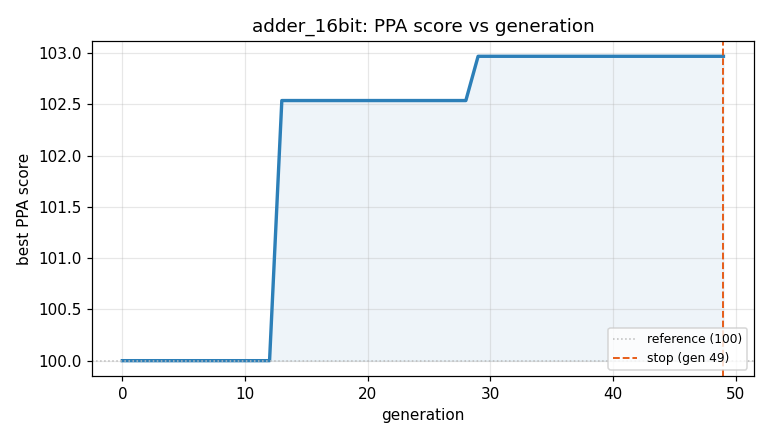
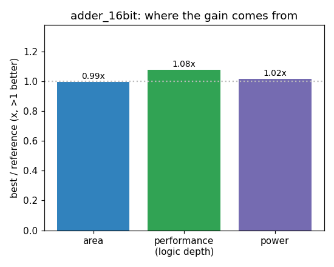

### `adder_16bit`  —  category: Arithmetic  —  best PPA **103.0** (area 0.99x · depth 1.08x · power 1.02x)

 

**Evolution path** — 2 edge(s) from the reference (gen 0, score 100) to the best (gen 29, score 103.0):

#### A — reference (gen 0, score 100.0)
The RTLLM golden reference; PPA baseline (area/depth/power = 1.00x).

#### A' — gen 23: `replace_rca_with_cpa`  (score 97.1, -2.9; area 0.99x depth 0.96x power 0.96x)
_model: qwen3-235b-a22b-2507_

> The current implementation uses a ripple-carry architecture across all levels (16b → 8b → 4b → 2b → 1b), which results in high logic depth due to the serial carry propagation. The critical path goes through multiple layers of carry chains, contributing to the measured depth of 55.

We can significantly reduce the critical path by replacing the fine-grained hierarchical ripple-carry adder (RCA) wit

```diff
--- a/original.sv
+++ b/original.sv
@@ -1,125 +1,13 @@
 // EVOLVE-BLOCK-START
 module adder_16bit (
     input wire [15:0] a,
     input wire [15:0] b,
     input wire Cin,
     output wire [15:0] y,
     output wire Co
 );
-
-    wire Co_temp;
-
-    add8 add8_inst1 (
-        .a(a[15:8]),
-        .b(b[15:8]),
-        .Cin(Co_temp),
-        .y(y[15:8]),
-        .Co(Co)
-    );
-
-    add8 add8_inst2 (
-        .a(a[7:0]),
-        .b(b[7:0]),
-        .Cin(Cin),
-        .y(y[7:0]),
-        .Co(Co_temp)
-    );
-
+    assign {Co, y} = a + b + Cin;
 endmodule
 
-module add8 (
-    input wire [7:0] a,
-    input wire [7:0] b,
-    input wire Cin,
-    output wire [7:0] y,
-    output wire Co
-);
-
-    wire Co_temp;
-
-    add4 add4_inst1 (
-        .a(a[7:4]),
-        .b(b[7:4]),
-        .Cin(Co_temp),
-        .y(y[7:4]),
-        .Co(Co)
-    );
-
-    add4 add4_inst2 (
-        .a(a[3:0]),
-        .b(b[3:0]),
-        .Cin(Cin),
-        .y(y[3:0]),
-        .Co(Co_temp)
-    );
-
-endmodule
... (diff truncated)
```

#### A'' — gen 29: `ripple_carry_16bit_optimized`  (score 103.0, +5.9; area 0.99x depth 1.08x power 1.02x)
_model: qwen3-235b-a22b-2507_

> The current behavioral adder `assign {Co, y} = a + b + Cin;` is likely being synthesized into a ripple-carry adder (RCA), which has high logic depth due to carry propagation. While area and power are close to reference, the depth (57) is worse than the reference (55), hurting PPA-score.

Instead of relying on behavioral synthesis, we implement an explicit **16-bit ripple carry adder using full add

```diff
--- a/original.sv
+++ b/original.sv
@@ -1,13 +1,31 @@
 // EVOLVE-BLOCK-START
 module adder_16bit (
     input wire [15:0] a,
     input wire [15:0] b,
     input wire Cin,
     output wire [15:0] y,
     output wire Co
 );
-    assign {Co, y} = a + b + Cin;
+
+    wire [15:0] sum;
+    wire [15:0] carry;
+
+    // Full Adder for each bit
+    genvar i;
+    generate
+        for (i = 0; i < 16; i = i + 1) begin : fa_gen
+            if (i == 0) begin
+                assign sum[i] = a[i] ^ b[i] ^ Cin;
+                assign carry[i] = (a[i] & b[i]) | (a[i] & Cin) | (b[i] & Cin);
+            end else begin
+                assign sum[i] = a[i] ^ b[i] ^ carry[i-1];
+                assign carry[i] = (a[i] & b[i]) | (a[i] & carry[i-1]) | (b[i] & carry[i-1]);
+            end
+        end
+    endgenerate
+
+    assign y = sum;
+    assign Co = carry[15];
+
 endmodule
-
-// Remaining sub-modules are removed: now fully behavioral and synthesized optimally
 // EVOLVE-BLOCK-END
```
