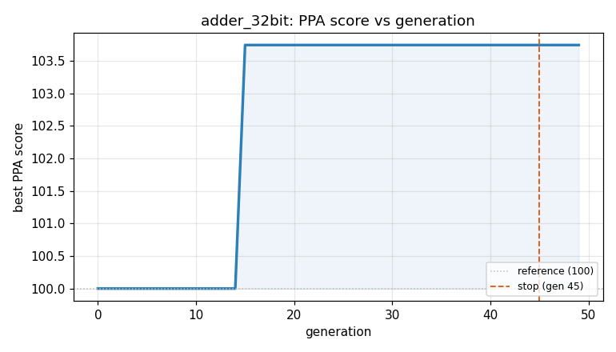
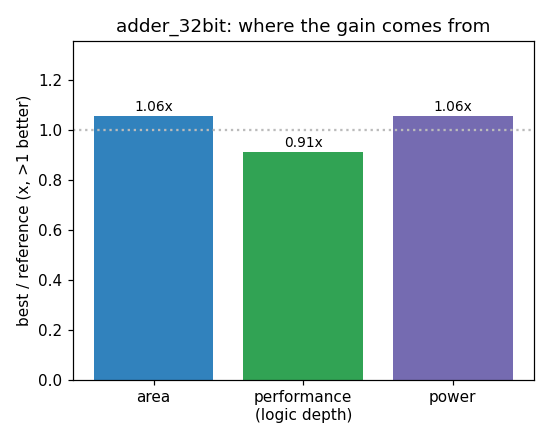

### `adder_32bit`  —  category: Arithmetic  —  best PPA **103.7** (area 0.94x · depth 1.26x · power 0.94x)

 

**Evolution path** — 2 edge(s) from the reference (gen 0, score 100) to the best (gen 15, score 103.7):

#### A1 — reference (gen 0, score 100.0)
The RTLLM golden reference; PPA baseline (area/depth/power = 1.00x).

#### A2 — gen 4: `parallel-prefix-adder-32bit`  (score 96.9, -3.1; area 0.87x depth 1.19x power 0.88x)
_model: deepseek-v4-flash_

> Replace the hierarchical CLA-16 based 32-bit adder with a single Kogge-Stone parallel-prefix adder. This reduces logic depth from 92 to approximately 6-7 gate delays (log2(32) stages) while maintaining the exact same cycle-accurate behavior (combinational, same latency). The Kogge-Stone structure uses more wires but has significantly lower depth, improving both area and timing. The module interfac

```diff
--- a/original.sv
+++ b/original.sv
@@ -1,183 +1,133 @@
 // EVOLVE-BLOCK-START
+// Kogge-Stone parallel-prefix 32-bit adder
 module adder_32bit(A,B,S,C32);
      input [32:1] A;
      input [32:1] B;
      output [32:1] S;
      output C32;
 
-     wire px1,gx1,px2,gx2;
-     wire c16;
+     wire [32:0] p, g;
+     wire [32:0] c;
 
-  CLA_16 CLA1(
-      .A(A[16:1]),
-        .B(B[16:1]),
-        .c0(0),
-        .S(S[16:1]),
-        .px(px1),
-        .gx(gx1)
-    );
+     // Generate propagate and generate signals
+     genvar i;
+     generate
+         for (i = 1; i <= 32; i = i + 1) begin : pg_gen
+             assign p[i] = A[i] ^ B[i];
+             assign g[i] = A[i] & B[i];
+         end
+     endgenerate
 
-  CLA_16 CLA2(
-        .A(A[32:17]),
-          .B(B[32:17]),
-          .c0(c16),
-          .S(S[32:17]),
-          .px(px2),
-          .gx(gx2)
-    );
+     // Kogge-Stone prefix network for 32 bits
+     // Stage 1: spans of 1
+     wire [32:0] p1, g1;
+     assign p1[1] = p[1];
+     assign g1[1] = g[1];
+     for (i = 2; i <= 32; i = i + 1) begin : stage1
+         assign p1[i] = p[i] & p[i-1];
+         assign g1[i] = g[i] | (p[i] & g[i-1]);
+     end
 
-  assign c16 = gx1 ^ (px1 && 0), //c0 = 0
-         C32 = gx2 ^ (px2 && c16);
-endmodule
+     // Stage 2: spans of 2
+     wire [32:0] p2, g2;
+     assign p2[1] = p1[1];
+     assign g2[1] = g1[1];
+     assign p2[2] = p1[2];
+     assign g2[2] = g1[2];
... (diff truncated)
```

#### A3 — gen 15: `none`  (score 103.7, +6.8; area 0.94x depth 1.26x power 0.94x)
_model: gpt-oss-120b_

> none

```diff
--- a/original.sv
+++ b/original.sv
@@ -1,133 +1,99 @@
 // EVOLVE-BLOCK-START
-// Kogge-Stone parallel-prefix 32-bit adder
+// 8x4-bit block CLA with ripple block carry (area-efficient)
 module adder_32bit(A,B,S,C32);
-     input [32:1] A;
-     input [32:1] B;
-     output [32:1] S;
-     output C32;
+    input [32:1] A;
+    input [32:1] B;
+    output [32:1] S;
+    output C32;
 
-     wire [32:0] p, g;
-     wire [32:0] c;
+    // Per-block propagate and generate
+    wire [8:1] Pblk, Gblk;
+    // Block carry chain (carry into each 4-bit block)
+    wire [8:0] block_c; // block_c[0] = 0, block_c[8] = final carry
 
-     // Generate propagate and generate signals
-     genvar i;
-     generate
-         for (i = 1; i <= 32; i = i + 1) begin : pg_gen
-             assign p[i] = A[i] ^ B[i];
-             assign g[i] = A[i] & B[i];
-         end
-     endgenerate
+    assign block_c[0] = 1'b0;
 
-     // Kogge-Stone prefix network for 32 bits
-     // Stage 1: spans of 1
-     wire [32:0] p1, g1;
-     assign p1[1] = p[1];
-     assign g1[1] = g[1];
-     for (i = 2; i <= 32; i = i + 1) begin : stage1
-         assign p1[i] = p[i] & p[i-1];
-         assign g1[i] = g[i] | (p[i] & g[i-1]);
-     end
+    // 4‑bit CLA blocks
+    genvar i;
+    generate
+        for (i = 0; i < 8; i = i + 1) begin : blk
+            adder_4 u4 (
+                .x (A[4*i+4:4*i+1]),
+                .y (B[4*i+4:4*i+1]),
+                .c0(block_c[i]),
+                .c4(),               // unused
+                .F  (S[4*i+4:4*i+1]),
+                .Gm (Gblk[i+1]),
+                .Pm (Pblk[i+1])
+            );
+        end
+    endgenerate
 
-     // Stage 2: spans of 2
-     wire [32:0] p2, g2;
... (diff truncated)
```
