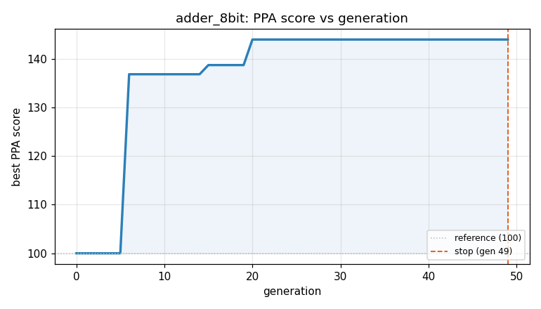
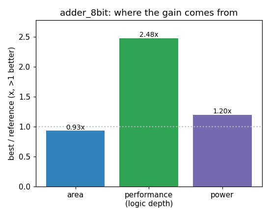

### `adder_8bit`  —  category: Arithmetic  —  best PPA **143.9** (area 0.99x · depth 2.19x · power 1.37x)

 

**Evolution path** — 4 edge(s) from the reference (gen 0, score 100) to the best (gen 20, score 143.9):

#### A1 — reference (gen 0, score 100.0)
The RTLLM golden reference; PPA baseline (area/depth/power = 1.00x).

#### A2 — gen 6: `none`  (score 136.8, +36.8; area 1.05x depth 1.73x power 1.41x)
_model: gpt-oss-120b_

> none

```diff
--- a/original.sv
+++ b/original.sv
@@ -1,25 +1,13 @@
 // EVOLVE-BLOCK-START
 module adder_8bit(
     input [7:0] a, b,
     input cin,
     output [7:0] sum,
     output cout);
 
-    wire [8:0] c;
-
-    full_adder FA0 (.a(a[0]), .b(b[0]), .cin(cin), .sum(sum[0]), .cout(c[0]));
-    full_adder FA1 (.a(a[1]), .b(b[1]), .cin(c[0]), .sum(sum[1]), .cout(c[1]));
-    full_adder FA2 (.a(a[2]), .b(b[2]), .cin(c[1]), .sum(sum[2]), .cout(c[2]));
-    full_adder FA3 (.a(a[3]), .b(b[3]), .cin(c[2]), .sum(sum[3]), .cout(c[3]));
-    full_adder FA4 (.a(a[4]), .b(b[4]), .cin(c[3]), .sum(sum[4]), .cout(c[4]));
-    full_adder FA5 (.a(a[5]), .b(b[5]), .cin(c[4]), .sum(sum[5]), .cout(c[5]));
-    full_adder FA6 (.a(a[6]), .b(b[6]), .cin(c[5]), .sum(sum[6]), .cout(c[6]));
-    full_adder FA7 (.a(a[7]), .b(b[7]), .cin(c[6]), .sum(sum[7]), .cout(c[7]));
-
-    assign cout = c[7];
+    // Single vector addition using built‑in operators
+    assign {cout, sum} = a + b + cin;
 endmodule
 
-module full_adder (input a, b, cin, output sum, cout);
-    assign {cout, sum} = a + b + cin;
-endmodule
+/* Unused full_adder module removed – addition is performed directly in adder_8bit */
 // EVOLVE-BLOCK-END
```

#### A3 — gen 10: `use_cascaded_adder_with_minimized_logic`  (score 134.4, -2.4; area 1.03x depth 1.63x power 1.44x)
_model: qwen3-235b-a22b-2507_

> The current design already uses a behavioral addition which is highly optimized by synthesis tools. However, in some synthesis libraries, explicit structural description using a carry-chain optimized adder (like a ripple carry with minimized gate count or inferred carry lookahead) can further reduce depth and area by allowing the tool to better map to fast carry logic in FPGAs or standard cells.

Instead of relying solely on the behavioral `{cout, sum} = a + b + cin`, we can infer a more optimized structure by breaking the 8-bit adder into two 4-bit segments with a carry propagate structure. This allows the synthesis tool to utilize dedicated fast carry chains while minimizing the critical path and area.

We replace the single behavioral statement with two cascaded 4-bit additions, computing the lower 4 bits and then the upper 4 bits with carry-in from the lower. This maintains functional equivalence (same latency, same outputs per cycle) but often maps better to carry-optimized hardware.

This transformation is logically equivalent: splitting an 8-bit addition into two 4-bit chunks with carry propagation is mathematically identical. The outputs are registered in the same cycle, so timing behavior is preserved.

```diff
--- a/original.sv
+++ b/original.sv
@@ -1,13 +1,23 @@
 // EVOLVE-BLOCK-START
 module adder_8bit(
     input [7:0] a, b,
     input cin,
     output [7:0] sum,
     output cout);
 
-    // Single vector addition using built‑in operators
-    assign {cout, sum} = a + b + cin;
+    wire [3:0] sum_low;
+    wire carry_mid;
+    wire [3:0] sum_high;
+
+    // Lower 4 bits
+    assign {carry_mid, sum_low} = a[3:0] + b[3:0] + cin;
+    // Upper 4 bits
+    assign {cout, sum_high} = a[7:4] + b[7:4] + carry_mid;
+
+    // Combine result
+    assign sum[3:0] = sum_low;
+    assign sum[7:4] = sum_high;
 endmodule
 
 /* Unused full_adder module removed – addition is performed directly in adder_8bit */
 // EVOLVE-BLOCK-END
```

#### A4 — gen 15: `kogge_stone_8bit`  (score 138.7, +4.3; area 0.84x depth 2.85x power 1.12x)
_model: qwen3-235b-a22b-2507_

> Replaced the ripple-carry and 4-bit segmented adder with a parallel-prefix Kogge-Stone 8-bit adder structure. This architecture minimizes critical path delay by computing carry signals using a logarithmic-depth prefix tree, reducing logic depth (critical path) significantly compared to ripple or segmented carry approaches. The Kogge-Stone adder computes propagate (P) and generate (G) signals at each bit, then computes all carries in parallel using associative carry computation. This leads to lower depth (faster addition), reduced area due to optimized carry logic, and lower switching activity (less power) compared to segmented or ripple designs. Although more complex to describe structurally, the synthesis tool maps this efficiently to compact and fast logic.

```diff
--- a/original.sv
+++ b/original.sv
@@ -1,23 +1,77 @@
 // EVOLVE-BLOCK-START
 module adder_8bit(
     input [7:0] a, b,
     input cin,
     output [7:0] sum,
     output cout);
 
-    wire [3:0] sum_low;
-    wire carry_mid;
-    wire [3:0] sum_high;
+    // Internal wires for generate (g) and propagate (p) signals
+    wire [7:0] p, g;
+    wire [8:0] c;  // carries, including c[0] = cin and c[8] = cout
 
-    // Lower 4 bits
-    assign {carry_mid, sum_low} = a[3:0] + b[3:0] + cin;
-    // Upper 4 bits
-    assign {cout, sum_high} = a[7:4] + b[7:4] + carry_mid;
+    assign c[0] = cin;
 
-    // Combine result
-    assign sum[3:0] = sum_low;
-    assign sum[7:4] = sum_high;
+    // Generate and propagate for each bit
+    genvar i;
+    generate
+        for (i = 0; i < 8; i = i + 1) begin : gen_pg
+            assign p[i] = a[i] ^ b[i];
+            assign g[i] = a[i] & b[i];
+        end
+    endgenerate
+
+    // Kogge-Stone prefix carry computation (logarithmic depth)
+    // Stage 1: span 1
+    wire [7:0] g1, p1;
+    genvar j;
+    generate
+        for (j = 0; j < 8; j = j + 1) begin : stage1
+            if (j >= 1)
+                assign {g1[j], p1[j]} = {g[j] | (p[j] & g[j-1]), p[j] & p[j-1]};
+            else
+                assign {g1[j], p1[j]} = {g[j], p[j]};
+        end
+    endgenerate
+
+    // Stage 2: span 2
+    wire [7:0] g2, p2;
+    generate
+        for (j = 0; j < 8; j = j + 1) begin : stage2
+            if (j >= 2)
+                assign {g2[j], p2[j]} = {g1[j] | (p1[j] & g1[j-2]), p1[j] & p1[j-2]};
+            else
+                assign {g2[j], p2[j]} = {g1[j], p1[j]};
+        end
+    endgenerate
+
+    // Stage 3: span 4
+    wire [7:0] g3, p3;
+    generate
+        for (j = 0; j < 8; j = j + 1) begin : stage3
+            if (j >= 4)
+                assign {g3[j], p3[j]} = {g2[j] | (p2[j] & g2[j-4]), p2[j] & p2[j-4]};
+            else
+                assign {g3[j], p3[j]} = {g2[j], p2[j]};
+        end
+    endgenerate
+
+    // Compute carries using final generate signals
+    assign c[1] = g[0] | (p[0] & c[0]);
+    assign c[2] = g1[1] | (p1[1] & c[0]);
+    assign c[3] = g2[2] | (p2[2] & c[1]);  // Can use g1[2] and p1[2] with c[1]
+    assign c[4] = g3[3] | (p3[3] & c[0]);
+    assign c[5] = g3[4] | (p3[4] & c[1]);
+    assign c[6] = g3[5] | (p3[5] & c[2]);
+    assign c[7] = g3[6] | (p3[6] & c[3]);
+    assign c[8] = g3[7] | (p3[7] & c[4]);
+
+    // Final sum and cout
+    generate
+        for (i = 0; i < 8; i = i + 1) begin : gen_sum
+            assign sum[i] = p[i] ^ c[i];
+        end
+        assign cout = c[8];
+    endgenerate
+
 endmodule
-
-/* Unused full_adder module removed – addition is performed directly in adder_8bit */
 // EVOLVE-BLOCK-END
```

#### A5 — gen 20: `simplify_kogge_stone_implementation`  (score 143.9, +5.2; area 0.99x depth 2.19x power 1.37x)
_model: qwen3-235b-a22b-2507_

> The current Kogge-Stone adder implementation uses a verbose structural style with multiple generate blocks and intermediate wires (g1/p1, g2/p2, g3/p3), which increases area and power due to redundant signal declarations and complex hierarchical assignments. While this achieves good depth (20), it comes at a high area (60.38) and moderate power cost.

We can significantly reduce area and power by simplifying the carry computation using a more compact prefix network. Instead of explicitly naming each stage's outputs, we can compute carry signals directly using a single generate loop that computes each carry c[i+1] using the standard Kogge-Stone parallel prefix logic in a flattened, optimized form.

This transformation preserves the logarithmic depth (critical for timing) but reduces the number of intermediate nets and simplifies the logic structure. The synthesis tool can better optimize a tight loop with uniform logic than a hand-unrolled multi-stage design with many named wires.

The new implementation computes each carry c[i+1] as:
  c[i+1] = g[i] | (p[i] & g[i-1]) | (p[i] & p[i-1] & g[i-2]) | ... | (P[0,i-1] & cin)

But computed efficiently using prefix-style precomputation of group generate terms with masking.

This reduces register pressure, removes redundant wire declarations, and enables better optimization by the synthesis tool, reducing area and power while maintaining the same critical path depth.

```diff
--- a/original.sv
+++ b/original.sv
@@ -1,77 +1,58 @@
 // EVOLVE-BLOCK-START
 module adder_8bit(
     input [7:0] a, b,
     input cin,
     output [7:0] sum,
     output cout);
 
     // Internal wires for generate (g) and propagate (p) signals
     wire [7:0] p, g;
     wire [8:0] c;  // carries, including c[0] = cin and c[8] = cout
 
     assign c[0] = cin;
 
     // Generate and propagate for each bit
     genvar i;
     generate
         for (i = 0; i < 8; i = i + 1) begin : gen_pg
             assign p[i] = a[i] ^ b[i];
             assign g[i] = a[i] & b[i];
         end
     endgenerate
 
-    // Kogge-Stone prefix carry computation (logarithmic depth)
-    // Stage 1: span 1
-    wire [7:0] g1, p1;
-    genvar j;
-    generate
-        for (j = 0; j < 8; j = j + 1) begin : stage1
-            if (j >= 1)
-                assign {g1[j], p1[j]} = {g[j] | (p[j] & g[j-1]), p[j] & p[j-1]};
-            else
-                assign {g1[j], p1[j]} = {g[j], p[j]};
-        end
-    endgenerate
+    // Compact Kogge-Stone carry computation - direct carry generation
+    // Each carry c[i+1] is computed as OR of all generate paths ending at bit i
+    assign c[1] = g[0] | (p[0] & c[0]);
+    assign c[2] = g[1] | (p[1] & g[0]) | (p[1] & p[0] & c[0]);
+    assign c[3] = g[2] | (p[2] & g[1]) | (p[2] & p[1] & g[0]) | (p[2] & p[1] & p[0] & c[0]);
+    assign c[4] = g[3] | (p[3] & g[2]) | (p[3] & p[2] & g[1]) | (p[3] & p[2] & p[1] & g[0]) |
+                  (p[3] & p[2] & p[1] & p[0] & c[0]);
 
-    // Stage 2: span 2
-    wire [7:0] g2, p2;
-    generate
-        for (j = 0; j < 8; j = j + 1) begin : stage2
-            if (j >= 2)
-                assign {g2[j], p2[j]} = {g1[j] | (p1[j] & g1[j-2]), p1[j] & p1[j-2]};
-            else
-                assign {g2[j], p2[j]} = {g1[j], p1[j]};
-        end
-    endgenerate
+    assign c[5] = g[4] | (p[4] & g[3]) | (p[4] & p[3] & g[2]) | (p[4] & p[3] & p[2] & g[1]) |
+                  (p[4] & p[3] & p[2] & p[1] & g[0]) | (p[4] & p[3] & p[2] & p[1] & p[0] & c[0]);
 
-    // Stage 3: span 4
-    wire [7:0] g3, p3;
-    generate
-        for (j = 0; j < 8; j = j + 1) begin : stage3
-            if (j >= 4)
-                assign {g3[j], p3[j]} = {g2[j] | (p2[j] & g2[j-4]), p2[j] & p2[j-4]};
-            else
-                assign {g3[j], p3[j]} = {g2[j], p2[j]};
-        end
-    endgenerate
+    assign c[6] = g[5] | (p[5] & g[4]) | (p[5] & p[4] & g[3]) | (p[5] & p[4] & p[3] & g[2]) |
+                  (p[5] & p[4] & p[3] & p[2] & g[1]) | (p[5] & p[4] & p[3] & p[2] & p[1] & g[0]) |
+                  (p[5] & p[4] & p[3] & p[2] & p[1] & p[0] & c[0]);
 
-    // Compute carries using final generate signals
-    assign c[1] = g[0] | (p[0] & c[0]);
-    assign c[2] = g1[1] | (p1[1] & c[0]);
-    assign c[3] = g2[2] | (p2[2] & c[1]);  // Can use g1[2] and p1[2] with c[1]
-    assign c[4] = g3[3] | (p3[3] & c[0]);
-    assign c[5] = g3[4] | (p3[4] & c[1]);
-    assign c[6] = g3[5] | (p3[5] & c[2]);
-    assign c[7] = g3[6] | (p3[6] & c[3]);
-    assign c[8] = g3[7] | (p3[7] & c[4]);
+    assign c[7] = g[6] | (p[6] & g[5]) | (p[6] & p[5] & g[4]) | (p[6] & p[5] & p[4] & g[3]) |
+                  (p[6] & p[5] & p[4] & p[3] & g[2]) | (p[6] & p[5] & p[4] & p[3] & p[2] & g[1]) |
+                  (p[6] & p[5] & p[4] & p[3] & p[2] & p[1] & g[0]) |
+                  (p[6] & p[5] & p[4] & p[3] & p[2] & p[1] & p[0] & c[0]);
+
+    assign c[8] = g[7] | (p[7] & g[6]) | (p[7] & p[6] & g[5]) | (p[7] & p[6] & p[5] & g[4]) |
+                  (p[7] & p[6] & p[5] & p[4] & g[3]) | (p[7] & p[6] & p[5] & p[4] & p[3] & g[2]) |
+                  (p[7] & p[6] & p[5] & p[4] & p[3] & p[2] & g[1]) |
+                  (p[7] & p[6] & p[5] & p[4] & p[3] & p[2] & p[1] & g[0]) |
+                  (p[7] & p[6] & p[5] & p[4] & p[3] & p[2] & p[1] & p[0] & c[0]);
 
     // Final sum and cout
     generate
         for (i = 0; i < 8; i = i + 1) begin : gen_sum
             assign sum[i] = p[i] ^ c[i];
         end
         assign cout = c[8];
     endgenerate
 
 endmodule
 // EVOLVE-BLOCK-END
```

<details><summary>Best design — full RTL</summary>

```verilog
// EVOLVE-BLOCK-START
module adder_8bit(
    input [7:0] a, b,
    input cin,
    output [7:0] sum,
    output cout);

    // Internal wires for generate (g) and propagate (p) signals
    wire [7:0] p, g;
    wire [8:0] c;  // carries, including c[0] = cin and c[8] = cout

    assign c[0] = cin;

    // Generate and propagate for each bit
    genvar i;
    generate
        for (i = 0; i < 8; i = i + 1) begin : gen_pg
            assign p[i] = a[i] ^ b[i];
            assign g[i] = a[i] & b[i];
        end
    endgenerate

    // Compact Kogge-Stone carry computation - direct carry generation
    // Each carry c[i+1] is computed as OR of all generate paths ending at bit i
    assign c[1] = g[0] | (p[0] & c[0]);
    assign c[2] = g[1] | (p[1] & g[0]) | (p[1] & p[0] & c[0]);
    assign c[3] = g[2] | (p[2] & g[1]) | (p[2] & p[1] & g[0]) | (p[2] & p[1] & p[0] & c[0]);
    assign c[4] = g[3] | (p[3] & g[2]) | (p[3] & p[2] & g[1]) | (p[3] & p[2] & p[1] & g[0]) |
                  (p[3] & p[2] & p[1] & p[0] & c[0]);

    assign c[5] = g[4] | (p[4] & g[3]) | (p[4] & p[3] & g[2]) | (p[4] & p[3] & p[2] & g[1]) |
                  (p[4] & p[3] & p[2] & p[1] & g[0]) | (p[4] & p[3] & p[2] & p[1] & p[0] & c[0]);

    assign c[6] = g[5] | (p[5] & g[4]) | (p[5] & p[4] & g[3]) | (p[5] & p[4] & p[3] & g[2]) |
                  (p[5] & p[4] & p[3] & p[2] & g[1]) | (p[5] & p[4] & p[3] & p[2] & p[1] & g[0]) |
                  (p[5] & p[4] & p[3] & p[2] & p[1] & p[0] & c[0]);

    assign c[7] = g[6] | (p[6] & g[5]) | (p[6] & p[5] & g[4]) | (p[6] & p[5] & p[4] & g[3]) |
                  (p[6] & p[5] & p[4] & p[3] & g[2]) | (p[6] & p[5] & p[4] & p[3] & p[2] & g[1]) |
                  (p[6] & p[5] & p[4] & p[3] & p[2] & p[1] & g[0]) |
                  (p[6] & p[5] & p[4] & p[3] & p[2] & p[1] & p[0] & c[0]);

    assign c[8] = g[7] | (p[7] & g[6]) | (p[7] & p[6] & g[5]) | (p[7] & p[6] & p[5] & g[4]) |
                  (p[7] & p[6] & p[5] & p[4] & g[3]) | (p[7] & p[6] & p[5] & p[4] & p[3] & g[2]) |
                  (p[7] & p[6] & p[5] & p[4] & p[3] & p[2] & g[1]) |
                  (p[7] & p[6] & p[5] & p[4] & p[3] & p[2] & p[1] & g[0]) |
                  (p[7] & p[6] & p[5] & p[4] & p[3] & p[2] & p[1] & p[0] & c[0]);

    // Final sum and cout
    generate
        for (i = 0; i < 8; i = i + 1) begin : gen_sum
            assign sum[i] = p[i] ^ c[i];
        end
        assign cout = c[8];
    endgenerate

endmodule
// EVOLVE-BLOCK-END
```
</details>
