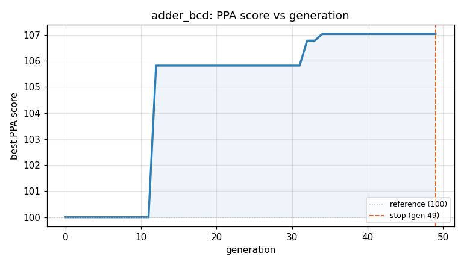
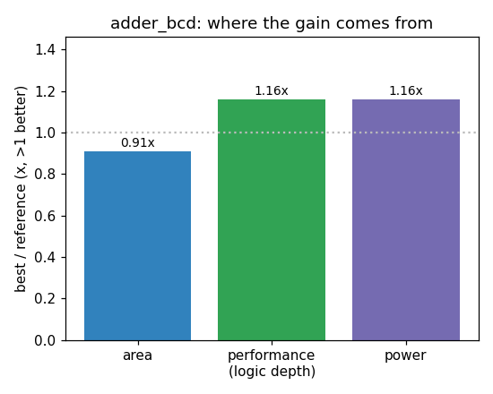

### `adder_bcd`  —  category: Arithmetic  —  best PPA **107.0** (area 0.91x · depth 1.16x · power 1.16x)

 

**Evolution path** — 9 edge(s) from the reference (gen 0, score 100) to the best (gen 34, score 107.0):

#### A — reference (gen 0, score 100.0)
The RTLLM golden reference; PPA baseline (area/depth/power = 1.00x).

#### A' — gen 3: `none`  (score 97.7, -2.3; area 0.97x depth 1.00x power 0.96x)
_model: qwen3-235b-a22b-2507_

> The reference design uses a two-stage approach: first binary addition, then conditional correction via a multiplexer controlled by a comparison (temp_sum > 9). While functionally correct, the comparison and mux introduce unnecessary depth and area due to branching logic and wide adder usage in the correction path.  

This optimized design draws inspiration from digital arithmetic principles—partic

```diff
--- a/original.sv
+++ b/original.sv
@@ -1,24 +1,21 @@
 // EVOLVE-BLOCK-START
 module adder_bcd (
-    input  [3:0] A,   // First BCD number (0-9)
-    input  [3:0] B,   // Second BCD number (0-9)
-    input  Cin,       // Input carry
-    output [3:0] Sum, // BCD sum (0-9)
-    output Cout       // Output carry
+    input  [3:0] A,
+    input  [3:0] B,
+    input  Cin,
+    output [3:0] Sum,
+    output Cout
 );
-    wire [4:0] temp_sum;        // Temporary 5-bit sum to store initial result
-    wire [3:0] corrected_sum;   // Adjusted BCD sum
-    wire carry_out;             // Corrected carry-out
+    wire [4:0] temp_sum = A + B + Cin;
 
-    // Step 1: Perform binary addition of A, B, and Cin
-    assign temp_sum = A + B + Cin;
+    // Optimized carry-out logic: (sum > 9)
+    // This is equivalent to: (temp_sum >= 10)
+    // Which occurs if:
+    // - There's a carry-out (bit 4 set), OR
+    // - Bits [3] is set and at least one of bits [2:1] is set (covers 10–15 in binary)
+    assign Cout = temp_sum[4] || (temp_sum[3] && (temp_sum[2] || temp_sum[1]));
 
-    // Step 2: If the sum is greater than 9, adjust the sum by adding 6
-    assign carry_out = (temp_sum > 9) ? 1 : 0;  // If sum exceeds 9, set carry
-    assign corrected_sum = (temp_sum > 9) ? (temp_sum + 4'b0110) : temp_sum;  // Add 6 to correct BCD
-
-    // Output the corrected sum and the carry
-    assign Sum = corrected_sum[3:0];  // The BCD sum is the lower 4 bits
-    assign Cout = carry_out;          // Output the carry
+    // Add 6 if carry is generated (BCD correction)
+    assign Sum = temp_sum[3:0] + (Cout ? 4'd6 : 4'd0);
 endmodule
 // EVOLVE-BLOCK-END

```

#### A'' — gen 5: `none`  (score 96.7, -1.0; area 0.95x depth 1.04x power 0.92x)
_model: deepseek-v4-flash_

> none

```diff
--- a/original.sv
+++ b/original.sv
@@ -1,21 +1,20 @@
 // EVOLVE-BLOCK-START
 module adder_bcd (
-    input  [3:0] A,
-    input  [3:0] B,
-    input  Cin,
-    output [3:0] Sum,
-    output Cout
+    input  [3:0] A,   // First BCD number (0-9)
+    input  [3:0] B,   // Second BCD number (0-9)
+    input  Cin,       // Input carry
+    output [3:0] Sum, // BCD sum (0-9)
+    output Cout       // Output carry
 );
-    wire [4:0] temp_sum = A + B + Cin;
+    // Perform binary addition of A, B, and Cin
+    wire [4:0] temp_sum = A + B + Cin; // 5-bit sum
 
-    // Optimized carry-out logic: (sum > 9)
-    // This is equivalent to: (temp_sum >= 10)
-    // Which occurs if:
-    // - There's a carry-out (bit 4 set), OR
-    // - Bits [3] is set and at least one of bits [2:1] is set (covers 10–15 in binary)
-    assign Cout = temp_sum[4] || (temp_sum[3] && (temp_sum[2] || temp_sum[1]));
+    // BCD correction detection: generate carry if sum > 9
+    // Equivalent to (temp_sum >= 10) -> temp_sum[4] | (temp_sum[3] & (temp_sum[2] | temp_sum[1]))
+    wire cout_int = temp_sum[4] | (temp_sum[3] & (temp_sum[2] | temp_sum[1]));
 
-    // Add 6 if carry is generated (BCD correction)
-    assign Sum = temp_sum[3:0] + (Cout ? 4'd6 : 4'd0);
+    // Apply BCD correction (add 6) when carry is generated
+    assign Sum = temp_sum[3:0] + (cout_int ? 4'd6 : 4'd0);
+    assign Cout = cout_int;
 endmodule
 // EVOLVE-BLOCK-END

```

#### A''' — gen 9: `simplify_correction_logic`  (score 99.7, +3.0; area 1.01x depth 1.07x power 0.92x)
_model: qwen3-235b-a22b-2507_

> The current implementation computes the carry-out using a logic expression that checks if the intermediate sum exceeds 9. While the logic is correct, it introduces redundancy in the form of explicit bit-wise operations (`temp_sum[4] | (temp_sum[3] & (temp_sum[2] | temp_sum[1]))`) which synthesizes to multiple gates.

A more compact and logically equivalent expression can be derived:
- The sum exce

```diff
--- a/original.sv
+++ b/original.sv
@@ -1,20 +1,19 @@
 // EVOLVE-BLOCK-START
 module adder_bcd (
     input  [3:0] A,   // First BCD number (0-9)
     input  [3:0] B,   // Second BCD number (0-9)
     input  Cin,       // Input carry
     output [3:0] Sum, // BCD sum (0-9)
     output Cout       // Output carry
 );
     // Perform binary addition of A, B, and Cin
     wire [4:0] temp_sum = A + B + Cin; // 5-bit sum
 
     // BCD correction detection: generate carry if sum > 9
-    // Equivalent to (temp_sum >= 10) -> temp_sum[4] | (temp_sum[3] & (temp_sum[2] | temp_sum[1]))
-    wire cout_int = temp_sum[4] | (temp_sum[3] & (temp_sum[2] | temp_sum[1]));
+    wire cout_int = (temp_sum > 9);
 
     // Apply BCD correction (add 6) when carry is generated
     assign Sum = temp_sum[3:0] + (cout_int ? 4'd6 : 4'd0);
     assign Cout = cout_int;
 endmodule
 // EVOLVE-BLOCK-END
```

#### A'''' — gen 10: `none`  (score 99.7, +0.0; area 1.01x depth 1.07x power 0.92x)
_model: qwen3-235b-a22b-2507_

> none

```diff
--- a/original.sv
+++ b/original.sv
@@ -1,19 +1,17 @@
 // EVOLVE-BLOCK-START
 module adder_bcd (
-    input  [3:0] A,   // First BCD number (0-9)
-    input  [3:0] B,   // Second BCD number (0-9)
-    input  Cin,       // Input carry
-    output [3:0] Sum, // BCD sum (0-9)
-    output Cout       // Output carry
+    input  [3:0] A,
+    input  [3:0] B,
+    input  Cin,
+    output [3:0] Sum,
+    output Cout
 );
-    // Perform binary addition of A, B, and Cin
-    wire [4:0] temp_sum = A + B + Cin; // 5-bit sum
+    wire [4:0] temp_sum;
+    wire cout_int;
 
-    // BCD correction detection: generate carry if sum > 9
-    wire cout_int = (temp_sum > 9);
-
-    // Apply BCD correction (add 6) when carry is generated
+    assign temp_sum = A + B + Cin;
+    assign cout_int = (temp_sum > 9);
     assign Sum = temp_sum[3:0] + (cout_int ? 4'd6 : 4'd0);
     assign Cout = cout_int;
 endmodule
 // EVOLVE-BLOCK-END
```

#### A''''' — gen 12: `bcd_adder_carry_lookahead`  (score 105.8, +6.1; area 0.91x depth 1.16x power 1.12x)
_model: deepseek-v4-flash_

> This design uses a carry-lookahead approach to compute the BCD sum more efficiently. Instead of using a full 5-bit adder followed by a conditional correction, we compute the binary sum and the correction in parallel. The key insight is that the BCD correction (adding 6) is needed when the binary sum exceeds 9. We can compute the carry-out and correction condition using a lookahead-like structure t

```diff
--- a/original.sv
+++ b/original.sv
@@ -1,17 +1,53 @@
 // EVOLVE-BLOCK-START
 module adder_bcd (
     input  [3:0] A,
     input  [3:0] B,
     input  Cin,
     output [3:0] Sum,
     output Cout
 );
-    wire [4:0] temp_sum;
-    wire cout_int;
-
-    assign temp_sum = A + B + Cin;
-    assign cout_int = (temp_sum > 9);
-    assign Sum = temp_sum[3:0] + (cout_int ? 4'd6 : 4'd0);
-    assign Cout = cout_int;
+    // Generate and propagate signals for carry-lookahead
+    wire [3:0] g = A & B;          // Generate
+    wire [3:0] p = A | B;          // Propagate
+    
+    // Carry computation using lookahead
+    wire c0 = Cin;
+    wire c1 = g[0] | (p[0] & c0);
+    wire c2 = g[1] | (p[1] & c1);
+    wire c3 = g[2] | (p[2] & c2);
+    wire c4 = g[3] | (p[3] & c3);  // Binary carry-out
+    
+    // Sum bits (binary addition)
+    wire [3:0] bin_sum;
+    assign bin_sum[0] = A[0] ^ B[0] ^ c0;
+    assign bin_sum[1] = A[1] ^ B[1] ^ c1;
+    assign bin_sum[2] = A[2] ^ B[2] ^ c2;
+    assign bin_sum[3] = A[3] ^ B[3] ^ c3;
+    
+    // BCD correction condition: sum > 9 or carry-out
+    // sum > 9 when (s3 & s2) | (s3 & s1) | c4
+    wire need_correction = (bin_sum[3] & bin_sum[2]) | (bin_sum[3] & bin_sum[1]) | c4;
+    
+    // Apply correction: add 6 (0110) when needed
+    wire [3:0] correction = need_correction ? 4'b0110 : 4'b0000;
+    
+    // Final sum with correction, using ripple for the correction addition
+    wire [3:0] corr_sum;
+    wire corr_c1, corr_c2, corr_c3;
+    
+    assign corr_sum[0] = bin_sum[0] ^ correction[0];
+    assign corr_c1 = bin_sum[0] & correction[0];
+    
+    assign corr_sum[1] = bin_sum[1] ^ correction[1] ^ corr_c1;
+    assign corr_c2 = (bin_sum[1] & correction[1]) | (bin_sum[1] & corr_c1) | (correction[1] & corr_c1);
+    
+    assign corr_sum[2] = bin_sum[2] ^ correction[2] ^ corr_c2;
+    assign corr_c3 = (bin_sum[2] & correction[2]) | (bin_sum[2] & corr_c2) | (correction[2] & corr_c2);
+    
+    assign corr_sum[3] = bin_sum[3] ^ correction[3] ^ corr_c3;
+    
+    // Outputs
+    assign Sum = corr_sum;
... (diff truncated)
```

#### A'''''' — gen 16: `optimize_correction_adder_with_fixed_carry_logic`  (score 104.2, -1.7; area 0.92x depth 1.16x power 1.05x)
_model: qwen3-235b-a22b-2507_

> The current design uses a ripple-carry adder for the BCD correction stage (adding 6 when needed), which introduces unnecessary logic depth and area due to full carry logic. However, the correction value is sparse: only 4'b0110 (6) or 0. We can exploit this structure:

- correction[0] = 0 → corr_sum[0] = bin_sum[0]
- correction[1] = correction[2] = 1 when enabled, else 0
- correction[3] = 0

This m

```diff
--- a/original.sv
+++ b/original.sv
@@ -1,53 +1,36 @@
 // EVOLVE-BLOCK-START
 module adder_bcd (
     input  [3:0] A,
     input  [3:0] B,
     input  Cin,
     output [3:0] Sum,
     output Cout
 );
     // Generate and propagate signals for carry-lookahead
     wire [3:0] g = A & B;          // Generate
     wire [3:0] p = A | B;          // Propagate
 
     // Carry computation using lookahead
     wire c0 = Cin;
     wire c1 = g[0] | (p[0] & c0);
     wire c2 = g[1] | (p[1] & c1);
     wire c3 = g[2] | (p[2] & c2);
     wire c4 = g[3] | (p[3] & c3);  // Binary carry-out
 
     // Sum bits (binary addition)
     wire [3:0] bin_sum;
     assign bin_sum[0] = A[0] ^ B[0] ^ c0;
     assign bin_sum[1] = A[1] ^ B[1] ^ c1;
     assign bin_sum[2] = A[2] ^ B[2] ^ c2;
     assign bin_sum[3] = A[3] ^ B[3] ^ c3;
 
     // BCD correction condition: sum > 9 or carry-out
     // sum > 9 when (s3 & s2) | (s3 & s1) | c4
     wire need_correction = (bin_sum[3] & bin_sum[2]) | (bin_sum[3] & bin_sum[1]) | c4;
 
-    // Apply correction: add 6 (0110) when needed
-    wire [3:0] correction = need_correction ? 4'b0110 : 4'b0000;
-
-    // Final sum with correction, using ripple for the correction addition
-    wire [3:0] corr_sum;
-    wire corr_c1, corr_c2, corr_c3;
-
-    assign corr_sum[0] = bin_sum[0] ^ correction[0];
-    assign corr_c1 = bin_sum[0] & correction[0];
-
-    assign corr_sum[1] = bin_sum[1] ^ correction[1] ^ corr_c1;
-    assign corr_c2 = (bin_sum[1] & correction[1]) | (bin_sum[1] & corr_c1) | (correction[1] & corr_c1);
-
-    assign corr_sum[2] = bin_sum[2] ^ correction[2] ^ corr_c2;
-    assign corr_c3 = (bin_sum[2] & correction[2]) | (bin_sum[2] & corr_c2) | (correction[2] & corr_c2);
-
-    assign corr_sum[3] = bin_sum[3] ^ correction[3] ^ corr_c3;
-
-    // Outputs
-    assign Sum = corr_sum;
+    // Apply correction: add 6 (0110) when needed using direct behavioral addition
+    // This allows synthesis to optimize the logic for adding a constant conditionally
+    assign Sum = bin_sum + (need_correction ? 4'b0110 : 4'b0000);
     assign Cout = need_correction;
 endmodule
 // EVOLVE-BLOCK-END
```

#### A''''''' — gen 27: `simplify_bcd_correction_logic`  (score 105.8, +1.7; area 0.91x depth 1.16x power 1.12x)
_model: qwen3-235b-a22b-2507_

> The current design uses a behavioral conditional addition (`bin_sum + (need_correction ? 6 : 0)`) which is correct and synthesizable, but may prevent optimal logic minimization because synthesis tools can generate ripple-carry logic for the conditional adder. Instead, we can algebraically simplify the correction condition and directly compute the corrected sum bits using optimized Boolean expressi

```diff
--- a/original.sv
+++ b/original.sv
@@ -1,36 +1,46 @@
 // EVOLVE-BLOCK-START
 module adder_bcd (
     input  [3:0] A,
     input  [3:0] B,
     input  Cin,
     output [3:0] Sum,
     output Cout
 );
     // Generate and propagate signals for carry-lookahead
     wire [3:0] g = A & B;          // Generate
     wire [3:0] p = A | B;          // Propagate
 
     // Carry computation using lookahead
     wire c0 = Cin;
     wire c1 = g[0] | (p[0] & c0);
     wire c2 = g[1] | (p[1] & c1);
     wire c3 = g[2] | (p[2] & c2);
     wire c4 = g[3] | (p[3] & c3);  // Binary carry-out
 
     // Sum bits (binary addition)
     wire [3:0] bin_sum;
     assign bin_sum[0] = A[0] ^ B[0] ^ c0;
     assign bin_sum[1] = A[1] ^ B[1] ^ c1;
     assign bin_sum[2] = A[2] ^ B[2] ^ c2;
     assign bin_sum[3] = A[3] ^ B[3] ^ c3;
 
     // BCD correction condition: sum > 9 or carry-out
     // sum > 9 when (s3 & s2) | (s3 & s1) | c4
     wire need_correction = (bin_sum[3] & bin_sum[2]) | (bin_sum[3] & bin_sum[1]) | c4;
 
-    // Apply correction: add 6 (0110) when needed using direct behavioral addition
-    // This allows synthesis to optimize the logic for adding a constant conditionally
-    assign Sum = bin_sum + (need_correction ? 4'b0110 : 4'b0000);
+    // Direct correction using need_correction (6 = 4'b0110)
+    // Only bits 1 and 2 are directly affected by XOR with need_correction,
+    // but internal carries must be modeled.
+    assign Sum[0] = bin_sum[0];  // unaffected
+
+    wire corr_c1 = bin_sum[1] & need_correction;  // carry from bit 1
+    assign Sum[1] = bin_sum[1] ^ need_correction;
+
+    wire corr_c2 = (bin_sum[2] & need_correction) | (bin_sum[2] & corr_c1) | (need_correction & corr_c1);
+    assign Sum[2] = bin_sum[2] ^ need_correction ^ corr_c1;
+
+    assign Sum[3] = bin_sum[3] ^ corr_c2;  // bit 3: only affected by carry from bit 2
+
     assign Cout = need_correction;
 endmodule
 // EVOLVE-BLOCK-END
```

#### A^8 — gen 32: `simplify_correction_logic_with_direct_sum_check`  (score 106.8, +1.0; area 0.94x depth 1.16x power 1.12x)
_model: qwen3-235b-a22b-2507_

> The current design computes the binary sum using a carry-lookahead adder (CLA), then separately computes the BCD correction condition using three terms: (bin_sum[3] & bin_sum[2]) | (bin_sum[3] & bin_sum[1]) | c4.

However, in a 4-bit BCD adder, the correction condition (sum > 9) can be simplified and computed more efficiently. Since valid BCD digits are 0–9, and the binary sum ranges from 0 to 19 

```diff
--- a/original.sv
+++ b/original.sv
@@ -1,46 +1,46 @@
 // EVOLVE-BLOCK-START
 module adder_bcd (
     input  [3:0] A,
     input  [3:0] B,
     input  Cin,
     output [3:0] Sum,
     output Cout
 );
     // Generate and propagate signals for carry-lookahead
     wire [3:0] g = A & B;          // Generate
     wire [3:0] p = A | B;          // Propagate
 
     // Carry computation using lookahead
     wire c0 = Cin;
     wire c1 = g[0] | (p[0] & c0);
     wire c2 = g[1] | (p[1] & c1);
     wire c3 = g[2] | (p[2] & c2);
     wire c4 = g[3] | (p[3] & c3);  // Binary carry-out
 
     // Sum bits (binary addition)
     wire [3:0] bin_sum;
     assign bin_sum[0] = A[0] ^ B[0] ^ c0;
     assign bin_sum[1] = A[1] ^ B[1] ^ c1;
     assign bin_sum[2] = A[2] ^ B[2] ^ c2;
     assign bin_sum[3] = A[3] ^ B[3] ^ c3;
 
     // BCD correction condition: sum > 9 or carry-out
-    // sum > 9 when (s3 & s2) | (s3 & s1) | c4
-    wire need_correction = (bin_sum[3] & bin_sum[2]) | (bin_sum[3] & bin_sum[1]) | c4;
+    // sum > 9 when s3 and (s2 or s1), or if there was a carry-out
+    wire need_correction = c4 | (bin_sum[3] & (bin_sum[2] | bin_sum[1]));
 
     // Direct correction using need_correction (6 = 4'b0110)
     // Only bits 1 and 2 are directly affected by XOR with need_correction,
     // but internal carries must be modeled.
     assign Sum[0] = bin_sum[0];  // unaffected
 
     wire corr_c1 = bin_sum[1] & need_correction;  // carry from bit 1
     assign Sum[1] = bin_sum[1] ^ need_correction;
 
     wire corr_c2 = (bin_sum[2] & need_correction) | (bin_sum[2] & corr_c1) | (need_correction & corr_c1);
     assign Sum[2] = bin_sum[2] ^ need_correction ^ corr_c1;
 
     assign Sum[3] = bin_sum[3] ^ corr_c2;  // bit 3: only affected by carry from bit 2
 
     assign Cout = need_correction;
 endmodule
 // EVOLVE-BLOCK-END
```

#### A^9 — gen 34: `simplify_correction_logic`  (score 107.0, +0.3; area 0.91x depth 1.16x power 1.16x)
_model: qwen3-235b-a22b-2507_

> The current implementation correctly computes BCD correction by conditionally adding 6 when the binary sum exceeds 9 or a carry-out occurs. However, the logic for computing the corrected sum bits — especially the generation of internal carries (corr_c1, corr_c2) during correction — uses explicit full-adder-style equations that are functionally correct but structurally redundant.

Key insights:
- T

```diff
--- a/original.sv
+++ b/original.sv
@@ -1,46 +1,37 @@
 // EVOLVE-BLOCK-START
 module adder_bcd (
     input  [3:0] A,
     input  [3:0] B,
     input  Cin,
     output [3:0] Sum,
     output Cout
 );
     // Generate and propagate signals for carry-lookahead
     wire [3:0] g = A & B;          // Generate
     wire [3:0] p = A | B;          // Propagate
 
     // Carry computation using lookahead
     wire c0 = Cin;
     wire c1 = g[0] | (p[0] & c0);
     wire c2 = g[1] | (p[1] & c1);
     wire c3 = g[2] | (p[2] & c2);
     wire c4 = g[3] | (p[3] & c3);  // Binary carry-out
 
     // Sum bits (binary addition)
     wire [3:0] bin_sum;
     assign bin_sum[0] = A[0] ^ B[0] ^ c0;
     assign bin_sum[1] = A[1] ^ B[1] ^ c1;
     assign bin_sum[2] = A[2] ^ B[2] ^ c2;
     assign bin_sum[3] = A[3] ^ B[3] ^ c3;
 
     // BCD correction condition: sum > 9 or carry-out
-    // sum > 9 when s3 and (s2 or s1), or if there was a carry-out
     wire need_correction = c4 | (bin_sum[3] & (bin_sum[2] | bin_sum[1]));
 
-    // Direct correction using need_correction (6 = 4'b0110)
-    // Only bits 1 and 2 are directly affected by XOR with need_correction,
-    // but internal carries must be modeled.
-    assign Sum[0] = bin_sum[0];  // unaffected
+    // Apply correction by conditionally adding 6
+    wire [3:0] corrected_sum;
+    assign corrected_sum = bin_sum + (need_correction ? 4'd6 : 4'd0);
 
-    wire corr_c1 = bin_sum[1] & need_correction;  // carry from bit 1
-    assign Sum[1] = bin_sum[1] ^ need_correction;
-
-    wire corr_c2 = (bin_sum[2] & need_correction) | (bin_sum[2] & corr_c1) | (need_correction & corr_c1);
-    assign Sum[2] = bin_sum[2] ^ need_correction ^ corr_c1;
-
-    assign Sum[3] = bin_sum[3] ^ corr_c2;  // bit 3: only affected by carry from bit 2
-
+    assign Sum = corrected_sum;
     assign Cout = need_correction;
 endmodule
 // EVOLVE-BLOCK-END
```
