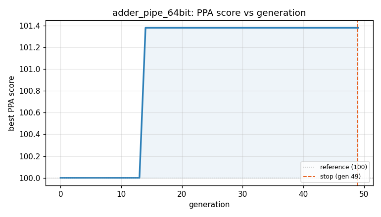
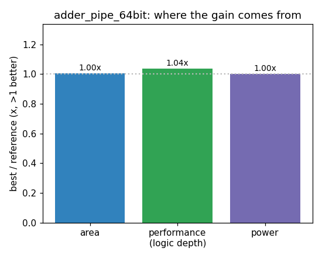

### `adder_pipe_64bit`  —  category: Arithmetic  —  best PPA **101.4** (area 1.00x · depth 1.04x · power 1.00x)

 

**Evolution path** — 1 edge(s) from the reference (gen 0, score 100) to the best (gen 14, score 101.4):

#### A — reference (gen 0, score 100.0)
The RTLLM golden reference; PPA baseline (area/depth/power = 1.00x).

#### A' — gen 14: `adder_pipe_64bit_optimized`  (score 101.4, +1.4; area 1.00x depth 1.04x power 1.00x)
_model: deepseek-v4-flash_

> This design combines the clean, minimal structure of the current program with the Kogge-Stone prefix tree approach from the inspiration program, but implemented more efficiently. The key insight is that for a pipelined 64-bit adder split into 16-bit chunks, the ripple-carry between chunks is the bottleneck. By replacing the ripple-carry between chunks with a lookahead carry computation, we can red

```diff
--- a/original.sv
+++ b/original.sv
@@ -1,197 +1,390 @@
 // EVOLVE-BLOCK-START
 module adder_pipe_64bit
 #(
     parameter DATA_WIDTH = 64,
     parameter STG_WIDTH = 16
 )
 (
     input clk,
     input rst_n,
     input i_en,
     input [DATA_WIDTH-1:0] adda,
     input [DATA_WIDTH-1:0] addb,
     output [DATA_WIDTH:0] result,
     output reg o_en
 );
 
+// --- Pipeline control registers ---
 reg stage1;
 reg stage2;
 reg stage3;
 
-wire [STG_WIDTH-1:0] a1;
-wire [STG_WIDTH-1:0] b1;
-wire [STG_WIDTH-1:0] a2;
-wire [STG_WIDTH-1:0] b2;
-wire [STG_WIDTH-1:0] a3;
-wire [STG_WIDTH-1:0] b3;
-wire [STG_WIDTH-1:0] a4;
-wire [STG_WIDTH-1:0] b4;
-
+// --- Input operand pipeline registers ---
 reg [STG_WIDTH-1:0] a2_ff1;
 reg [STG_WIDTH-1:0] b2_ff1;
-
 reg [STG_WIDTH-1:0] a3_ff1;
 reg [STG_WIDTH-1:0] b3_ff1;
 reg [STG_WIDTH-1:0] a3_ff2;
 reg [STG_WIDTH-1:0] b3_ff2;
-
 reg [STG_WIDTH-1:0] a4_ff1;
 reg [STG_WIDTH-1:0] b4_ff1;
 reg [STG_WIDTH-1:0] a4_ff2;
 reg [STG_WIDTH-1:0] b4_ff2;
 reg [STG_WIDTH-1:0] a4_ff3;
 reg [STG_WIDTH-1:0] b4_ff3;
 
-reg c1;
-reg c2;
-reg c3;
-reg c4;
-
-reg [STG_WIDTH-1:0] s1;
-reg [STG_WIDTH-1:0] s2;
-reg [STG_WIDTH-1:0] s3;
-reg [STG_WIDTH-1:0] s4;
-
-reg [STG_WIDTH-1:0] s1_ff1;
... (diff truncated)
```
