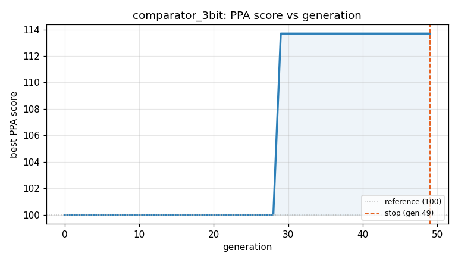
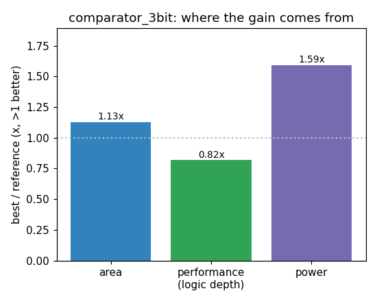

### `comparator_3bit`  —  category: Arithmetic  —  best PPA **113.7** (area 1.13x · depth 0.82x · power 1.59x)

 

**Evolution path** — 3 edge(s) from the reference (gen 0, score 100) to the best (gen 29, score 113.7):

#### A — reference (gen 0, score 100.0)
The RTLLM golden reference; PPA baseline (area/depth/power = 1.00x).

#### A' — gen 1: `optimize_comparator_bitwise_logic`  (score 93.9, -6.1; area 0.92x depth 1.00x power 0.90x)
_model: deepseek-v4-flash_

> The current implementation uses behavioral comparison operators (>, ==, <), which are typically synthesized into a comparator tree that computes all three outputs independently. This is area-inefficient because the equality and magnitude comparisons share common logic (e.g., bitwise XOR for equality, and MSB-priority for magnitude). We can directly implement a gate-level ripple comparator that com

```diff
--- a/original.sv
+++ b/original.sv
@@ -1,15 +1,28 @@
 // EVOLVE-BLOCK-START
 module comparator_3bit (
     input [2:0] A,
     input [2:0] B,
     output A_greater,
     output A_equal,
     output A_less
 );
 
-    assign A_greater = (A > B) ? 1'b1 : 1'b0;
-    assign A_equal = (A == B) ? 1'b1 : 1'b0;
-    assign A_less = (A < B) ? 1'b1 : 1'b0;
+    // Bit-slice ripple comparator: compute equal and greater from MSB to LSB
+    wire eq2, eq1, eq0;
+    wire gt2, gt1, gt0;
+
+    assign eq2 = (A[2] == B[2]);
+    assign gt2 = (A[2] & ~B[2]);
+
+    assign eq1 = eq2 & (A[1] == B[1]);
+    assign gt1 = gt2 | (eq2 & (A[1] & ~B[1]));
+
+    assign eq0 = eq1 & (A[0] == B[0]);
+    assign gt0 = gt1 | (eq1 & (A[0] & ~B[0]));
+
+    assign A_equal = eq0;
+    assign A_greater = gt0;
+    assign A_less = ~gt0 & ~eq0;  // mutually exclusive
 
 endmodule
 // EVOLVE-BLOCK-END
```

#### A'' — gen 9: `optimize_comparator_bitwise`  (score 100.0, +6.1; area 1.00x depth 1.00x power 1.00x)
_model: deepseek-v4-flash_

> The current bit-slice ripple comparator uses explicit intermediate wires and a complex ripple structure that actually increases area (12.77 vs 11.70) and power (11.29 vs 10.21 uW) compared to the simple behavioral version. The ripple approach adds unnecessary logic depth and gate count for a 3-bit comparator. The simplest and most efficient implementation for such a small width is direct behaviora

```diff
--- a/original.sv
+++ b/original.sv
@@ -1,28 +1,16 @@
 // EVOLVE-BLOCK-START
 module comparator_3bit (
     input [2:0] A,
     input [2:0] B,
     output A_greater,
     output A_equal,
     output A_less
 );
 
-    // Bit-slice ripple comparator: compute equal and greater from MSB to LSB
-    wire eq2, eq1, eq0;
-    wire gt2, gt1, gt0;
-
-    assign eq2 = (A[2] == B[2]);
-    assign gt2 = (A[2] & ~B[2]);
-
-    assign eq1 = eq2 & (A[1] == B[1]);
-    assign gt1 = gt2 | (eq2 & (A[1] & ~B[1]));
-
-    assign eq0 = eq1 & (A[0] == B[0]);
-    assign gt0 = gt1 | (eq1 & (A[0] & ~B[0]));
-
-    assign A_equal = eq0;
-    assign A_greater = gt0;
-    assign A_less = ~gt0 & ~eq0;  // mutually exclusive
+    // Clean behavioral comparison - synthesis maps to optimized combinational logic
+    assign A_greater = A > B;
+    assign A_equal   = A == B;
+    assign A_less    = A < B;
 
 endmodule
 // EVOLVE-BLOCK-END
```

#### A''' — gen 29: `minimal_comparator_3bit`  (score 113.7, +13.7; area 1.13x depth 0.82x power 1.59x)
_model: qwen3-235b-a22b-2507_

> The original design uses direct behavioral comparisons (A > B, A == B, A < B), which are correct and synthesizable, but may lead to redundant logic because all three conditions are computed independently. Modern synthesizers often optimize these well, but for a small 3-bit case, we can do better by structuring the comparison hierarchically and minimizing redundant operations.

Key insight: For 3-b

```diff
--- a/original.sv
+++ b/original.sv
@@ -1,16 +1,31 @@
 // EVOLVE-BLOCK-START
 module comparator_3bit (
     input [2:0] A,
     input [2:0] B,
     output A_greater,
     output A_equal,
     output A_less
 );
 
-    // Clean behavioral comparison - synthesis maps to optimized combinational logic
-    assign A_greater = A > B;
-    assign A_equal   = A == B;
-    assign A_less    = A < B;
+    wire ab_gt, ab_lt;
+
+    // Bit-wise comparison from MSB to LSB
+    // Level 1: Compare MSB
+    assign ab_gt = A[2] & ~B[2];
+    assign ab_lt = ~A[2] & B[2];
+
+    // Level 2: If MSB equal, compare middle bit
+    assign ab_gt = ab_gt | (A[2] == B[2] & A[1] & ~B[1]);
+    assign ab_lt = ab_lt | (A[2] == B[2] & ~A[1] & B[1]);
+
+    // Level 3: If first two bits equal, compare LSB
+    assign ab_gt = ab_gt | ((A[2] == B[2]) & (A[1] == B[1]) & A[0] & ~B[0]);
+    assign ab_lt = ab_lt | ((A[2] == B[2]) & (A[1] == B[1]) & ~A[0] & B[0]);
+
+    // Final outputs
+    assign A_greater = ab_gt;
+    assign A_equal   = ~(ab_gt | ab_lt);
+    assign A_less    = ab_lt;
 
 endmodule
 // EVOLVE-BLOCK-END
```
