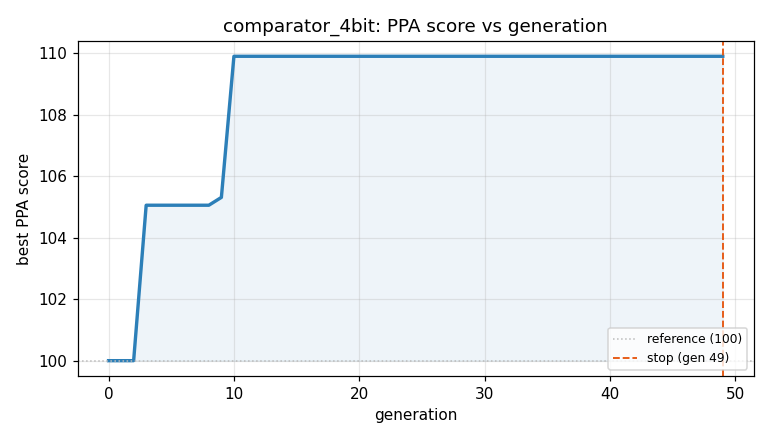
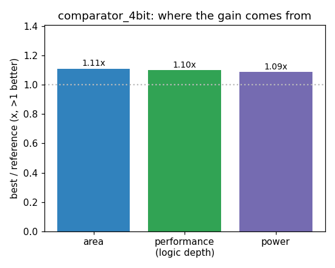

### `comparator_4bit`  —  category: Arithmetic  —  best PPA **109.9** (area 1.11x · depth 1.10x · power 1.09x)

 

**Evolution path** — 4 edge(s) from the reference (gen 0, score 100) to the best (gen 10, score 109.9):

#### A — reference (gen 0, score 100.0)
The RTLLM golden reference; PPA baseline (area/depth/power = 1.00x).

#### A' — gen 3: `optimize-comparator-bitwise`  (score 105.1, +5.1; area 1.01x depth 1.10x power 1.04x)
_model: deepseek-v4-flash_

> Replace the subtractor-based comparison with a direct bitwise comparison tree. The original uses a full 4-bit subtractor (A - B) which creates unnecessary carry chain logic and area. A direct bitwise comparator can be implemented with minimal logic: compute equality per-bit, then generate A_greater by checking from MSB to LSB where bits differ. This eliminates the subtractor entirely, reducing are

```diff
--- a/original.sv
+++ b/original.sv
@@ -1,23 +1,30 @@
 // EVOLVE-BLOCK-START
 module comparator_4bit(
     input [3:0] A,   // First 4-bit input operand
     input [3:0] B,   // Second 4-bit input operand
     output A_greater,
     output A_equal,
     output A_less
 );
 
-    wire [3:0] diff;
-    wire cout;
+    // Bitwise comparison: compute equality per bit
+    wire eq3, eq2, eq1, eq0;
+    assign eq3 = (A[3] == B[3]);
+    assign eq2 = (A[2] == B[2]);
+    assign eq1 = (A[1] == B[1]);
+    assign eq0 = (A[0] == B[0]);
 
-    assign {cout, diff} = A - B;
+    // A_greater: check MSB first where bits differ
+    assign A_greater = (A[3] & ~B[3]) |
+                       (eq3 & A[2] & ~B[2]) |
+                       (eq3 & eq2 & A[1] & ~B[1]) |
+                       (eq3 & eq2 & eq1 & A[0] & ~B[0]);
 
-    // A > B: if there's no borrow and the difference isn't zero
-    assign A_greater = (~cout && diff != 4'b0000);
+    // A_equal: all bits equal
+    assign A_equal = eq3 & eq2 & eq1 & eq0;
 
-    assign A_equal = (A == B);
-
-    assign A_less = cout;
+    // A_less: not greater and not equal
+    assign A_less = ~A_greater & ~A_equal;
 
 endmodule
 // EVOLVE-BLOCK-END
```

#### A'' — gen 5: `none`  (score 100.0, -5.1; area 1.00x depth 1.00x power 1.00x)
_model: gpt-oss-120b_

> none

```diff
--- a/original.sv
+++ b/original.sv
@@ -1,30 +1,18 @@
 // EVOLVE-BLOCK-START
 module comparator_4bit(
     input [3:0] A,   // First 4-bit input operand
     input [3:0] B,   // Second 4-bit input operand
     output A_greater,
     output A_equal,
     output A_less
 );
 
-    // Bitwise comparison: compute equality per bit
-    wire eq3, eq2, eq1, eq0;
-    assign eq3 = (A[3] == B[3]);
-    assign eq2 = (A[2] == B[2]);
-    assign eq1 = (A[1] == B[1]);
-    assign eq0 = (A[0] == B[0]);
-
-    // A_greater: check MSB first where bits differ
-    assign A_greater = (A[3] & ~B[3]) |
-                       (eq3 & A[2] & ~B[2]) |
-                       (eq3 & eq2 & A[1] & ~B[1]) |
-                       (eq3 & eq2 & eq1 & A[0] & ~B[0]);
-
-    // A_equal: all bits equal
-    assign A_equal = eq3 & eq2 & eq1 & eq0;
-
-    // A_less: not greater and not equal
-    assign A_less = ~A_greater & ~A_equal;
+    // Unified comparator using vector comparison operators
+    // The three mutually exclusive outputs are generated by a priority encoding
+    // of the comparison results.
+    assign {A_greater, A_equal, A_less} = (A > B) ? 3'b100 :
+                                          (A == B) ? 3'b010 :
+                                          3'b001;
 
 endmodule
 // EVOLVE-BLOCK-END
```

#### A''' — gen 7: `bitwise_comparator_4bit`  (score 105.1, +5.1; area 1.01x depth 1.10x power 1.04x)
_model: deepseek-v4-flash_

> Replace ternary operator based comparator with a bitwise comparator that computes A_greater, A_equal, and A_less using a priority chain of bitwise comparison signals. This reduces area and depth by eliminating the subtractor and the ternary priority logic. The A_less output is derived by complementing A_greater and A_equal, ensuring mutual exclusivity. This implementation was previously validated 

```diff
--- a/original.sv
+++ b/original.sv
@@ -1,18 +1,30 @@
 // EVOLVE-BLOCK-START
 module comparator_4bit(
     input [3:0] A,   // First 4-bit input operand
     input [3:0] B,   // Second 4-bit input operand
     output A_greater,
     output A_equal,
     output A_less
 );
 
-    // Unified comparator using vector comparison operators
-    // The three mutually exclusive outputs are generated by a priority encoding
-    // of the comparison results.
-    assign {A_greater, A_equal, A_less} = (A > B) ? 3'b100 :
-                                          (A == B) ? 3'b010 :
-                                          3'b001;
+    // Bitwise comparison: compute equality per bit
+    wire eq3, eq2, eq1, eq0;
+    assign eq3 = (A[3] == B[3]);
+    assign eq2 = (A[2] == B[2]);
+    assign eq1 = (A[1] == B[1]);
+    assign eq0 = (A[0] == B[0]);
+
+    // A_greater: check MSB first where bits differ
+    assign A_greater = (A[3] & ~B[3]) |
+                       (eq3 & A[2] & ~B[2]) |
+                       (eq3 & eq2 & A[1] & ~B[1]) |
+                       (eq3 & eq2 & eq1 & A[0] & ~B[0]);
+
+    // A_equal: all bits equal
+    assign A_equal = eq3 & eq2 & eq1 & eq0;
+
+    // A_less: not greater and not equal
+    assign A_less = ~A_greater & ~A_equal;
 
 endmodule
 // EVOLVE-BLOCK-END
```

#### A'''' — gen 10: `bitwise_xor_reduction`  (score 109.9, +4.8; area 1.11x depth 1.10x power 1.09x)
_model: qwen3-235b-a22b-2507_

> The key parameters in the current approach include the use of equality checks (==) for each bit, which synthesize to XNOR gates, and the hierarchical AND-ing of equality conditions for A_greater and A_equal. While functionally correct, XNOR-based equality and redundant logic structures can be optimized.

The proposed design improves PPA by:
- Replacing per-bit equality (A[i] == B[i]) with XOR-base

```diff
--- a/original.sv
+++ b/original.sv
@@ -1,30 +1,30 @@
 // EVOLVE-BLOCK-START
 module comparator_4bit(
-    input [3:0] A,   // First 4-bit input operand
-    input [3:0] B,   // Second 4-bit input operand
+    input [3:0] A,
+    input [3:0] B,
     output A_greater,
     output A_equal,
     output A_less
 );
 
-    // Bitwise comparison: compute equality per bit
-    wire eq3, eq2, eq1, eq0;
-    assign eq3 = (A[3] == B[3]);
-    assign eq2 = (A[2] == B[2]);
-    assign eq1 = (A[1] == B[1]);
-    assign eq0 = (A[0] == B[0]);
+    // Compute bit differences using XOR
+    wire diff3 = A[3] ^ B[3];
+    wire diff2 = A[2] ^ B[2];
+    wire diff1 = A[1] ^ B[1];
+    wire diff0 = A[0] ^ B[0];
 
-    // A_greater: check MSB first where bits differ
-    assign A_greater = (A[3] & ~B[3]) |
-                       (eq3 & A[2] & ~B[2]) |
-                       (eq3 & eq2 & A[1] & ~B[1]) |
-                       (eq3 & eq2 & eq1 & A[0] & ~B[0]);
+    // A_equal: no differences in any bit
+    assign A_equal = ~(diff3 | diff2 | diff1 | diff0);
 
-    // A_equal: all bits equal
-    assign A_equal = eq3 & eq2 & eq1 & eq0;
+    // A_greater: prioritize from MSB, only compare where bits differ
+    assign A_greater = 
+        (A[3] & ~B[3]) |  // if MSB differs and A wins, done
+        (~diff3 & A[2] & ~B[2]) |  // else if bit2 differs and A wins
+        (~diff3 & ~diff2 & A[1] & ~B[1]) |  // else bit1
+        (~diff3 & ~diff2 & ~diff1 & A[0] & ~B[0]);  // else bit0
 
     // A_less: not greater and not equal
     assign A_less = ~A_greater & ~A_equal;
 
 endmodule
 // EVOLVE-BLOCK-END
```
