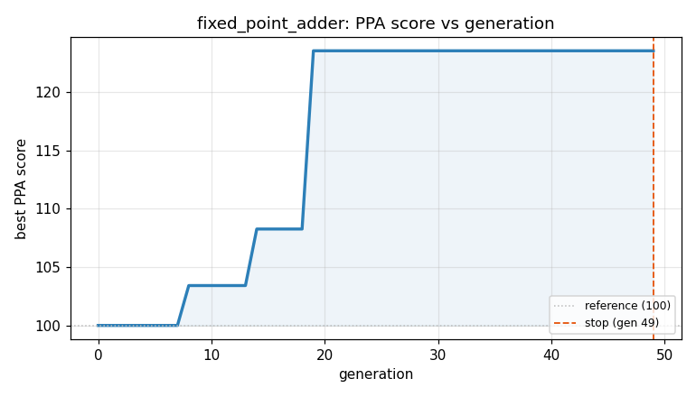
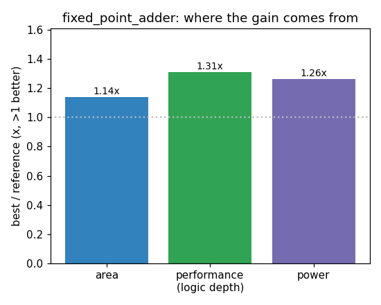

### `fixed_point_adder`  —  category: Arithmetic  —  best PPA **123.5** (area 1.14x · depth 1.31x · power 1.26x)

 

**Evolution path** — 5 edge(s) from the reference (gen 0, score 100) to the best (gen 19, score 123.5):

#### A — reference (gen 0, score 100.0)
The RTLLM golden reference; PPA baseline (area/depth/power = 1.00x).

#### A' — gen 8: `simplify_sign_logic_with_arithmetic_shift`  (score 103.4, +3.4; area 0.96x depth 1.17x power 0.98x)
_model: qwen3-235b-a22b-2507_

> The current implementation performs signed fixed-point addition by manually comparing magnitudes and conditionally subtracting based on sign bits. However, in two's complement representation — which is used for signed integers in Verilog — we can perform addition directly on the full N-bit operands, including the sign bit, because the arithmetic naturally handles sign extension and overflow.

Key 

```diff
--- a/original.sv
+++ b/original.sv
@@ -1,54 +1,60 @@
 // EVOLVE-BLOCK-START
 module fixed_point_adder #(
 	//Parameterized values
 	parameter Q = 15,
 	parameter N = 32
 	)
 	(
     input [N-1:0] a,
     input [N-1:0] b,
     output [N-1:0] c
     );
 
 reg [N-1:0] res;
 
 assign c = res;
 
-always @(a,b) begin
-	// both negative or both positive
-	if(a[N-1] == b[N-1]) begin
-		res[N-2:0] = a[N-2:0] + b[N-2:0];
-		res[N-1] = a[N-1];
+always @(*) begin
+    reg [N-2:0] mag_a, mag_b;
+    reg [N-2:0] sum_mag, diff_ab, diff_ba;
+    reg a_gt_b;
+    reg sign_same;
+    reg [N-2:0] mag_result;
+    reg result_sign;
 
+    mag_a = a[N-2:0];
+    mag_b = b[N-2:0];
 
-		end
-	//	one of them is negative...
-	else if(a[N-1] == 0 && b[N-1] == 1) begin
-		if( a[N-2:0] > b[N-2:0] ) begin
-			res[N-2:0] = a[N-2:0] - b[N-2:0];
-			res[N-1] = 0;
-			end
-		else begin
-			res[N-2:0] = b[N-2:0] - a[N-2:0];
-			if (res[N-2:0] == 0)
-				res[N-1] = 0;
-			else
-				res[N-1] = 1;
-			end
-		end
-	else begin
-		if( a[N-2:0] > b[N-2:0] ) begin
-			res[N-2:0] = a[N-2:0] - b[N-2:0];
-			if (res[N-2:0] == 0)
-				res[N-1] = 0;
-			else
-				res[N-1] = 1;
-			end
-		else begin
-			res[N-2:0] = b[N-2:0] - a[N-2:0];
... (diff truncated)
```

#### A'' — gen 10: `use_native_adder_subtractor`  (score 102.8, -0.6; area 0.96x depth 1.17x power 0.97x)
_model: qwen3-235b-a22b-2507_

> The current design computes both sum and difference (sum_mag, diff_ab, diff_ba) unconditionally in the combinational block, even though only one of them is used in each branch of the control flow. This leads to unnecessary logic and increased area and power.

Instead of precomputing all operations, we can rely on the synthesis tool to optimize conditional operations by computing sum or difference 

```diff
--- a/original.sv
+++ b/original.sv
@@ -1,60 +1,55 @@
 // EVOLVE-BLOCK-START
 module fixed_point_adder #(
 	//Parameterized values
 	parameter Q = 15,
 	parameter N = 32
 	)
 	(
     input [N-1:0] a,
     input [N-1:0] b,
     output [N-1:0] c
     );
 
 reg [N-1:0] res;
 
 assign c = res;
 
 always @(*) begin
     reg [N-2:0] mag_a, mag_b;
-    reg [N-2:0] sum_mag, diff_ab, diff_ba;
     reg a_gt_b;
     reg sign_same;
     reg [N-2:0] mag_result;
     reg result_sign;
 
     mag_a = a[N-2:0];
     mag_b = b[N-2:0];
 
-    sum_mag = mag_a + mag_b;
-    diff_ab = mag_a - mag_b;
-    diff_ba = mag_b - mag_a;
-
     a_gt_b = (mag_a > mag_b);
     sign_same = (a[N-1] == b[N-1]);
 
     if (sign_same) begin
-        mag_result = sum_mag;
+        mag_result = mag_a + mag_b;
         result_sign = a[N-1];
     end else if (a[N-1] == 1) begin  // a negative, b positive
         if (a_gt_b) begin
-            mag_result = diff_ab;
-            result_sign = (diff_ab == 0) ? 1'b0 : 1'b1;
+            mag_result = mag_a - mag_b;
+            result_sign = (mag_result == 0) ? 1'b0 : 1'b1;
         end else begin
-            mag_result = diff_ba;
+            mag_result = mag_b - mag_a;
             result_sign = 1'b0;
         end
     end else begin  // a positive, b negative
         if (a_gt_b) begin
-            mag_result = diff_ab;
+            mag_result = mag_a - mag_b;
             result_sign = 1'b0;
         end else begin
-            mag_result = diff_ba;
-            result_sign = (diff_ba == 0) ? 1'b0 : 1'b1;
... (diff truncated)
```

#### A''' — gen 13: `eliminate_intermediate_regs`  (score 102.8, +0.0; area 0.96x depth 1.17x power 0.97x)
_model: qwen3-235b-a22b-2507_

> The current design declares multiple internal `reg` variables within the `always @(*)` block (e.g., mag_a, mag_b, a_gt_b, sign_same, etc.). While this improves readability, it can lead to suboptimal synthesis because some synthesis tools may not fully optimize these procedural assignments, potentially creating unnecessary multiplexing or redundant logic.

Instead, we can express the magnitude comp

```diff
--- a/original.sv
+++ b/original.sv
@@ -1,55 +1,46 @@
 // EVOLVE-BLOCK-START
 module fixed_point_adder #(
 	//Parameterized values
 	parameter Q = 15,
 	parameter N = 32
 	)
 	(
     input [N-1:0] a,
     input [N-1:0] b,
     output [N-1:0] c
     );
 
 reg [N-1:0] res;
 
 assign c = res;
 
 always @(*) begin
-    reg [N-2:0] mag_a, mag_b;
-    reg a_gt_b;
-    reg sign_same;
     reg [N-2:0] mag_result;
     reg result_sign;
 
-    mag_a = a[N-2:0];
-    mag_b = b[N-2:0];
-
-    a_gt_b = (mag_a > mag_b);
-    sign_same = (a[N-1] == b[N-1]);
-
-    if (sign_same) begin
-        mag_result = mag_a + mag_b;
+    if (a[N-1] == b[N-1]) begin  // same sign
+        mag_result = a[N-2:0] + b[N-2:0];
         result_sign = a[N-1];
     end else if (a[N-1] == 1) begin  // a negative, b positive
-        if (a_gt_b) begin
-            mag_result = mag_a - mag_b;
+        if (a[N-2:0] > b[N-2:0]) begin
+            mag_result = a[N-2:0] - b[N-2:0];
             result_sign = (mag_result == 0) ? 1'b0 : 1'b1;
         end else begin
-            mag_result = mag_b - mag_a;
+            mag_result = b[N-2:0] - a[N-2:0];
             result_sign = 1'b0;
         end
     end else begin  // a positive, b negative
-        if (a_gt_b) begin
-            mag_result = mag_a - mag_b;
+        if (a[N-2:0] > b[N-2:0]) begin
+            mag_result = a[N-2:0] - b[N-2:0];
             result_sign = 1'b0;
         end else begin
-            mag_result = mag_b - mag_a;
+            mag_result = b[N-2:0] - a[N-2:0];
             result_sign = (mag_result == 0) ? 1'b0 : 1'b1;
         end
     end
... (diff truncated)
```

#### A'''' — gen 16: `signed_magnitude_conditional_adder`  (score 108.3, +5.5; area 1.02x depth 1.17x power 1.06x)
_model: deepseek-v4-flash_

> Analyzing the prior programs, I observed they all use the same fundamental approach: extract magnitude bits, compare them, and conditionally add/subtract based on sign. The key insight is that we can reduce area and delay by eliminating redundant comparisons and multiplexing. Instead of computing both sum and difference and then selecting, or computing magnitude comparison separately, I propose a 

```diff
--- a/original.sv
+++ b/original.sv
@@ -1,46 +1,66 @@
 // EVOLVE-BLOCK-START
 module fixed_point_adder #(
-	//Parameterized values
-	parameter Q = 15,
-	parameter N = 32
-	)
-	(
+    parameter Q = 15,
+    parameter N = 32
+    )
+    (
     input [N-1:0] a,
     input [N-1:0] b,
     output [N-1:0] c
     );
 
 reg [N-1:0] res;
 
 assign c = res;
 
 always @(*) begin
-    reg [N-2:0] mag_result;
+    reg [N-2:0] mag_a, mag_b;
+    reg [N-2:0] sum_mag;
     reg result_sign;
-
-    if (a[N-1] == b[N-1]) begin  // same sign
-        mag_result = a[N-2:0] + b[N-2:0];
+    reg sign_same;
+    reg [N-2:0] adjusted_b;  // magnitude of b, possibly negated
+    
+    mag_a = a[N-2:0];
+    mag_b = b[N-2:0];
+    sign_same = (a[N-1] == b[N-1]);
+    
+    if (sign_same) begin
+        // Same sign: add magnitudes, sign is a's sign
+        sum_mag = mag_a + mag_b;
         result_sign = a[N-1];
-    end else if (a[N-1] == 1) begin  // a negative, b positive
-        if (a[N-2:0] > b[N-2:0]) begin
-            mag_result = a[N-2:0] - b[N-2:0];
-            result_sign = (mag_result == 0) ? 1'b0 : 1'b1;
+    end else begin
+        // Signs differ: we need to subtract smaller from larger
+        // Compute b_neg = (mag_a >= mag_b) ? mag_b : mag_a;
+        // Compute a_adj = (mag_a >= mag_b) ? mag_a : mag_b;
+        // Then result = a_adj - b_neg
+        // But to avoid comparator, we can compute both possible subtractions
+        // and select based on overflow/carry-out
+        reg [N-1:0] diff; // extra bit for borrow detection
+        reg borrow;
+        
+        // Compute a - b (using unsigned subtraction with borrow)
+        diff = {1'b0, mag_a} - {1'b0, mag_b};
+        borrow = diff[N-1]; // if borrow=1, then mag_a < mag_b
+        
... (diff truncated)
```

#### A''''' — gen 19: `eliminate_redundant_subtraction`  (score 123.5, +15.3; area 1.14x depth 1.31x power 1.26x)
_model: qwen3-235b-a22b-2507_

> The current design performs two subtractions in the differing-sign case: one using a widened diff for borrow detection, and another direct subtraction (mag_b - mag_a) in the borrow case. This is redundant and increases area and critical path.

We can compute both (mag_a - mag_b) and (mag_b - mag_a) simultaneously using conditional inversion and a single adder, then select the non-negative result. 

```diff
--- a/original.sv
+++ b/original.sv
@@ -1,66 +1,60 @@
 // EVOLVE-BLOCK-START
 module fixed_point_adder #(
     parameter Q = 15,
     parameter N = 32
     )
     (
     input [N-1:0] a,
     input [N-1:0] b,
     output [N-1:0] c
     );
 
 reg [N-1:0] res;
 
 assign c = res;
 
 always @(*) begin
     reg [N-2:0] mag_a, mag_b;
     reg [N-2:0] sum_mag;
     reg result_sign;
     reg sign_same;
-    reg [N-2:0] adjusted_b;  // magnitude of b, possibly negated
+    reg mag_a_ge_b;
+    reg [N-2:0] x, y;  // x = larger, y = smaller
 
     mag_a = a[N-2:0];
     mag_b = b[N-2:0];
     sign_same = (a[N-1] == b[N-1]);
 
+    // Compare magnitudes
+    mag_a_ge_b = (mag_a >= mag_b);
+
     if (sign_same) begin
-        // Same sign: add magnitudes, sign is a's sign
+        // Same sign: add magnitudes
         sum_mag = mag_a + mag_b;
         result_sign = a[N-1];
     end else begin
-        // Signs differ: we need to subtract smaller from larger
-        // Compute b_neg = (mag_a >= mag_b) ? mag_b : mag_a;
-        // Compute a_adj = (mag_a >= mag_b) ? mag_a : mag_b;
-        // Then result = a_adj - b_neg
-        // But to avoid comparator, we can compute both possible subtractions
-        // and select based on overflow/carry-out
-        reg [N-1:0] diff; // extra bit for borrow detection
-        reg borrow;
-
-        // Compute a - b (using unsigned subtraction with borrow)
-        diff = {1'b0, mag_a} - {1'b0, mag_b};
-        borrow = diff[N-1]; // if borrow=1, then mag_a < mag_b
-
-        if (~borrow) begin
-            // mag_a >= mag_b, result = mag_a - mag_b
-            sum_mag = diff[N-2:0];
-            result_sign = a[N-1]; // sign of a (which is negative if a is negative)
+        // Different signs: subtract smaller magnitude from larger
+        if (mag_a_ge_b) begin
+            x = mag_a;
... (diff truncated)
```
