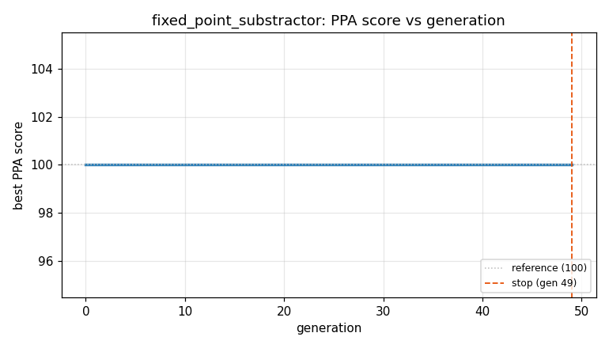
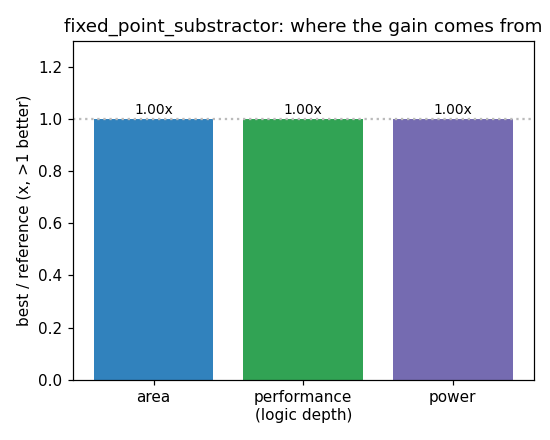

### `fixed_point_substractor`  —  category: Arithmetic  —  best PPA **100.0** (area 1.00x · depth 1.00x · power 1.00x)

 

**Evolution path** — 0 edge(s) from the reference (gen 0, score 100) to the best (gen 0, score 100.0):

#### A — reference (gen 0, score 100.0)
The RTLLM golden reference; PPA baseline (area/depth/power = 1.00x).
