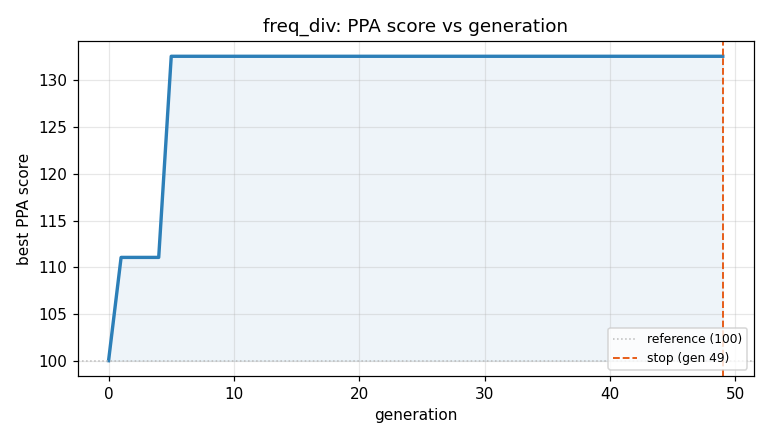
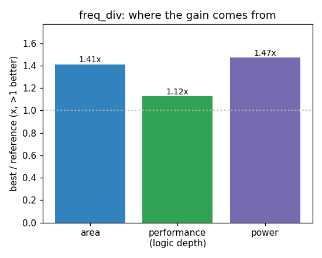

### `freq_div`  —  category: Miscellaneous  —  best PPA **132.6** (area 1.41x · depth 1.12x · power 1.47x)

 

**Evolution path** — 2 edge(s) from the reference (gen 0, score 100) to the best (gen 5, score 132.6):

#### A — reference (gen 0, score 100.0)
The RTLLM golden reference; PPA baseline (area/depth/power = 1.00x).

#### A' — gen 1: `optimize-counters-width`  (score 111.1, +11.1; area 1.18x depth 1.00x power 1.16x)
_model: deepseek-v4-flash_

> The current implementation uses 4-bit counter for cnt_10 and 7-bit counter for cnt_100. The cnt_10 counter only needs to count from 0 to 4, so a 3-bit counter is sufficient. The cnt_100 counter counts from 0 to 49, which requires 6 bits (since 2^6=64 > 49). Reducing counter widths saves flip-flops and combinational logic, reducing area and power without changing functionality. The counters are res

```diff
--- a/original.sv
+++ b/original.sv
@@ -1,47 +1,47 @@
 // EVOLVE-BLOCK-START
 module freq_div (CLK_in,CLK_50,CLK_10,CLK_1,RST);
 input CLK_in,RST;
 output reg CLK_50,CLK_10,CLK_1;
 
-reg [3:0] cnt_10;
-reg [6:0] cnt_100;
+reg [2:0] cnt_10;
+reg [5:0] cnt_100;
 
 always @(posedge CLK_in or posedge RST) begin
 	if (RST) begin
 		CLK_50<= 1'b0;
         end
 	else begin
 		CLK_50<= ~CLK_50;
         end
 end
 
 always @(posedge CLK_in or posedge RST) begin
 	if (RST) begin
 		CLK_10<= 1'b0;
                 cnt_10<=0;
         end
 	else if (cnt_10==4) begin
 		CLK_10<= ~CLK_10;
                 cnt_10<=0;
         end
         else begin
                 cnt_10<=cnt_10+1;
         end
 end
 
 always @(posedge CLK_in or posedge RST) begin
 	if (RST) begin
 		CLK_1<= 1'b0;
                 cnt_100<=0;
         end
 	else if (cnt_100==49) begin
 		CLK_1<= ~CLK_1;
                 cnt_100<=0;
         end
         else begin
                 cnt_100<=cnt_100+1;
         end
 end
 
 endmodule
 // EVOLVE-BLOCK-END
```

#### A'' — gen 5: `merge_clock_dividers_with_shared_counter`  (score 132.6, +21.5; area 1.41x depth 1.12x power 1.47x)
_model: qwen3-235b-a22b-2507_

> Instead of maintaining two separate counters for 10MHz and 1MHz outputs (cnt_10 and cnt_100), we can reduce area and power by using a hierarchical approach:

- Use the 10MHz clock (CLK_10) as a base to derive the 1MHz clock.
- Since 1MHz is exactly 1/10 of 10MHz, we only need a 4-bit counter (counting 0–9) triggered on the rising edge of CLK_10.
- However, because we cannot use CLK_10 as a clockin

```diff
--- a/original.sv
+++ b/original.sv
@@ -1,47 +1,50 @@
 // EVOLVE-BLOCK-START
 module freq_div (CLK_in,CLK_50,CLK_10,CLK_1,RST);
 input CLK_in,RST;
 output reg CLK_50,CLK_10,CLK_1;
 
 reg [2:0] cnt_10;
-reg [5:0] cnt_100;
+reg [3:0] cnt_10_stage;  // Counts 10 stages of the 10MHz cycle
 
 always @(posedge CLK_in or posedge RST) begin
 	if (RST) begin
-		CLK_50<= 1'b0;
-        end
+		CLK_50 <= 1'b0;
+	end
 	else begin
-		CLK_50<= ~CLK_50;
-        end
+		CLK_50 <= ~CLK_50;
+	end
 end
 
 always @(posedge CLK_in or posedge RST) begin
 	if (RST) begin
-		CLK_10<= 1'b0;
-                cnt_10<=0;
-        end
-	else if (cnt_10==4) begin
-		CLK_10<= ~CLK_10;
-                cnt_10<=0;
-        end
-        else begin
-                cnt_10<=cnt_10+1;
-        end
+		CLK_10 <= 1'b0;
+		cnt_10 <= 0;
+	end
+	else if (cnt_10 == 4) begin
+		CLK_10 <= ~CLK_10;
+		cnt_10 <= 0;
+	end
+	else begin
+		cnt_10 <= cnt_10 + 1;
+	end
 end
 
 always @(posedge CLK_in or posedge RST) begin
 	if (RST) begin
-		CLK_1<= 1'b0;
-                cnt_100<=0;
-        end
-	else if (cnt_100==49) begin
-		CLK_1<= ~CLK_1;
-                cnt_100<=0;
-        end
-        else begin
-                cnt_100<=cnt_100+1;
... (diff truncated)
```
