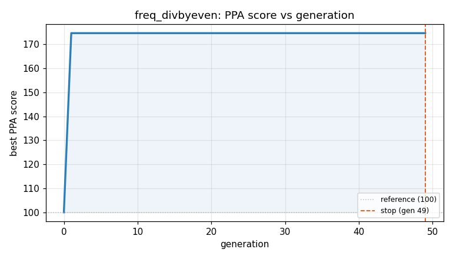
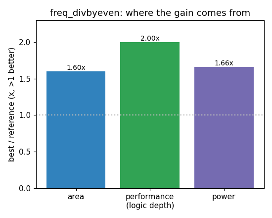

### `freq_divbyeven`  —  category: Miscellaneous  —  best PPA **174.6** (area 1.60x · depth 2.00x · power 1.66x)

 

**Evolution path** — 1 edge(s) from the reference (gen 0, score 100) to the best (gen 1, score 174.6):

#### A — reference (gen 0, score 100.0)
The RTLLM golden reference; PPA baseline (area/depth/power = 1.00x).

#### A' — gen 1: `reduce_counter_width`  (score 174.6, +74.6; area 1.60x depth 2.00x power 1.66x)
_model: qwen3-235b-a22b-2507_

> The current design uses a 4-bit counter (`[3:0] cnt`) to count up to `NUM_DIV/2 - 1`. However, `NUM_DIV` is parameterized with a default of 6, meaning the maximum count value is `6/2 - 1 = 2`, which requires only 2 bits (values 0, 1, 2). Using a 4-bit counter is overkill and wastes area and power.

By reducing the counter width to the minimum required — `WIDTH = $clog2(NUM_DIV/2)` — we save area a

```diff
--- a/original.sv
+++ b/original.sv
@@ -1,30 +1,31 @@
 module freq_divbyeven(
     clk,
     rst_n,
     clk_div
 );
 
     input clk;
     input rst_n;
     output clk_div;
 // EVOLVE-BLOCK-START
 reg clk_div;
 
     parameter NUM_DIV = 6;
-    reg    [3:0] cnt;
+    localparam CNT_WIDTH = $clog2(NUM_DIV/2);
+    reg [CNT_WIDTH-1:0] cnt;
 
 always @(posedge clk or negedge rst_n)
     if(!rst_n) begin
-        cnt     <= 4'd0;
-        clk_div    <= 1'b0;
+        cnt     <= '0;
+        clk_div <= 1'b0;
     end
-    else if(cnt < NUM_DIV / 2 - 1) begin
+    else if(cnt < NUM_DIV/2 - 1) begin
         cnt     <= cnt + 1'b1;
-        clk_div    <= clk_div;
+        clk_div <= clk_div;
     end
     else begin
-        cnt     <= 4'd0;
-        clk_div    <= ~clk_div;
+        cnt     <= '0;
+        clk_div <= ~clk_div;
     end
  endmodule
 // EVOLVE-BLOCK-END
```
