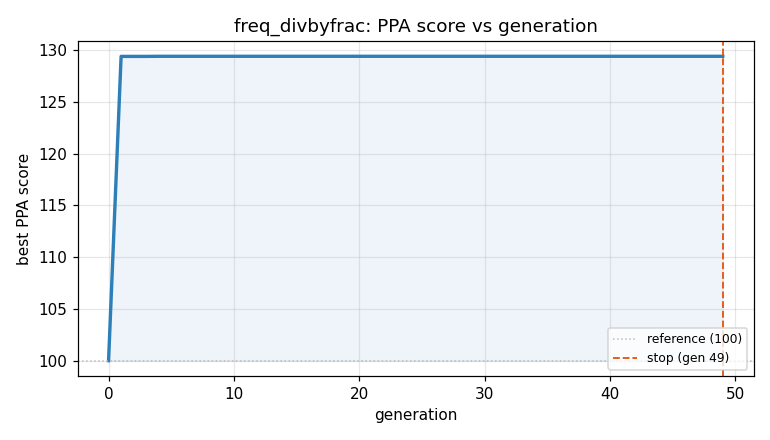
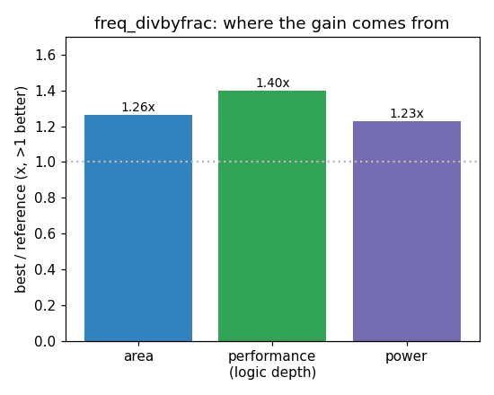

### `freq_divbyfrac`  —  category: Miscellaneous  —  best PPA **129.4** (area 1.26x · depth 1.40x · power 1.23x)

 

**Evolution path** — 2 edge(s) from the reference (gen 0, score 100) to the best (gen 4, score 129.4):

#### A — reference (gen 0, score 100.0)
The RTLLM golden reference; PPA baseline (area/depth/power = 1.00x).

#### A' — gen 1: `reduce_counter_width`  (score 129.4, +29.4; area 1.26x depth 1.40x power 1.23x)
_model: qwen3-235b-a22b-2507_

> The current design uses a 4-bit counter (cnt [3:0]) to count up to MUL2_DIV_CLK-1 = 6. However, 6 can be represented using only 3 bits (3'h7). By reducing the counter from 4 bits to 3 bits, we reduce register area and the logic cone of the comparison operations (cnt == 0, cnt == 4, etc.), which also improves power and delay. This is a safe transformation because 3 bits are sufficient to represent 

```diff
--- a/original.sv
+++ b/original.sv
@@ -1,59 +1,58 @@
 module freq_divbyfrac(
     input               rst_n ,
     input               clk,
     output              clk_div
     );
 // EVOLVE-BLOCK-START
 parameter            MUL2_DIV_CLK = 7 ;
-   reg [3:0]            cnt ;
+   reg [2:0]            cnt ;
    always @(posedge clk or negedge rst_n) begin
       if (!rst_n) begin
          cnt    <= 'b0 ;
       end
       else if (cnt == MUL2_DIV_CLK-1) begin
          cnt    <= 'b0 ;
       end
       else begin
          cnt    <= cnt + 1'b1 ;
       end
    end
 
+   localparam           MID_COUNT = (MUL2_DIV_CLK >> 1) + 1; // == 4
    reg                  clk_ave_r ;
    always @(posedge clk or negedge rst_n) begin
       if (!rst_n) begin
          clk_ave_r <= 1'b0 ;
       end
-      //first cycle: 4 source clk cycle
-      else if (cnt == 0) begin
+      else if (cnt == 3'd0) begin
          clk_ave_r <= 1 ;
       end
-      //2nd cycle: 3 source clk cycle
-      else if (cnt == (MUL2_DIV_CLK/2)+1) begin
+      else if (cnt == MID_COUNT) begin
          clk_ave_r <= 1 ;
       end
       else begin
          clk_ave_r <= 0 ;
       end
    end
 
    //adjust
    reg                  clk_adjust_r ;
    always @(negedge clk or negedge rst_n) begin
       if (!rst_n) begin
          clk_adjust_r <= 1'b0 ;
       end
-      else if (cnt == 1) begin
+      else if (cnt == 3'd1) begin
          clk_adjust_r <= 1 ;
       end
-      else if (cnt == (MUL2_DIV_CLK/2)+1 ) begin
+      else if (cnt == MID_COUNT) begin
          clk_adjust_r <= 1 ;
       end
       else begin
... (diff truncated)
```

#### A'' — gen 4: `merge_clock_generation_logic`  (score 129.4, +0.0; area 1.26x depth 1.40x power 1.23x)
_model: qwen3-235b-a22b-2507_

> The current design uses two separate flip-flops (clk_ave_r and clk_adjust_r) clocked on opposite clock edges (posedge and negedge) to generate intermediate pulses that are OR-ed to form the final divided clock. This dual-edge approach increases area and complexity and can lead to timing issues in low-power flows.

We observe that the two pulses occur at cnt == 0 (activate clk_ave_r on posedge) and

```diff
--- a/original.sv
+++ b/original.sv
@@ -1,58 +1,46 @@
 module freq_divbyfrac(
     input               rst_n ,
     input               clk,
     output              clk_div
     );
 // EVOLVE-BLOCK-START
 parameter            MUL2_DIV_CLK = 7 ;
    reg [2:0]            cnt ;
    always @(posedge clk or negedge rst_n) begin
       if (!rst_n) begin
          cnt    <= 'b0 ;
       end
       else if (cnt == MUL2_DIV_CLK-1) begin
          cnt    <= 'b0 ;
       end
       else begin
          cnt    <= cnt + 1'b1 ;
       end
    end
 
-   localparam           MID_COUNT = (MUL2_DIV_CLK >> 1) + 1; // == 4
-   reg                  clk_ave_r ;
+   // Precompute conditions to share logic and reduce area
+   wire set_ave = (cnt == 3'd0) || (cnt == 3'd4);
+   wire set_adj = (cnt == 3'd1) || (cnt == 3'd4);
+
+   reg clk_ave_r;
    always @(posedge clk or negedge rst_n) begin
       if (!rst_n) begin
-         clk_ave_r <= 1'b0 ;
-      end
-      else if (cnt == 3'd0) begin
-         clk_ave_r <= 1 ;
-      end
-      else if (cnt == MID_COUNT) begin
-         clk_ave_r <= 1 ;
-      end
-      else begin
-         clk_ave_r <= 0 ;
+         clk_ave_r <= 1'b0;
+      end else begin
+         clk_ave_r <= set_ave;
       end
    end
 
-   //adjust
-   reg                  clk_adjust_r ;
+   reg clk_adjust_r;
    always @(negedge clk or negedge rst_n) begin
       if (!rst_n) begin
-         clk_adjust_r <= 1'b0 ;
-      end
-      else if (cnt == 3'd1) begin
-         clk_adjust_r <= 1 ;
-      end
-      else if (cnt == MID_COUNT) begin
-         clk_adjust_r <= 1 ;
... (diff truncated)
```
