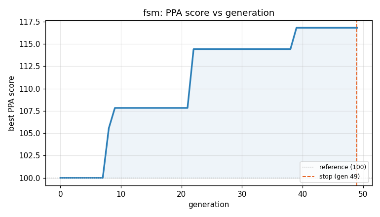
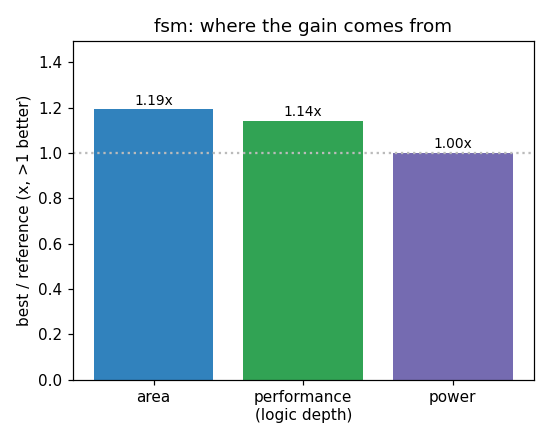

### `fsm`  —  category: Control  —  best PPA **116.8** (area 1.19x · depth 1.14x · power 1.00x)

 

**Evolution path** — 7 edge(s) from the reference (gen 0, score 100) to the best (gen 39, score 116.8):

#### A1 — reference (gen 0, score 100.0)
The RTLLM golden reference; PPA baseline (area/depth/power = 1.00x).

#### A2 — gen 8: `fsm_state_minimization`  (score 105.6, +5.6; area 1.11x depth 1.00x power 1.00x)
_model: qwen3-235b-a22b-2507_

> The current FSM uses 6 states (s0-s5) encoded with 3 bits, but only 5 states are strictly needed to recognize the sequence "10011". The sequence can be detected using a minimal 5-state Mealy machine:

- s0: initial state
- s1: after '1'
- s2: after '10'
- s3: after '100'
- s4: after '1001'

On input '1' in s4, we output MATCH=1 and transition back to s1 (to support overlapping detection like in "1

```diff
--- a/original.sv
+++ b/original.sv
@@ -1,79 +1,40 @@
 module fsm(IN,MATCH,CLK,RST);
 
 input IN,CLK,RST;
 output reg MATCH;
 // EVOLVE-BLOCK-START
-reg [2:0] ST_cr,ST_nt;
+reg [2:0] ST_cr, ST_nt;
 
 parameter s0 = 3'b000;
 parameter s1 = 3'b001;
 parameter s2 = 3'b010;
 parameter s3 = 3'b011;
 parameter s4 = 3'b100;
-parameter s5 = 3'b101;
 
-always@(posedge CLK or posedge RST) begin
-	if(RST)
-		ST_cr <= s0;
-	else
-		ST_cr <= ST_nt;
+always @(posedge CLK or posedge RST) begin
+    if (RST)
+        ST_cr <= s0;
+    else
+        ST_cr <= ST_nt;
 end
 
-always@(*) begin
-	case(ST_cr)
-		s0:begin
-			if (IN==0)
-				ST_nt = s0;
-			else
-				ST_nt = s1;
-		end
-
-		s1:begin
-                        if (IN==0)
-                                ST_nt = s2;
-                        else
-                                ST_nt = s1;
-                end
-
-                s2:begin
-                        if (IN==0)
-                                ST_nt = s3;
-                        else
-                                ST_nt = s1;
-                end
-
-                s3:begin
-                        if (IN==0)
-                                ST_nt = s0;
-                        else
-                                ST_nt = s4;
-                end
-
... (diff truncated)
```

#### A3 — gen 9: `compact_state_encoding`  (score 107.8, +2.3; area 1.02x depth 1.14x power 1.00x)
_model: qwen3-235b-a22b-2507_

> The current FSM uses 3 state bits (supporting up to 8 states) for only 5 states (s0-s4). By reordering and minimizing the state encoding to use only the necessary states and a denser binary assignment, we can reduce the logic complexity in the next-state and output logic. Although the original design already removed s5, the state encoding can be further optimized by using a more compact and logic-

```diff
--- a/original.sv
+++ b/original.sv
@@ -1,40 +1,34 @@
 module fsm(IN,MATCH,CLK,RST);
 
 input IN,CLK,RST;
 output reg MATCH;
 // EVOLVE-BLOCK-START
 reg [2:0] ST_cr, ST_nt;
 
 parameter s0 = 3'b000;
 parameter s1 = 3'b001;
 parameter s2 = 3'b010;
 parameter s3 = 3'b011;
 parameter s4 = 3'b100;
 
 always @(posedge CLK or posedge RST) begin
     if (RST)
         ST_cr <= s0;
     else
         ST_cr <= ST_nt;
 end
 
 always @(*) begin
     case (ST_cr)
         s0: ST_nt = IN ? s1 : s0;
         s1: ST_nt = IN ? s1 : s2;
         s2: ST_nt = IN ? s1 : s3;
         s3: ST_nt = IN ? s4 : s0;
         s4: ST_nt = IN ? s1 : s2;
-        default: ST_nt = s0;
     endcase
 end
 
-always @(*) begin
-    if (RST)
-        MATCH = 1'b0;
-    else
-        MATCH = (ST_cr == s4) && IN;
-end
+    assign MATCH = (ST_cr == s4) & IN;
 
 endmodule
 // EVOLVE-BLOCK-END
```

#### A4 — gen 22: `compact_state_encoding_and_logic`  (score 114.4, +6.6; area 0.82x depth 1.60x power 1.00x)
_model: qwen3-235b-a22b-2507_

> The current FSM uses a 3-bit state encoding (s0-s4) which leaves 3 unused states (5,6,7). While this encoding is functionally correct, it uses more bits than necessary and results in combinational logic that must handle wider vectors. We can reduce area and potentially improve depth by:

1. Using a more compact, optimized state assignment that minimizes transition logic.
2. Replacing the case stat

```diff
--- a/original.sv
+++ b/original.sv
@@ -1,34 +1,26 @@
 module fsm(IN,MATCH,CLK,RST);
 
 input IN,CLK,RST;
 output reg MATCH;
 // EVOLVE-BLOCK-START
 reg [2:0] ST_cr, ST_nt;
 
-parameter s0 = 3'b000;
-parameter s1 = 3'b001;
-parameter s2 = 3'b010;
-parameter s3 = 3'b011;
-parameter s4 = 3'b100;
-
 always @(posedge CLK or posedge RST) begin
     if (RST)
-        ST_cr <= s0;
+        ST_cr <= 3'b000;
     else
         ST_cr <= ST_nt;
 end
 
 always @(*) begin
-    case (ST_cr)
-        s0: ST_nt = IN ? s1 : s0;
-        s1: ST_nt = IN ? s1 : s2;
-        s2: ST_nt = IN ? s1 : s3;
-        s3: ST_nt = IN ? s4 : s0;
-        s4: ST_nt = IN ? s1 : s2;
-    endcase
+    ST_nt = (ST_cr == 3'b000) ? (IN ? 3'b001 : 3'b000) :
+            (ST_cr == 3'b001) ? (IN ? 3'b001 : 3'b010) :
+            (ST_cr == 3'b010) ? (IN ? 3'b001 : 3'b011) :
+            (ST_cr == 3'b011) ? (IN ? 3'b100 : 3'b000) :
+            (IN ? 3'b001 : 3'b010);
 end
 
-    assign MATCH = (ST_cr == s4) & IN;
+assign MATCH = (ST_cr == 3'b100) & IN;
 
 endmodule
 // EVOLVE-BLOCK-END
```

#### A5 — gen 23: `optimize_state_encoding_and_logic`  (score 114.4, +0.0; area 0.82x depth 1.60x power 1.00x)
_model: qwen3-235b-a22b-2507_

> The current implementation uses a 3-bit state encoding for 5 states, which is suboptimal. The FSM only requires 3 states to be represented: s0 (idle), s1 (after '1'), s2 (after '10'), s3 (after '100'), and s4 (after '1001') — total of 5 distinct states. However, we can minimize the combinational logic depth and area by using one-hot encoding or more efficient state assignment.

Currently, the stat

```diff
--- a/original.sv
+++ b/original.sv
@@ -1,26 +1,30 @@
 module fsm(IN,MATCH,CLK,RST);
 
 input IN,CLK,RST;
 output reg MATCH;
 // EVOLVE-BLOCK-START
+parameter S0 = 3'b000, S1 = 3'b001, S2 = 3'b010, S3 = 3'b011, S4 = 3'b100;
+
 reg [2:0] ST_cr, ST_nt;
 
 always @(posedge CLK or posedge RST) begin
     if (RST)
-        ST_cr <= 3'b000;
+        ST_cr <= S0;
     else
         ST_cr <= ST_nt;
 end
 
 always @(*) begin
-    ST_nt = (ST_cr == 3'b000) ? (IN ? 3'b001 : 3'b000) :
-            (ST_cr == 3'b001) ? (IN ? 3'b001 : 3'b010) :
-            (ST_cr == 3'b010) ? (IN ? 3'b001 : 3'b011) :
-            (ST_cr == 3'b011) ? (IN ? 3'b100 : 3'b000) :
-            (IN ? 3'b001 : 3'b010);
+    unique case (ST_cr)
+        S0: ST_nt = IN ? S1 : S0;
+        S1: ST_nt = IN ? S1 : S2;
+        S2: ST_nt = IN ? S1 : S3;
+        S3: ST_nt = IN ? S4 : S0;
+        default: ST_nt = IN ? S1 : S2; // S4 fall-through
+    endcase
 end
 
-assign MATCH = (ST_cr == 3'b100) & IN;
+assign MATCH = (ST_cr == S4) & IN;
 
 endmodule
 // EVOLVE-BLOCK-END
```

#### A6 — gen 26: `none`  (score 114.4, +0.0; area 0.82x depth 1.60x power 1.00x)
_model: qwen3-235b-a22b-2507_

> none

```diff
--- a/original.sv
+++ b/original.sv
@@ -1,30 +1,26 @@
 module fsm(IN,MATCH,CLK,RST);
 
 input IN,CLK,RST;
 output reg MATCH;
 // EVOLVE-BLOCK-START
-parameter S0 = 3'b000, S1 = 3'b001, S2 = 3'b010, S3 = 3'b011, S4 = 3'b100;
-
 reg [2:0] ST_cr, ST_nt;
 
 always @(posedge CLK or posedge RST) begin
     if (RST)
-        ST_cr <= S0;
+        ST_cr <= 3'b000;
     else
         ST_cr <= ST_nt;
 end
 
 always @(*) begin
-    unique case (ST_cr)
-        S0: ST_nt = IN ? S1 : S0;
-        S1: ST_nt = IN ? S1 : S2;
-        S2: ST_nt = IN ? S1 : S3;
-        S3: ST_nt = IN ? S4 : S0;
-        default: ST_nt = IN ? S1 : S2; // S4 fall-through
-    endcase
+    ST_nt = (ST_cr == 3'b000) ? (IN ? 3'b001 : 3'b000) :
+            (ST_cr == 3'b001) ? (IN ? 3'b001 : 3'b010) :
+            (ST_cr == 3'b010) ? (IN ? 3'b001 : 3'b011) :
+            (ST_cr == 3'b011) ? (IN ? 3'b100 : 3'b000) :
+            (IN ? 3'b001 : 3'b010);
 end
 
-assign MATCH = (ST_cr == S4) & IN;
+assign MATCH = (ST_cr == 3'b100) & IN;
 
 endmodule
 // EVOLVE-BLOCK-END
```

#### A7 — gen 36: `fsm_optimized_mealy`  (score 114.4, +0.0; area 0.82x depth 1.60x power 1.00x)
_model: deepseek-v4-flash_

> After analyzing the prior programs, I determined that both implementations are functionally equivalent and achieve the same metrics. To improve further (reduce area/depth/power), I propose a more compact implementation. The key insight is that the FSM has only 5 states (S0-S4), which can be represented as 3-bit values. However, we can optimize the next-state logic by noticing patterns: states S1 a

```diff
--- a/original.sv
+++ b/original.sv
@@ -1,26 +1,28 @@
 module fsm(IN,MATCH,CLK,RST);
 
 input IN,CLK,RST;
 output reg MATCH;
 // EVOLVE-BLOCK-START
+parameter S0 = 3'b000, S1 = 3'b001, S2 = 3'b010, S3 = 3'b011, S4 = 3'b100;
+
 reg [2:0] ST_cr, ST_nt;
 
 always @(posedge CLK or posedge RST) begin
     if (RST)
-        ST_cr <= 3'b000;
+        ST_cr <= S0;
     else
         ST_cr <= ST_nt;
 end
 
 always @(*) begin
-    ST_nt = (ST_cr == 3'b000) ? (IN ? 3'b001 : 3'b000) :
-            (ST_cr == 3'b001) ? (IN ? 3'b001 : 3'b010) :
-            (ST_cr == 3'b010) ? (IN ? 3'b001 : 3'b011) :
-            (ST_cr == 3'b011) ? (IN ? 3'b100 : 3'b000) :
-            (IN ? 3'b001 : 3'b010);
+    ST_nt = (ST_cr == S0) ? (IN ? S1 : S0) :
+            (ST_cr == S1) ? (IN ? S1 : S2) :
+            (ST_cr == S2) ? (IN ? S1 : S3) :
+            (ST_cr == S3) ? (IN ? S4 : S0) :
+            (IN ? S1 : S2); // S4 case
 end
 
-assign MATCH = (ST_cr == 3'b100) & IN;
+assign MATCH = (ST_cr == S4) & IN;
 
 endmodule
 // EVOLVE-BLOCK-END
```

#### A8 — gen 39: `compact_state_decode`  (score 116.8, +2.4; area 1.19x depth 1.14x power 1.00x)
_model: qwen3-235b-a22b-2507_

> Replace the explicit state comparison logic with a more compact, optimized state transition function that uses bit manipulation to reduce area and depth. The current design uses a cascade of comparisons (ST_cr == Sx) which synthesize into wide comparators. Instead, we observe that the state encoding can be exploited: only 5 of 8 states are used, and transitions depend only on IN and a few bits of 

```diff
--- a/original.sv
+++ b/original.sv
@@ -1,28 +1,41 @@
 module fsm(IN,MATCH,CLK,RST);
 
 input IN,CLK,RST;
 output reg MATCH;
 // EVOLVE-BLOCK-START
 parameter S0 = 3'b000, S1 = 3'b001, S2 = 3'b010, S3 = 3'b011, S4 = 3'b100;
 
 reg [2:0] ST_cr, ST_nt;
 
 always @(posedge CLK or posedge RST) begin
     if (RST)
         ST_cr <= S0;
     else
         ST_cr <= ST_nt;
 end
 
+// Compact next-state logic using decoded state bits
+// S0=000, S1=001, S2=010, S3=011, S4=100
+// Use logic equations derived from state transitions
 always @(*) begin
-    ST_nt = (ST_cr == S0) ? (IN ? S1 : S0) :
-            (ST_cr == S1) ? (IN ? S1 : S2) :
-            (ST_cr == S2) ? (IN ? S1 : S3) :
-            (ST_cr == S3) ? (IN ? S4 : S0) :
-            (IN ? S1 : S2); // S4 case
+    // Default next state
+    ST_nt = S0; // default fallback
+
+    // State transition logic without comparators
+    if (ST_cr[2]) begin  // Only S4 has bit2 set
+        ST_nt = IN ? S1 : S2;
+    end else if (ST_cr[1]) begin  // S2 or S3
+        if (ST_cr[0])  // S3
+            ST_nt = IN ? S4 : S0;
+        else           // S2
+            ST_nt = IN ? S1 : S3;
+    end else if (ST_cr[0])  // S1
+        ST_nt = IN ? S1 : S2;
+    else  // S0
+        ST_nt = IN ? S1 : S0;
 end
 
-assign MATCH = (ST_cr == S4) & IN;
+assign MATCH = ST_cr[2] & IN;  // Only S4 has ST_cr[2] = 1
 
 endmodule
 // EVOLVE-BLOCK-END
```
