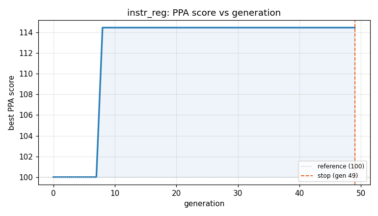
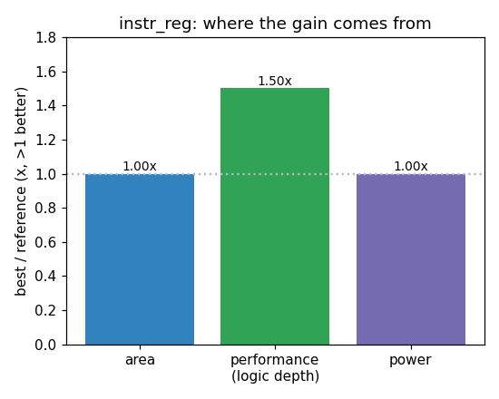

### `instr_reg`  —  category: Miscellaneous  —  best PPA **114.5** (area 1.00x · depth 1.50x · power 1.00x)

 

**Evolution path** — 2 edge(s) from the reference (gen 0, score 100) to the best (gen 8, score 114.5):

#### A — reference (gen 0, score 100.0)
The RTLLM golden reference; PPA baseline (area/depth/power = 1.00x).

#### A' — gen 3: `remove_unnecessary_state_and_assignments`  (score 100.0, +0.0; area 1.00x depth 1.00x power 1.00x)
_model: deepseek-v4-flash_

> The current code has an unused 3-bit `state` register and redundant assignments like `ins_p1 <= ins_p1;` which are unnecessary and waste area/power. Removing these will reduce area and power without changing functionality. The `state` register is declared but never used, so it can be eliminated. The explicit self-assignments in the always block are redundant because Verilog already implies storage

```diff
--- a/original.sv
+++ b/original.sv
@@ -1,37 +1,31 @@
 // EVOLVE-BLOCK-START
 module instr_reg (
     input clk,
     input rst,
     input [1:0] fetch,
     input [7:0] data,
     output [2:0] ins,
     output [4:0] ad1,
     output [7:0] ad2
 );
 
     reg [7:0] ins_p1, ins_p2;
-    reg [2:0] state;
 
     always @(posedge clk or negedge rst) begin
         if (!rst) begin
             ins_p1 <= 8'd0;
             ins_p2 <= 8'd0;
         end else begin
             if (fetch == 2'b01) begin // Fetch operation 1, from REG
                 ins_p1 <= data;
-                ins_p2 <= ins_p2;
             end else if (fetch == 2'b10) begin // Fetch operation 2, from RAM/ROM
-                ins_p1 <= ins_p1;
                 ins_p2 <= data;
-            end else begin
-                ins_p1 <= ins_p1;
-                ins_p2 <= ins_p2;
             end
         end
     end
 
     assign ins = ins_p1[7:5]; // High 3 bits, instructions
     assign ad1 = ins_p1[4:0];  // Low 5 bits, register address
     assign ad2 = ins_p2;
 endmodule
 // EVOLVE-BLOCK-END
```

#### A'' — gen 8: `compact_instr_reg`  (score 114.5, +14.5; area 1.00x depth 1.50x power 1.00x)
_model: qwen3-235b-a22b-2507_

> The original design uses two 8-bit registers (`ins_p1` and `ins_p2`) to store instructions from two different sources, with conditional updates based on the `fetch` signal. The outputs are derived directly from bit slices of these registers.

Observations for optimization:
- The `fetch` signal is one-hot: only 2'b01 and 2'b10 are meaningful; all other values (including 2'b00 and 2'b11) cause no up

```diff
--- a/original.sv
+++ b/original.sv
@@ -1,31 +1,33 @@
 // EVOLVE-BLOCK-START
 module instr_reg (
     input clk,
     input rst,
     input [1:0] fetch,
     input [7:0] data,
     output [2:0] ins,
     output [4:0] ad1,
     output [7:0] ad2
 );
 
     reg [7:0] ins_p1, ins_p2;
 
     always @(posedge clk or negedge rst) begin
         if (!rst) begin
             ins_p1 <= 8'd0;
             ins_p2 <= 8'd0;
         end else begin
-            if (fetch == 2'b01) begin // Fetch operation 1, from REG
+            // Use direct bit comparisons to avoid full equality logic
+            if (fetch[0] && !fetch[1]) begin  // fetch == 2'b01
                 ins_p1 <= data;
-            end else if (fetch == 2'b10) begin // Fetch operation 2, from RAM/ROM
+            end else if (fetch[1] && !fetch[0]) begin  // fetch == 2'b10
                 ins_p2 <= data;
             end
+            // Otherwise, retain values (implicit)
         end
     end
 
-    assign ins = ins_p1[7:5]; // High 3 bits, instructions
-    assign ad1 = ins_p1[4:0];  // Low 5 bits, register address
+    assign ins = ins_p1[7:5];
+    assign ad1 = ins_p1[4:0];
     assign ad2 = ins_p2;
 endmodule
 // EVOLVE-BLOCK-END
```
