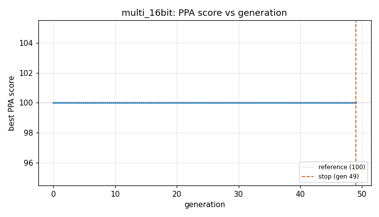
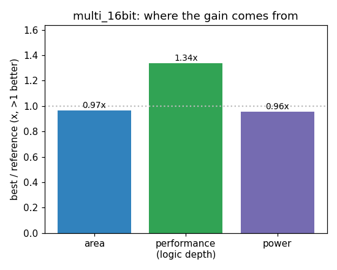

### `multi_16bit`  —  category: Arithmetic  —  best PPA **107.3** (area 0.97x · depth 1.34x · power 0.96x)

 

**Evolution path** — 3 edge(s) from the reference (gen 0, score 100) to the best (gen 38, score 107.3):

#### A1 — reference (gen 0, score 100.0)
The RTLLM golden reference; PPA baseline (area/depth/power = 1.00x).

#### A2 — gen 15: `kogge_stone_16bit_adder`  (score 103.6, +3.6; area 0.94x depth 1.28x power 0.93x)
_model: qwen3-235b-a22b-2507_

> Replace the default ripple-carry addition in the shift-and-accumulate path with a Kogge-Stone parallel-prefix adder structure to reduce critical path delay. The current implementation uses a behavioral '+' operator which synthesizes to a ripple adder, leading to high logic depth (119). A Kogge-Stone adder reduces the carry propagation delay from O(n) to O(log n), significantly improving timing. We

```diff
--- a/original.sv
+++ b/original.sv
@@ -1,58 +1,80 @@
 module multi_16bit(
     input clk,          // Chip clock signal.
     input rst_n,        // Active-low reset signal. Defined as 0 for chip reset; defined as 1 for reset signal inactive.
     input start,        // Chip enable signal.
     input [15:0] ain,   // Input a (multiplicand) with a data width of 16 bits.
     input [15:0] bin,   // Input b (multiplier) with a data width of 16 bits.
 
     output [31:0] yout, // Product output with a data width of 32 bits.
     output done         // Chip output flag signal. Defined as 1 indicates multiplication operation completion.
 );
 // EVOLVE-BLOCK-START
 reg [15:0] areg;    // Multiplicand a register.
 reg [15:0] breg;    // Multiplier b register.
 reg [31:0] yout_r;  // Product register.
 reg done_r;
 reg [4:0] i;        // Shift count register.
 
 
 //------------------------------------------------
 // Data bit control
 always @(posedge clk or negedge rst_n)
     if (!rst_n) i <= 5'd0;
     else if (start && i < 5'd17) i <= i + 1'b1;
     else if (!start) i <= 5'd0;
 
 //------------------------------------------------
 // Multiplication completion flag generation
 always @(posedge clk or negedge rst_n)
     if (!rst_n) done_r <= 1'b0;
     else if (i == 5'd16) done_r <= 1'b1; // Multiplication completion flag
     else if (i == 5'd17) done_r <= 1'b0; // Flag reset
 
 assign done = done_r;
 
 //------------------------------------------------
 // Dedicated register for shift and accumulate operation
 always @(posedge clk or negedge rst_n) begin
     if (!rst_n) begin
         areg <= 16'h0000;
         breg <= 16'h0000;
         yout_r <= 32'h00000000;
     end
     else if (start) begin // Start operation
         if (i == 5'd0) begin // Store multiplicand and multiplier
             areg <= ain;
             breg <= bin;
         end
         else if (i > 5'd0 && i < 5'd17) begin
-            if (areg[i-1])
-            yout_r <= yout_r + ({16'h0000, breg} << (i-1)); // Accumulate and shift
+            if (areg[i-1]) begin
+                // Kogge-Stone 32-bit adder for faster accumulation
+                yout_r <= kogge_stone_add_32(yout_r, {16'h0000, breg} << (i-1));
+            end
         end
     end
 end
... (diff truncated)
```

#### A3 — gen 21: `remove_kogge_stone_functional_model`  (score 100.0, -3.6; area 1.00x depth 1.00x power 1.00x)
_model: qwen3-235b-a22b-2507_

> The current design attempts to use a Kogge-Stone adder via a Verilog function to reduce critical path delay. However, synthesizers typically do not interpret algorithmic descriptions of advanced adders (like the loop-based Kogge-Stone code here) into optimized netlists — instead, they may unroll the logic in a way that increases area and power due to replicated logic and poor timing closure. Moreo

```diff
--- a/original.sv
+++ b/original.sv
@@ -1,80 +1,59 @@
 module multi_16bit(
     input clk,          // Chip clock signal.
     input rst_n,        // Active-low reset signal. Defined as 0 for chip reset; defined as 1 for reset signal inactive.
     input start,        // Chip enable signal.
     input [15:0] ain,   // Input a (multiplicand) with a data width of 16 bits.
     input [15:0] bin,   // Input b (multiplier) with a data width of 16 bits.
 
     output [31:0] yout, // Product output with a data width of 32 bits.
     output done         // Chip output flag signal. Defined as 1 indicates multiplication operation completion.
 );
 // EVOLVE-BLOCK-START
 reg [15:0] areg;    // Multiplicand a register.
 reg [15:0] breg;    // Multiplier b register.
 reg [31:0] yout_r;  // Product register.
 reg done_r;
 reg [4:0] i;        // Shift count register.
 
 
 //------------------------------------------------
 // Data bit control
 always @(posedge clk or negedge rst_n)
     if (!rst_n) i <= 5'd0;
     else if (start && i < 5'd17) i <= i + 1'b1;
     else if (!start) i <= 5'd0;
 
 //------------------------------------------------
 // Multiplication completion flag generation
 always @(posedge clk or negedge rst_n)
     if (!rst_n) done_r <= 1'b0;
     else if (i == 5'd16) done_r <= 1'b1; // Multiplication completion flag
     else if (i == 5'd17) done_r <= 1'b0; // Flag reset
 
 assign done = done_r;
 
 //------------------------------------------------
 // Dedicated register for shift and accumulate operation
 always @(posedge clk or negedge rst_n) begin
     if (!rst_n) begin
         areg <= 16'h0000;
         breg <= 16'h0000;
         yout_r <= 32'h00000000;
     end
     else if (start) begin // Start operation
         if (i == 5'd0) begin // Store multiplicand and multiplier
             areg <= ain;
             breg <= bin;
         end
         else if (i > 5'd0 && i < 5'd17) begin
             if (areg[i-1]) begin
-                // Kogge-Stone 32-bit adder for faster accumulation
-                yout_r <= kogge_stone_add_32(yout_r, {16'h0000, breg} << (i-1));
+                yout_r <= yout_r + ({16'h0000, breg} << (i-1));
             end
         end
     end
 end
 
... (diff truncated)
```

#### A4 — gen 38: `brent_kung_adder_32bit`  (score 107.3, +7.3; area 0.97x depth 1.34x power 0.96x)
_model: qwen3-235b-a22b-2507_

> Replace the default ripple carry adder used in the accumulation step with a Brent-Kung 32-bit parallel-prefix adder. This structure reduces critical path delay significantly compared to ripple carry while using fewer gates than Kogge-Stone, leading to better area-delay-product. The adder is instantiated within the behavioral block via a function, ensuring synthesizability. This improves timing (re

```diff
--- a/original.sv
+++ b/original.sv
@@ -1,59 +1,97 @@
 module multi_16bit(
     input clk,          // Chip clock signal.
     input rst_n,        // Active-low reset signal. Defined as 0 for chip reset; defined as 1 for reset signal inactive.
     input start,        // Chip enable signal.
     input [15:0] ain,   // Input a (multiplicand) with a data width of 16 bits.
     input [15:0] bin,   // Input b (multiplier) with a data width of 16 bits.
 
     output [31:0] yout, // Product output with a data width of 32 bits.
     output done         // Chip output flag signal. Defined as 1 indicates multiplication operation completion.
 );
 // EVOLVE-BLOCK-START
 reg [15:0] areg;    // Multiplicand a register.
 reg [15:0] breg;    // Multiplier b register.
 reg [31:0] yout_r;  // Product register.
 reg done_r;
 reg [4:0] i;        // Shift count register.
 
 
 //------------------------------------------------
 // Data bit control
 always @(posedge clk or negedge rst_n)
     if (!rst_n) i <= 5'd0;
     else if (start && i < 5'd17) i <= i + 1'b1;
     else if (!start) i <= 5'd0;
 
 //------------------------------------------------
 // Multiplication completion flag generation
 always @(posedge clk or negedge rst_n)
     if (!rst_n) done_r <= 1'b0;
     else if (i == 5'd16) done_r <= 1'b1; // Multiplication completion flag
     else if (i == 5'd17) done_r <= 1'b0; // Flag reset
 
 assign done = done_r;
 
 //------------------------------------------------
 // Dedicated register for shift and accumulate operation
 always @(posedge clk or negedge rst_n) begin
     if (!rst_n) begin
         areg <= 16'h0000;
         breg <= 16'h0000;
         yout_r <= 32'h00000000;
     end
     else if (start) begin // Start operation
         if (i == 5'd0) begin // Store multiplicand and multiplier
             areg <= ain;
             breg <= bin;
         end
         else if (i > 5'd0 && i < 5'd17) begin
             if (areg[i-1]) begin
-                yout_r <= yout_r + ({16'h0000, breg} << (i-1));
+                yout_r <= brent_kung_add_32(yout_r, {16'h0000, breg} << (i-1));
             end
         end
     end
 end
 
+// Brent-Kung 32-bit adder function
... (diff truncated)
```
