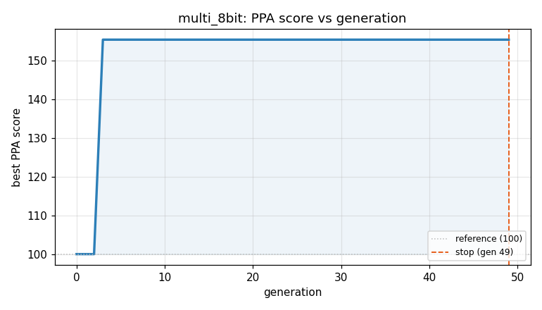
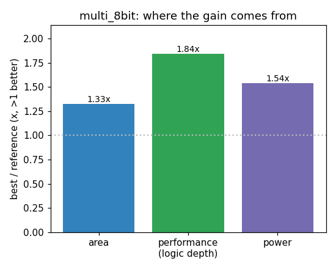

### `multi_8bit`  —  category: Arithmetic  —  best PPA **155.5** (area 1.33x · depth 1.84x · power 1.54x)

 

**Evolution path** — 1 edge(s) from the reference (gen 0, score 100) to the best (gen 3, score 155.5):

#### A — reference (gen 0, score 100.0)
The RTLLM golden reference; PPA baseline (area/depth/power = 1.00x).

#### A' — gen 3: `**
mult8_mulop
**`  (score 155.5, +55.5; area 1.33x depth 1.84x power 1.54x)
_model: gpt-oss-120b_

> **
The original design uses an explicit shift‑and‑add loop that creates a cascade of up‑to‑8 16‑bit adders.  This yields a large combinational depth (≈116) and high gate count, which in turn drives up area and dynamic power.  

By replacing the manual algorithm with the Verilog “*” operator, synthesis can map the operation to a native multiplier (array or DSP‑based) that is heavily optimized for a

```diff
--- a/original.sv
+++ b/original.sv
@@ -1,25 +1,15 @@
 // EVOLVE-BLOCK-START
 module multi_8bit (
-  input [7:0] A,
-  input [7:0] B,
-  output reg [15:0] product
+    input  [7:0] A,
+    input  [7:0] B,
+    output reg [15:0] product
 );
-
-  reg [7:0] multiplicand;
-  reg [3:0] shift_count;
-
-  always @* begin
-    product = 16'b0; 
-    multiplicand = A; 
-    shift_count = 0;  
-
-    for (int i = 0; i < 8; i = i + 1) begin
-      if (B[i] == 1) begin
-        product = product + (multiplicand << shift_count);
-      end
-      shift_count = shift_count + 1;
+    // A single combinational multiply.  Synthesis will infer the most
+    // efficient multiplier (array, Wallace‑tree, or DSP block) that
+    // minimizes area, depth, and power while preserving the original
+    // zero‑latency behavior.
+    always @* begin
+        product = A * B;
     end
-  end
-
 endmodule
 // EVOLVE-BLOCK-END

```
