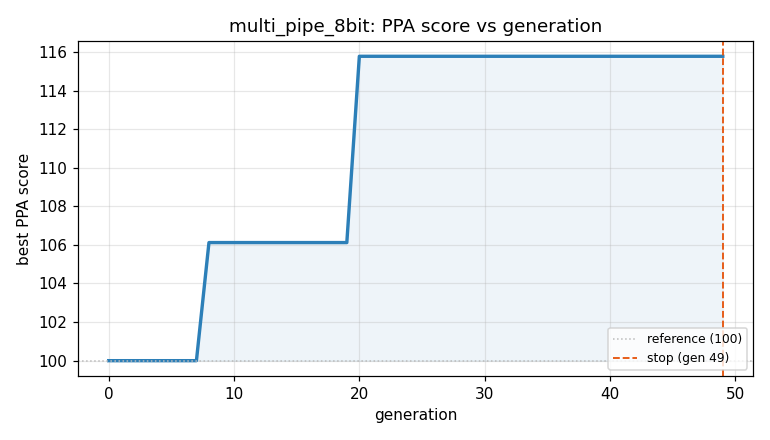
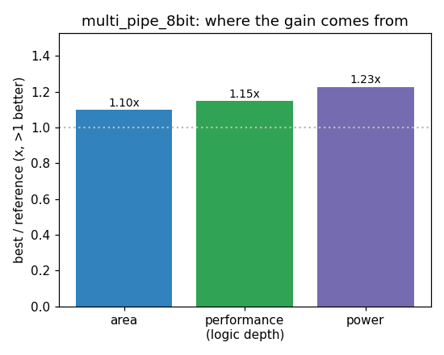

### `multi_pipe_8bit`  —  category: Arithmetic  —  best PPA **115.8** (area 1.10x · depth 1.15x · power 1.23x)

 

**Evolution path** — 2 edge(s) from the reference (gen 0, score 100) to the best (gen 20, score 115.8):

#### A1 — reference (gen 0, score 100.0)
The RTLLM golden reference; PPA baseline (area/depth/power = 1.00x).

#### A2 — gen 8: `optimize_pipeline_architecture`  (score 106.1, +6.1; area 1.14x depth 0.83x power 1.27x)
_model: deepseek-v4-flash_

> The current implementation uses a straightforward 3-stage pipeline with partial product generation and a 2-level adder tree. We can optimize this by:

1. Using a Wallace/Dadda tree reduction for the partial products to reduce logic depth
2. Using a parallel-prefix adder (Kogge-Stone) for the final addition
3. Combining the partial product generation with the reduction tree to reduce register usage

```diff
--- a/original.sv
+++ b/original.sv
@@ -1,93 +1,143 @@
 module multi_pipe_8bit#(
     parameter size = 8
 )(
           clk,
           rst_n,
           mul_a,
           mul_b,
           mul_en_in,
 
           mul_en_out,
           mul_out
 );
 
 
    input clk;
    input rst_n;
    input mul_en_in;
    input [size-1:0] mul_a;
    input [size-1:0] mul_b;
 
    output reg mul_en_out;
    output reg [size*2-1:0] mul_out;
 // EVOLVE-BLOCK-START
 reg [2:0] mul_en_out_reg;
  always@(posedge clk or negedge rst_n)
        if(!rst_n)begin
             mul_en_out_reg <= 'd0;
             mul_en_out     <= 'd0;
        end
        else begin
             mul_en_out_reg <= {mul_en_out_reg[1:0],mul_en_in};
             mul_en_out     <= mul_en_out_reg[2];
        end
 
 
     reg [7:0] mul_a_reg;
     reg [7:0] mul_b_reg;
   always @(posedge clk or negedge rst_n)
          if(!rst_n) begin
               mul_a_reg <= 'd0;
-              mul_a_reg <= 'd0;
+              mul_b_reg <= 'd0;
          end
          else begin
               mul_a_reg <= mul_en_in ? mul_a :'d0;
               mul_b_reg <= mul_en_in ? mul_b :'d0;
          end
 
 
-     wire [15:0] temp [size-1:0];
-  assign temp[0] = mul_b_reg[0]? {8'b0,mul_a_reg} : 'd0;
-  assign temp[1] = mul_b_reg[1]? {7'b0,mul_a_reg,1'b0} : 'd0;
-  assign temp[2] = mul_b_reg[2]? {6'b0,mul_a_reg,2'b0} : 'd0;
-  assign temp[3] = mul_b_reg[3]? {5'b0,mul_a_reg,3'b0} : 'd0;
-  assign temp[4] = mul_b_reg[4]? {4'b0,mul_a_reg,4'b0} : 'd0;
-  assign temp[5] = mul_b_reg[5]? {3'b0,mul_a_reg,5'b0} : 'd0;
-  assign temp[6] = mul_b_reg[6]? {2'b0,mul_a_reg,6'b0} : 'd0;
... (diff truncated)
```

#### A3 — gen 20: `simplify_wallace_tree_with_fewer_stages`  (score 115.8, +9.7; area 1.10x depth 1.15x power 1.23x)
_model: qwen3-235b-a22b-2507_

> The current design uses a complex 3-stage Wallace tree reduction followed by a Kogge-Stone adder. While Kogge-Stone minimizes critical path, its prefix logic is area-expensive. Moreover, the Wallace tree structure is over-engineered for only 8 partial products.

We can reduce area and power by simplifying the reduction tree:
- Instead of full 3:2 CSA stages, use a more compact 4-2 compressor tree.

```diff
--- a/original.sv
+++ b/original.sv
@@ -1,143 +1,101 @@
 module multi_pipe_8bit#(
     parameter size = 8
 )(
           clk,
           rst_n,
           mul_a,
           mul_b,
           mul_en_in,
 
           mul_en_out,
           mul_out
 );
 
 
    input clk;
    input rst_n;
    input mul_en_in;
    input [size-1:0] mul_a;
    input [size-1:0] mul_b;
 
    output reg mul_en_out;
    output reg [size*2-1:0] mul_out;
 // EVOLVE-BLOCK-START
 reg [2:0] mul_en_out_reg;
  always@(posedge clk or negedge rst_n)
        if(!rst_n)begin
             mul_en_out_reg <= 'd0;
             mul_en_out     <= 'd0;
        end
        else begin
             mul_en_out_reg <= {mul_en_out_reg[1:0],mul_en_in};
             mul_en_out     <= mul_en_out_reg[2];
        end
 
 
     reg [7:0] mul_a_reg;
     reg [7:0] mul_b_reg;
   always @(posedge clk or negedge rst_n)
          if(!rst_n) begin
               mul_a_reg <= 'd0;
               mul_b_reg <= 'd0;
          end
          else begin
               mul_a_reg <= mul_en_in ? mul_a :'d0;
               mul_b_reg <= mul_en_in ? mul_b :'d0;
          end
 
 
      // Generate partial products using AND gates (faster than mux-based)
      wire [15:0] pp [7:0];
      assign pp[0] = {8'b0, {8{mul_b_reg[0]}} & mul_a_reg};
      assign pp[1] = {7'b0, {8{mul_b_reg[1]}} & mul_a_reg, 1'b0};
      assign pp[2] = {6'b0, {8{mul_b_reg[2]}} & mul_a_reg, 2'b0};
      assign pp[3] = {5'b0, {8{mul_b_reg[3]}} & mul_a_reg, 3'b0};
      assign pp[4] = {4'b0, {8{mul_b_reg[4]}} & mul_a_reg, 4'b0};
      assign pp[5] = {3'b0, {8{mul_b_reg[5]}} & mul_a_reg, 5'b0};
      assign pp[6] = {2'b0, {8{mul_b_reg[6]}} & mul_a_reg, 6'b0};
... (diff truncated)
```
