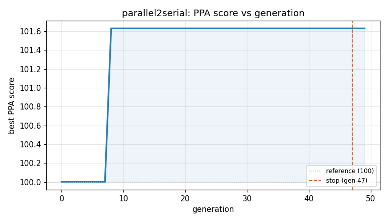
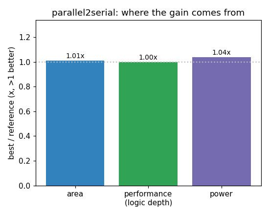

### `parallel2serial`  —  category: Miscellaneous  —  best PPA **101.6** (area 1.01x · depth 1.00x · power 1.04x)

 

**Evolution path** — 1 edge(s) from the reference (gen 0, score 100) to the best (gen 8, score 101.6):

#### A — reference (gen 0, score 100.0)
The RTLLM golden reference; PPA baseline (area/depth/power = 1.00x).

#### A' — gen 8: `optimized_parallel2serial`  (score 101.6, +1.6; area 1.01x depth 1.00x power 1.04x)
_model: deepseek-v4-flash_

> The current implementation uses a 4-bit shift register with rotate-left operation and a 2-bit counter. While functionally correct, we can optimize area and power by:
1. Using a simpler counter implementation with direct comparison to 2'd3 instead of 2'd3 constant
2. Removing the rotate-left operation which requires additional muxing - instead use a simple shift register that shifts right (MSB firs

```diff
--- a/original.sv
+++ b/original.sv
@@ -1,39 +1,38 @@
 `timescale 1ns/1ns
 module parallel2serial(
 	input wire clk  ,
 	input wire rst_n  ,
 	input wire [3:0]d ,
 	output wire valid_out ,
 	output wire dout
 	);
 // EVOLVE-BLOCK-START
-reg [3:0] data = 'd0;
-reg [1:0]cnt;
+reg [3:0] data;
+reg [1:0] cnt;
 reg valid;
+
+// Output MSB directly - no mux needed
 assign dout = data[3];
-assign valid_out =valid;
+assign valid_out = valid;
+
 always @(posedge clk or negedge rst_n) begin
-    if(!rst_n)begin
-        data<= 'd0;
-        cnt <= 'd0;
-        valid <= 'd0;
+    if (!rst_n) begin
+        data <= 4'd0;
+        cnt <= 2'd0;
+        valid <= 1'b0;
+    end else begin
+        if (cnt == 2'd3) begin
+            // Load new parallel data, reset counter, assert valid
+            data <= d;
+            cnt <= 2'd0;
+            valid <= 1'b1;
+        end else begin
+            // Shift left to discard MSB (already output), shift in 0
+            data <= {data[2:0], 1'b0};
+            cnt <= cnt + 1'b1;
+            valid <= 1'b0;
+        end
     end
-    else  begin
-                
-		if (cnt == 'd3) begin
-			data <= d;
-			cnt <= 'd0;
-			valid <= 1;
-		end
-		else begin
-			cnt <= cnt + 'd1;
-			valid <= 0;
-			data  <= {data[2:0],data[3]};
-		end
-    end
-		
 end
... (diff truncated)
```
