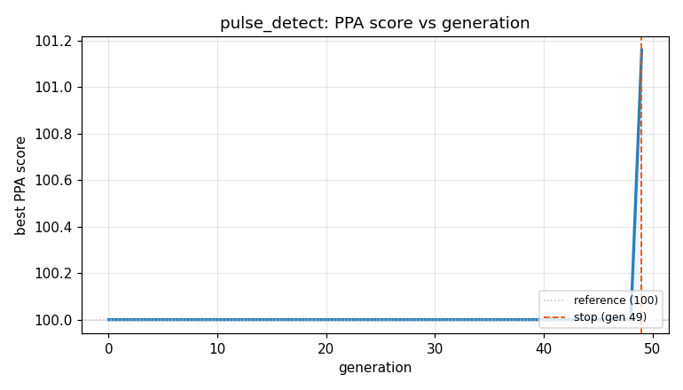
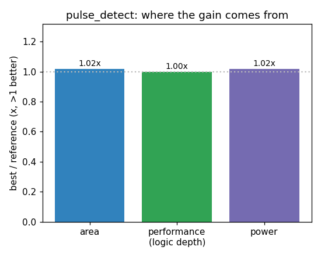

### `pulse_detect`  —  category: Miscellaneous  —  best PPA **101.2** (area 1.02x · depth 1.00x · power 1.02x)

 

**Evolution path** — 1 edge(s) from the reference (gen 0, score 100) to the best (gen 49, score 101.2):

#### A — reference (gen 0, score 100.0)
The RTLLM golden reference; PPA baseline (area/depth/power = 1.00x).

#### A' — gen 49: `optimize_pulse_detect_fsm`  (score 101.2, +1.2; area 1.02x depth 1.00x power 1.02x)
_model: deepseek-v4-flash_

> The current implementation uses a two-stage FSM with combinational next-state logic and a separate combinational output. This can be simplified to a single always_ff block with registered state and output, reducing area and logic depth. The FSM states can be encoded more efficiently (using 2 bits is fine, but we can merge the output logic into the state machine to avoid extra combinational logic).

```diff
--- a/original.sv
+++ b/original.sv
@@ -1,78 +1,59 @@
 // EVOLVE-BLOCK-START
 `timescale 1ns/1ns
 
 module pulse_detect(
     input clk,
     input rst_n,
     input data_in,
     output reg data_out
 );
 
-parameter s0 = 2'b00; // initial
-parameter s1 = 2'b01; // 0, 00
-parameter s2 = 2'b10; // 01
-parameter s3 = 2'b11; // 010
+localparam s0 = 2'b00; // initial
+localparam s1 = 2'b01; // 0, 00
+localparam s2 = 2'b10; // 01
+localparam s3 = 2'b11; // 010
 
-reg [1:0] pulse_level1, pulse_level2;
+reg [1:0] pulse_state, pulse_next;
 
 always @(posedge clk or negedge rst_n) begin
     if (!rst_n)
-        pulse_level1 <= s0;
+        pulse_state <= s0;
     else
-        pulse_level1 <= pulse_level2;
+        pulse_state <= pulse_next;
 end
 
 always @(*) begin
-    case (pulse_level1)
+    pulse_next = pulse_state; // default
+    data_out = 1'b0;
+    case (pulse_state)
         s0: begin
-            if (data_in == 0)
-                pulse_level2 = s1;
+            if (data_in == 1'b0)
+                pulse_next = s1;
             else
-                pulse_level2 = s0;
+                pulse_next = s0;
         end
-
         s1: begin
-            if (data_in == 1)
-                pulse_level2 = s2;
+            if (data_in == 1'b1)
+                pulse_next = s2;
             else
-                pulse_level2 = s1;
+                pulse_next = s1;
         end
-
         s2: begin
... (diff truncated)
```
