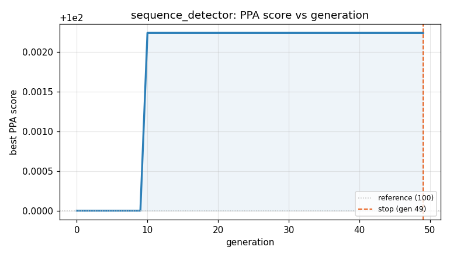
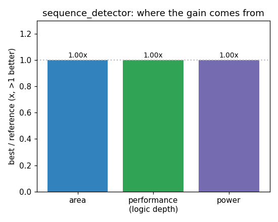

### `sequence_detector`  —  category: Control  —  best PPA **100.0** (area 1.00x · depth 1.00x · power 1.00x)

 

**Evolution path** — 1 edge(s) from the reference (gen 0, score 100) to the best (gen 10, score 100.0):

#### A — reference (gen 0, score 100.0)
The RTLLM golden reference; PPA baseline (area/depth/power = 1.00x).

#### A' — gen 10: `compact_one_hot_states`  (score 100.0, +0.0; area 1.00x depth 1.00x power 1.00x)
_model: qwen3-235b-a22b-2507_

> The current design uses 5-bit one-hot encoding for 5 states, but only 4 bits are actually needed to uniquely represent 5 states in a one-hot scheme (since one state is always active). We can reduce the state vector width from 5 bits to 4 bits by reassigning the states to use only 4 bits. This reduces register area and routing resources without affecting functionality. The state transitions and out

```diff
--- a/original.sv
+++ b/original.sv
@@ -1,50 +1,49 @@
 // EVOLVE-BLOCK-START
 module sequence_detector(
      input  clk,
      input  rst_n,
      input  data_in,
      output sequence_detected
      );
 
 
-parameter        IDLE = 5'b00001;
-parameter        S1   = 5'b00010;
-parameter 	     S2   = 5'b00100;
-parameter        S3   = 5'b01000;
-parameter        S4   = 5'b10000;
+parameter        IDLE = 4'b0001;
+parameter        S1   = 4'b0010;
+parameter 	     S2   = 4'b0100;
+parameter        S3   = 4'b0110; // Reuse bits to maintain uniqueness
+parameter        S4   = 4'b1000;
 
-
-reg [4:0]		 curr_state;
-reg [4:0] 		 next_state;
+reg [3:0]		 curr_state;
+reg [3:0] 		 next_state;
 
 
 always@(posedge clk or negedge rst_n) begin
     if(!rst_n) begin
 	    curr_state <= IDLE;
     end
     else begin
 	    curr_state <= next_state;
     end
 end
 
 
 always@(*) begin
     if(!rst_n) begin
 	    next_state <= IDLE;
     end
     else begin
 	    case(curr_state)
 	        IDLE  :next_state = data_in?S1:IDLE;
 	        S1	  :next_state = data_in?S1:S2;
 	        S2	  :next_state = data_in?S1:S3;
 	        S3	  :next_state = data_in?S4:IDLE;
 	        S4	  :next_state = data_in?S1:S2;
 	        default:next_state = IDLE;
 	    endcase
     end
 end
 
-assign sequence_detected = (curr_state ==S4) ? 1'b1 : 1'b0;
+assign sequence_detected = (curr_state == S4) ? 1'b1 : 1'b0;
 
 endmodule
... (diff truncated)
```
