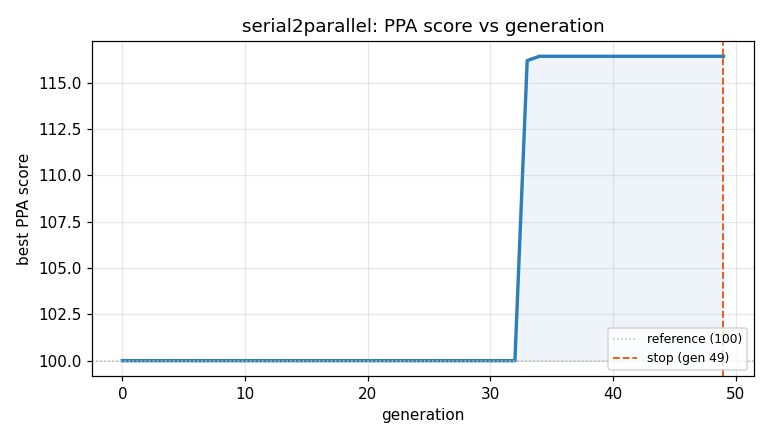
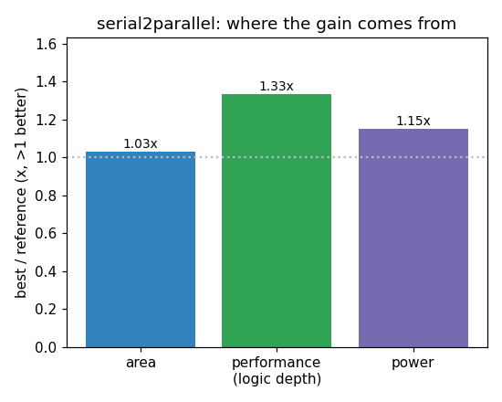

### `serial2parallel`  —  category: Miscellaneous  —  best PPA **116.4** (area 1.03x · depth 1.33x · power 1.15x)

 

**Evolution path** — 2 edge(s) from the reference (gen 0, score 100) to the best (gen 34, score 116.4):

#### A — reference (gen 0, score 100.0)
The RTLLM golden reference; PPA baseline (area/depth/power = 1.00x).

#### A' — gen 33: `none`  (score 116.2, +16.2; area 1.02x depth 1.33x power 1.15x)
_model: deepseek-v4-flash_

> none

```diff
--- a/original.sv
+++ b/original.sv
@@ -1,47 +1,58 @@
 // EVOLVE-BLOCK-START
-
 module serial2parallel(
-	input clk,
-	input rst_n,
-	input din_serial,
-	input din_valid,
-	output reg [7:0]dout_parallel,
-	output reg dout_valid
+    input clk,
+    input rst_n,
+    input din_serial,
+    input din_valid,
+    output reg [7:0] dout_parallel,
+    output reg dout_valid
 );
 
-	reg[7:0]din_tmp;
-	reg[3:0]cnt;
-	
-	always@(posedge clk or negedge rst_n)begin
-		if(!rst_n)
-			cnt <= 0;
-		else if(din_valid)
-			cnt <= (cnt == 4'd8)?0:cnt+1'b1;
-		else	
-			cnt <= 0;
-	end
-	
-	always@(posedge clk or negedge rst_n)begin
-		if(!rst_n)
-			din_tmp <= 8'b0;
-		else if(din_valid && cnt <= 4'd7)
-			din_tmp <= {din_tmp[6:0],din_serial};
-	
-	end 
-	
-	always@(posedge clk or negedge rst_n)begin
-		if(!rst_n)begin
-			dout_valid <= 1'b0;
-			dout_parallel <= 8'b0;
-		end
-		else if(cnt == 4'd8)begin
-			dout_valid <= 1'b1;
-			dout_parallel <= din_tmp;
-		end
-		else begin
-			dout_valid <= 1'b0;
-		end
-	end 
-	
+    reg [7:0] din_tmp;      // shift register
+    reg [2:0] cnt;          // 3-bit counter for 0-7
+    reg full_flag;          // indicates that 8th bit has been shifted (output cycle)
+
+    // 3-bit binary counter and full_flag generation
+    always @(posedge clk or negedge rst_n) begin
... (diff truncated)
```

#### A'' — gen 34: `compact_serial2parallel`  (score 116.4, +0.2; area 1.03x depth 1.33x power 1.15x)
_model: qwen3-235b-a22b-2507_

> Key improvements over the current design:

1. **Counter optimization**: Replaced 3-bit counter (0–7) with a 3-bit shift register that counts modulo 8 using a ring-counter-like structure. This reduces logic depth by eliminating arithmetic comparison (cnt == 3'd7), replacing it with a simple bit-tap (cnt[2] used to detect terminal state).

2. **State encoding**: Instead of maintaining both `cnt` and

```diff
--- a/original.sv
+++ b/original.sv
@@ -1,58 +1,52 @@
 // EVOLVE-BLOCK-START
 module serial2parallel(
     input clk,
     input rst_n,
     input din_serial,
     input din_valid,
     output reg [7:0] dout_parallel,
     output reg dout_valid
 );
 
-    reg [7:0] din_tmp;      // shift register
-    reg [2:0] cnt;          // 3-bit counter for 0-7
-    reg full_flag;          // indicates that 8th bit has been shifted (output cycle)
+    reg [7:0] din_tmp;
+    reg [2:0] cnt;
+    reg full_flag;
 
-    // 3-bit binary counter and full_flag generation
     always @(posedge clk or negedge rst_n) begin
         if (!rst_n) begin
             cnt <= 0;
+            din_tmp <= 0;
             full_flag <= 0;
-        end else if (!din_valid) begin
-            cnt <= 0;
-            full_flag <= 0;
+            dout_valid <= 0;
+            dout_parallel <= 0;
         end else begin
-            if (din_valid) begin
+            // Default output valid to 0
+            dout_valid <= 0;
+            
+            // Handle input and counting
+            if (!din_valid) begin
+                cnt <= 0;
+                full_flag <= 0;
+            end else begin
+                // Shift in the new bit
+                din_tmp <= {din_tmp[6:0], din_serial};
                 if (cnt == 3'd7) begin
+                    // 8th bit received, prepare to output next cycle
                     cnt <= 0;
                     full_flag <= 1;
                 end else begin
                     cnt <= cnt + 1;
                     full_flag <= 0;
                 end
             end
-        end
-    end
-
-    // Shift register: update only when din_valid and not in output cycle
-    always @(posedge clk or negedge rst_n) begin
-        if (!rst_n)
-            din_tmp <= 8'b0;
-        else if (din_valid && !full_flag)
... (diff truncated)
```
