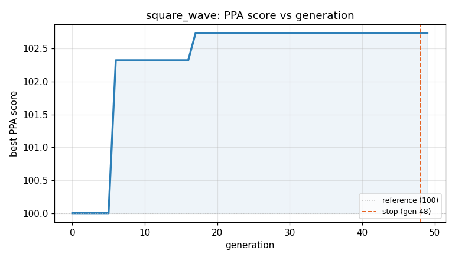
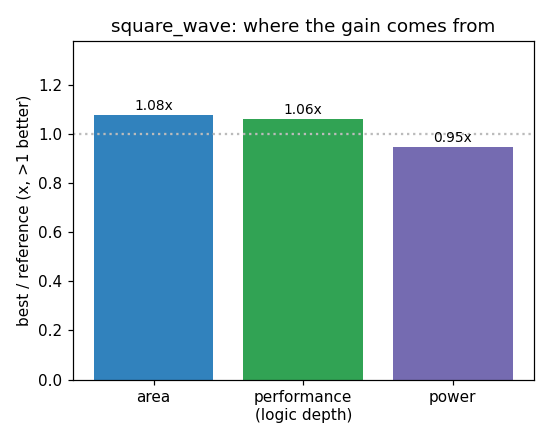

### `square_wave`  —  category: Miscellaneous  —  best PPA **102.7** (area 1.08x · depth 1.06x · power 0.95x)

 

**Evolution path** — 4 edge(s) from the reference (gen 0, score 100) to the best (gen 17, score 102.7):

#### A — reference (gen 0, score 100.0)
The RTLLM golden reference; PPA baseline (area/depth/power = 1.00x).

#### A' — gen 6: `none`  (score 102.3, +2.3; area 1.17x depth 1.00x power 0.92x)
_model: deepseek-v4-flash_

> none

```diff
--- a/original.sv
+++ b/original.sv
@@ -1,25 +1,25 @@
 module square_wave(
     input clk,                     
     input [7:0] freq,           
     output reg wave_out          
 );
 // EVOLVE-BLOCK-START
 reg [7:0] count;                
+wire [7:0] next_count = count + 1;
 
 initial begin
     wave_out = 0;  
     count = 0;     
 end
 
 always @(posedge clk) begin
-    if(count == freq - 1 ) begin      
+    if(next_count == freq) begin      
         count <= 0;
-        wave_out <=  ~wave_out ;            
-
+        wave_out <=  ~wave_out;            
     end else begin
-        count <= count + 1;        
+        count <= next_count;        
     end
 end
 
 endmodule
 // EVOLVE-BLOCK-END

```

#### A'' — gen 9: `eliminate_initial_block`  (score 100.0, -2.3; area 1.00x depth 1.00x power 1.00x)
_model: qwen3-235b-a22b-2507_

> The `initial` block is unnecessary in synthesizable Verilog for FPGA/ASIC designs because it does not translate to real hardware behavior and may be ignored or handled inconsistently across synthesis tools. The registers `count` and `wave_out` are already driven in the `always @(posedge clk)` block, so their reset behavior can be safely removed. Since the design toggles `wave_out` based on countin

```diff
--- a/original.sv
+++ b/original.sv
@@ -1,25 +1,19 @@
 module square_wave(
     input clk,
     input [7:0] freq,
     output reg wave_out
 );
 // EVOLVE-BLOCK-START
 reg [7:0] count;
-wire [7:0] next_count = count + 1;
-
-initial begin
-    wave_out = 0;
-    count = 0;
-end
 
 always @(posedge clk) begin
-    if(next_count == freq) begin
+    if(count == freq - 1) begin
         count <= 0;
         wave_out <=  ~wave_out;
     end else begin
-        count <= next_count;
+        count <= count + 1;
     end
 end
 
 endmodule
 // EVOLVE-BLOCK-END
```

#### A''' — gen 15: `eliminate_subtraction`  (score 102.3, +2.3; area 1.17x depth 1.00x power 0.92x)
_model: qwen3-235b-a22b-2507_

> The current implementation computes `freq - 1` on every cycle to compare against `count`. This subtraction is unnecessary and adds logic depth and area. Instead, we can compare `count == freq`, and reset when that condition is met — but with a twist: increment first, then check.

By changing the logic to increment the counter unconditionally at the start of the cycle and then check if it has reach

```diff
--- a/original.sv
+++ b/original.sv
@@ -1,19 +1,20 @@
 module square_wave(
     input clk,
     input [7:0] freq,
     output reg wave_out
 );
 // EVOLVE-BLOCK-START
 reg [7:0] count;
+wire [7:0] next_count = count + 1;
 
 always @(posedge clk) begin
-    if(count == freq - 1) begin
+    if(next_count == freq) begin
         count <= 0;
-        wave_out <=  ~wave_out;
+        wave_out <= ~wave_out;
     end else begin
-        count <= count + 1;
+        count <= next_count;
     end
 end
 
 endmodule
 // EVOLVE-BLOCK-END
```

#### A'''' — gen 17: `eliminate_wire_declaration`  (score 102.7, +0.4; area 1.08x depth 1.06x power 0.95x)
_model: qwen3-235b-a22b-2507_

> The current design uses a `wire [7:0] next_count = count + 1;` to compute the incremented value of the counter. While this is functionally correct, it introduces an unnecessary net declaration that adds minimal value and slightly increases synthesis area and possibly power due to additional signal naming and driver logic.

We can eliminate the `wire` by moving the increment expression directly int

```diff
--- a/original.sv
+++ b/original.sv
@@ -1,20 +1,19 @@
 module square_wave(
     input clk,
     input [7:0] freq,
     output reg wave_out
 );
 // EVOLVE-BLOCK-START
 reg [7:0] count;
-wire [7:0] next_count = count + 1;
 
 always @(posedge clk) begin
-    if(next_count == freq) begin
+    if(count + 1 == freq) begin
         count <= 0;
         wave_out <= ~wave_out;
     end else begin
-        count <= next_count;
+        count <= count + 1;
     end
 end
 
 endmodule
 // EVOLVE-BLOCK-END
```
