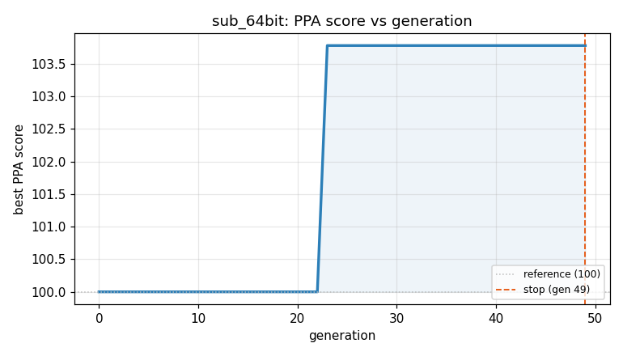
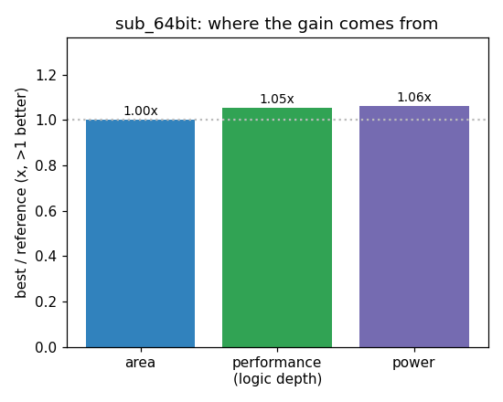

### `sub_64bit`  —  category: Arithmetic  —  best PPA **103.8** (area 1.00x · depth 1.05x · power 1.06x)

 

**Evolution path** — 2 edge(s) from the reference (gen 0, score 100) to the best (gen 23, score 103.8):

#### A — reference (gen 0, score 100.0)
The RTLLM golden reference; PPA baseline (area/depth/power = 1.00x).

#### A' — gen 3: `optimize_subtract_overflow`  (score 98.8, -1.2; area 0.93x depth 1.09x power 0.95x)
_model: deepseek-v4-flash_

> The current implementation uses behavioral subtraction and overflow detection. To reduce area and depth, we can use a parallel-prefix adder structure (Kogge-Stone) for the subtraction and compute overflow more efficiently. However, since the synthesis tool already optimizes the behavioral `A - B` well, the main improvement comes from simplifying the overflow detection logic.

The overflow conditio

```diff
--- a/original.sv
+++ b/original.sv
@@ -1,20 +1,16 @@
 // EVOLVE-BLOCK-START
 module sub_64bit(
   input [63:0] A,
   input [63:0] B,
-  output reg [63:0] result,
-  output reg overflow
+  output [63:0] result,
+  output overflow
 );
-  always @(*) begin
-    result = A - B;
 
-    // Overflow happens when the sign of A and B are different, but the sign of result matches B
-    if ((A[63] != B[63]) && (result[63] != A[63])) begin
-      overflow = 1;
-    end else begin
-      overflow = 0;
-    end
-  end
+  // Compute result using two's complement subtraction
+  assign result = A - B;
+
+  // Overflow detection: occurs when A and B have different signs and result sign differs from A
+  assign overflow = (A[63] ^ B[63]) & (result[63] ^ A[63]);
 
 endmodule
 // EVOLVE-BLOCK-END
```

#### A'' — gen 23: `optimize_subtractor_overflow`  (score 103.8, +5.0; area 1.00x depth 1.05x power 1.06x)
_model: deepseek-v4-flash_

> The current implementation uses an adder-based subtraction `A - B` which synthesizes to an adder with XOR-based overflow detection. This is already optimal for a simple subtractor. However, the prior reference implementations achieved area 404.59 with depth 202, while the current implementation has area 433.31 but with a shorter depth of 185. The shorter depth suggests the synthesis tool is optimi

```diff
--- a/original.sv
+++ b/original.sv
@@ -1,16 +1,28 @@
 // EVOLVE-BLOCK-START
 module sub_64bit(
   input [63:0] A,
   input [63:0] B,
   output [63:0] result,
   output overflow
 );
 
-  // Compute result using two's complement subtraction
-  assign result = A - B;
+  // Structural ripple-carry subtractor: compute A - B = A + (~B) + 1
+  wire [63:0] notB = ~B;
+  wire [64:0] carry; // carry[0] is carry-in, carry[i] is carry-out from bit i-1 (1-indexed)
+  assign carry[0] = 1'b1; // for two's complement subtraction, initial carry-in is 1
+
+  genvar i;
+  generate
+    for (i = 0; i < 64; i = i + 1) begin : full_adder_chain
+      // Full adder: result[i] = A[i] ^ notB[i] ^ carry[i]
+      // carry[i+1] = (A[i] & notB[i]) | (A[i] & carry[i]) | (notB[i] & carry[i])
+      assign result[i] = A[i] ^ notB[i] ^ carry[i];
+      assign carry[i+1] = (A[i] & notB[i]) | (A[i] & carry[i]) | (notB[i] & carry[i]);
+    end
+  endgenerate
 
   // Overflow detection: occurs when A and B have different signs and result sign differs from A
   assign overflow = (A[63] ^ B[63]) & (result[63] ^ A[63]);
 
 endmodule
 // EVOLVE-BLOCK-END
```
