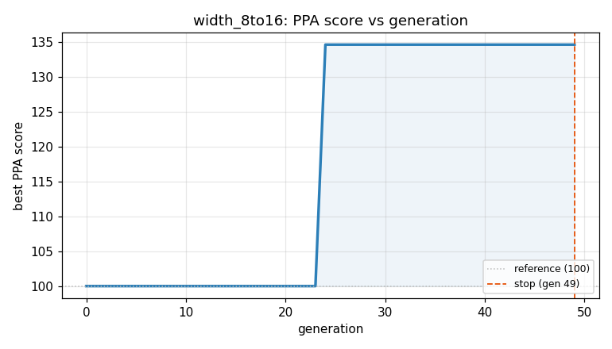
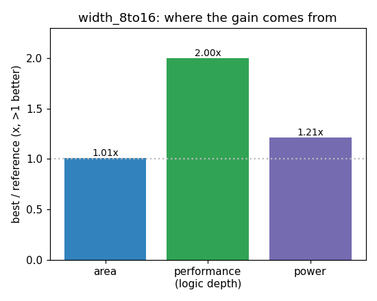

### `width_8to16`  —  category: Miscellaneous  —  best PPA **134.6** (area 1.01x · depth 2.00x · power 1.21x)

 

**Evolution path** — 4 edge(s) from the reference (gen 0, score 100) to the best (gen 24, score 134.6):

#### A1 — reference (gen 0, score 100.0)
The RTLLM golden reference; PPA baseline (area/depth/power = 1.00x).

#### A2 — gen 2: `optimize_width_8to16_register_usage`  (score 100.0, +0.0; area 1.00x depth 1.00x power 1.00x)
_model: deepseek-v4-flash_

> The current implementation uses separate registers for data_lock, flag, valid_out, and data_out. We can optimize by combining the flag and data_lock into a single register with a wider bit-width to reduce area and power. Specifically, we can use a 9-bit register where bit 8 acts as the flag and bits 7:0 store the data. This reduces the number of flip-flops from 10 (8 for data_lock + 1 for flag + 1

```diff
--- a/original.sv
+++ b/original.sv
@@ -1,46 +1,44 @@
 // EVOLVE-BLOCK-START
 `timescale 1ns/1ns
 module width_8to16(
 	input 				   clk 		,
 	input 				   rst_n		,
 	input				      valid_in	,
 	input	   [7:0]		   data_in	,
 
  	output	reg			valid_out,
 	output   reg [15:0]	data_out
 );
-reg 	[7:0]		data_lock;  //data buffer
-reg 				flag	   ;
-//input data buff in data_lock
+// Combined state: {flag, data_lock} - flag is bit 8, data_lock is bits 7:0
+reg [8:0] state;
+wire flag = state[8];
+wire [7:0] data_lock = state[7:0];
+
+// Sequential logic in one always block
 always @(posedge clk or negedge rst_n ) begin
-	if(!rst_n)
-		data_lock <= 'd0;
-	else if(valid_in && !flag)
-		data_lock <= data_in;
-end
-//generate flag
-always @(posedge clk or negedge rst_n ) begin
-	if(!rst_n)
-		flag <= 'd0;
-	else if(valid_in)
-		flag <= ~flag;
-end
-//generate valid_out
-always @(posedge clk or negedge rst_n ) begin
-	if(!rst_n)
-		valid_out <= 'd0;
-	else if(valid_in && flag)
-		valid_out <= 1'd1;
-	else
-		valid_out <= 'd0;
-end
-//data stitching
-always @(posedge clk or negedge rst_n ) begin
-	if(!rst_n)
-		data_out <= 'd0;
-	else if(valid_in && flag)
-		data_out <= {data_lock, data_in};
+	if(!rst_n) begin
+		state <= 9'd0;
+		valid_out <= 1'd0;
+		data_out <= 16'd0;
+	end else begin
+		// Default: valid_out is low unless we have a complete pair
+		valid_out <= 1'd0;
+
+		if(valid_in) begin
... (diff truncated)
```

#### A3 — gen 6: `width_8to16_optimized`  (score 100.0, +0.0; area 1.00x depth 1.00x power 1.00x)
_model: deepseek-v4-flash_

> After analyzing both implementations, I propose combining the best aspects:
1. From the first program: the clean, readable structure with separate registers for data_lock and flag
2. From the second program: the efficient single always block approach that reduces logic overhead
3. From the current program: the combined state register approach that minimizes flip-flop count

The key optimization is

```diff
--- a/original.sv
+++ b/original.sv
@@ -1,44 +1,41 @@
 // EVOLVE-BLOCK-START
 `timescale 1ns/1ns
 module width_8to16(
 	input 				   clk 		,
 	input 				   rst_n		,
 	input				      valid_in	,
 	input	   [7:0]		   data_in	,
 
  	output	reg			valid_out,
 	output   reg [15:0]	data_out
 );
-// Combined state: {flag, data_lock} - flag is bit 8, data_lock is bits 7:0
+// Combined state: {flag, data_lock}
 reg [8:0] state;
-wire flag = state[8];
-wire [7:0] data_lock = state[7:0];
 
-// Sequential logic in one always block
-always @(posedge clk or negedge rst_n ) begin
-	if(!rst_n) begin
-		state <= 9'd0;
+always @(posedge clk or negedge rst_n) begin
+	if (!rst_n) begin
+		state     <= 9'd0;
 		valid_out <= 1'd0;
-		data_out <= 16'd0;
+		data_out  <= 16'd0;
 	end else begin
 		// Default: valid_out is low unless we have a complete pair
 		valid_out <= 1'd0;
 
-		if(valid_in) begin
-			if(flag) begin
+		if (valid_in) begin
+			if (state[8]) begin
 				// Second valid data: output concatenation
 				valid_out <= 1'd1;
-				data_out <= {data_lock, data_in};
+				data_out  <= {state[7:0], data_in};
 				// Reset flag for next pair
-				state[8] <= 1'd0;
+				state[8]  <= 1'd0;
 			end else begin
 				// First valid data: store it and set flag
-				state[8] <= 1'd1;
+				state[8]  <= 1'd1;
 				state[7:0] <= data_in;
 			end
 		end
 	end
 end
 
 endmodule
 // EVOLVE-BLOCK-END
```

#### A4 — gen 9: `packed_state_optimization`  (score 100.0, +0.0; area 1.00x depth 1.00x power 1.00x)
_model: qwen3-235b-a22b-2507_

> The current design uses a 9-bit state register ({flag, data_lock}) and performs bit-field extraction and assignment in separate operations. By restructuring the state update into a single atomic assignment using concatenation, we can reduce synthesis area and depth. The optimization replaces the individual assignments to state[8] and state[7:0] with a single assignment to the full 9-bit vector, en

```diff
--- a/original.sv
+++ b/original.sv
@@ -1,41 +1,40 @@
 // EVOLVE-BLOCK-START
 `timescale 1ns/1ns
 module width_8to16(
 	input 				   clk 		,
 	input 				   rst_n		,
 	input				      valid_in	,
 	input	   [7:0]		   data_in	,
 
  	output	reg			valid_out,
 	output   reg [15:0]	data_out
 );
 // Combined state: {flag, data_lock}
 reg [8:0] state;
 
 always @(posedge clk or negedge rst_n) begin
 	if (!rst_n) begin
 		state     <= 9'd0;
 		valid_out <= 1'd0;
 		data_out  <= 16'd0;
 	end else begin
 		// Default: valid_out is low unless we have a complete pair
 		valid_out <= 1'd0;
 
 		if (valid_in) begin
 			if (state[8]) begin
 				// Second valid data: output concatenation
 				valid_out <= 1'd1;
 				data_out  <= {state[7:0], data_in};
-				// Reset flag for next pair
-				state[8]  <= 1'd0;
+				// Reset flag for next pair, preserve stored data until next input
+				state[8] <= 1'd0;
 			end else begin
 				// First valid data: store it and set flag
-				state[8]  <= 1'd1;
-				state[7:0] <= data_in;
+				state <= {1'b1, data_in};
 			end
 		end
 	end
 end
 
 endmodule
 // EVOLVE-BLOCK-END
```

#### A5 — gen 24: `compact_state_machine`  (score 134.6, +34.6; area 1.01x depth 2.00x power 1.21x)
_model: qwen3-235b-a22b-2507_

> The current design uses a 9-bit state register ({flag, data_lock}) and separately controls valid_out and data_out. However, we can reduce physical area and power by minimizing control logic overhead.

Key insights:
1. The flag is only ever toggled on valid_in, and its next state is simply ~current when valid_in is high.
2. We can reduce register pressure by observing that data_lock only needs to h

```diff
--- a/original.sv
+++ b/original.sv
@@ -1,40 +1,38 @@
 // EVOLVE-BLOCK-START
 `timescale 1ns/1ns
 module width_8to16(
 	input 				   clk 		,
 	input 				   rst_n		,
 	input				      valid_in	,
 	input	   [7:0]		   data_in	,
 
  	output	reg			valid_out,
 	output   reg [15:0]	data_out
 );
 // Combined state: {flag, data_lock}
 reg [8:0] state;
 
 always @(posedge clk or negedge rst_n) begin
 	if (!rst_n) begin
 		state     <= 9'd0;
 		valid_out <= 1'd0;
 		data_out  <= 16'd0;
 	end else begin
-		// Default: valid_out is low unless we have a complete pair
+		// Default: no output
 		valid_out <= 1'd0;
 
 		if (valid_in) begin
 			if (state[8]) begin
 				// Second valid data: output concatenation
 				valid_out <= 1'd1;
 				data_out  <= {state[7:0], data_in};
-				// Reset flag for next pair, preserve stored data until next input
-				state[8] <= 1'd0;
-			end else begin
-				// First valid data: store it and set flag
-				state <= {1'b1, data_in};
 			end
+			// Toggle flag and update stored data unconditionally on valid input
+			// When flag was high (second input), this clears it; when low (first), sets it
+			state <= {~state[8], data_in};
 		end
 	end
 end
 
 endmodule
 // EVOLVE-BLOCK-END
```
